# MySMS ER diagrams

> **Stale.** Covers 466 tables of 21 schemas; the baselines now have 489 tables in 22 schemas (privacy and later
> additions are missing). The generator is not in the repository; regenerate once a Java generator exists in the
> build (ROADMAP DOC-1). The baselines are the source of truth.

Every diagram here is generated from the SQL migrations in `../migrations/` alone: the DDL is parsed with the PostgreSQL parser and turned into Mermaid `erDiagram` text, then rendered to PNG. Nothing is drawn by hand.

**Formats.** Each diagram is a Mermaid source file (`.mmd`, plain text, renders on GitHub, GitLab, Azure DevOps, Confluence, IntelliJ, VS Code and mermaid.live) and a PNG next to it. The diagrams are also embedded below, so this page renders them directly wherever Mermaid is supported.

## How to read them

- **Boxes** are tables, titled `schema.table`. Rows are `type column keys "notes"`: `PK` primary key, `FK` foreign key, `UK` unique; `NN` = NOT NULL; `14,2` = numeric precision and scale.
- **Lines** are foreign keys inside the module, in crow's-foot notation, labelled with the FK column. `||` at the parent end = mandatory (NOT NULL FK), `|o` = optional; `o{` at the child end = many, `o|` = at most one (unique FK).
- **Cross-module references are logical, not foreign keys** (schemas may run on separate database instances): the row notes `→ schema.table (logical)`; the owning module validates the id through its API and its events drive cleanup (see `../logical-references.md`). The module overview draws the dependency graph they imply as dashed arrows (label = number of reference columns; the same table as ARCHITECTURE.md §2). The 26 against-DAG references are event-only and not drawn there.
- **Standard columns** (`tenant_id` and the audit / soft-delete / version columns `created_at`, `created_by`, `updated_at`, `updated_by`, `deleted_at`, `row_version`) are omitted; every table has them (see the database README).
- **Large modules** (LMS, Communication) are split into sub-areas. A box that shows only `id` is a table of the same module drawn on the sub-area named in its note.

Totals: 460 tables drawn (the other one, `iam.member_record`, is a copy kept from other modules' events with no relationships to draw), 458 intra-module foreign keys drawn as lines, 494 cross-module logical references noted in rows.

## Diagrams

| Diagram | Tables | Lines | Files |
|---|---:|---:|---|
| [Module dependency overview](#00_overview) | 21 | 494 | [`00_overview.mmd`](00_overview.mmd) · [`00_overview.png`](00_overview.png) |
| [Master Data](#010_master) | 6 | 3 | [`010_master.mmd`](010_master.mmd) · [`010_master.png`](010_master.png) |
| [Platform & Tenancy](#020_platform) | 22 | 6 | [`020_platform.mmd`](020_platform.mmd) · [`020_platform.png`](020_platform.png) |
| [Identity & Access](#030_iam) | 20 | 18 | [`030_iam.mmd`](030_iam.mmd) · [`030_iam.png`](030_iam.png) |
| [Organisation & Calendar](#040_org) | 13 | 12 | [`040_org.mmd`](040_org.mmd) · [`040_org.png`](040_org.png) |
| [People & Profiles](#050_people) | 18 | 15 | [`050_people.mmd`](050_people.mmd) · [`050_people.png`](050_people.png) |
| [Academic Structure](#060_academics) | 18 | 15 | [`060_academics.mmd`](060_academics.mmd) · [`060_academics.png`](060_academics.png) |
| [Student Information](#070_sis) | 22 | 19 | [`070_sis.mmd`](070_sis.mmd) · [`070_sis.png`](070_sis.png) |
| [Workforce / HR](#080_hr) | 12 | 8 | [`080_hr.mmd`](080_hr.mmd) · [`080_hr.png`](080_hr.png) |
| [Payroll](#090_payroll) | 17 | 12 | [`090_payroll.mmd`](090_payroll.mmd) · [`090_payroll.png`](090_payroll.png) |
| [Admissions](#100_admission) | 10 | 4 | [`100_admission.mmd`](100_admission.mmd) · [`100_admission.png`](100_admission.png) |
| [Attendance](#110_attendance) | 10 | 5 | [`110_attendance.mmd`](110_attendance.mmd) · [`110_attendance.png`](110_attendance.png) |
| [Rooms & Facilities](#120_facility) | 9 | 4 | [`120_facility.mmd`](120_facility.mmd) · [`120_facility.png`](120_facility.png) |
| [Timetable](#130_timetable) | 7 | 2 | [`130_timetable.mmd`](130_timetable.mmd) · [`130_timetable.png`](130_timetable.png) |
| [Assessment & Results](#140_assessment) | 25 | 21 | [`140_assessment.mmd`](140_assessment.mmd) · [`140_assessment.png`](140_assessment.png) |
| [Learning Management — Courses, versions & catalogue](#150_lms_1) | 13 | 20 | [`150_lms_1.mmd`](150_lms_1.mmd) · [`150_lms_1.png`](150_lms_1.png) |
| [Learning Management — Outline, content delivery & progress](#150_lms_2) | 13 | 46 | [`150_lms_2.mmd`](150_lms_2.mmd) · [`150_lms_2.png`](150_lms_2.png) |
| [Learning Management — Repository resources & external tools](#150_lms_3) | 15 | 13 | [`150_lms_3.mmd`](150_lms_3.mmd) · [`150_lms_3.png`](150_lms_3.png) |
| [Learning Management — Quizzes & question bank](#150_lms_4) | 18 | 32 | [`150_lms_4.mmd`](150_lms_4.mmd) · [`150_lms_4.png`](150_lms_4.png) |
| [Learning Management — Assignments, exercises & plagiarism checks](#150_lms_5) | 13 | 21 | [`150_lms_5.mmd`](150_lms_5.mmd) · [`150_lms_5.png`](150_lms_5.png) |
| [Learning Management — Gradebook, rubrics & conditional release](#150_lms_6) | 15 | 35 | [`150_lms_6.mmd`](150_lms_6.mmd) · [`150_lms_6.png`](150_lms_6.png) |
| [Learning Management — Cohorts, schedules & live classes](#150_lms_7) | 17 | 27 | [`150_lms_7.mmd`](150_lms_7.mmd) · [`150_lms_7.png`](150_lms_7.png) |
| [Learning Management — Discussions](#150_lms_8) | 8 | 14 | [`150_lms_8.mmd`](150_lms_8.mmd) · [`150_lms_8.png`](150_lms_8.png) |
| [Learning Management — Evaluation, certificates, badges & programs](#150_lms_9) | 10 | 13 | [`150_lms_9.mmd`](150_lms_9.mmd) · [`150_lms_9.png`](150_lms_9.png) |
| [Learning Management — Files, import/export, settings & events](#150_lms_10) | 11 | 7 | [`150_lms_10.mmd`](150_lms_10.mmd) · [`150_lms_10.png`](150_lms_10.png) |
| [Fees & Payments](#160_finance) | 24 | 30 | [`160_finance.mmd`](160_finance.mmd) · [`160_finance.png`](160_finance.png) |
| [Library](#170_library) | 22 | 17 | [`170_library.mmd`](170_library.mmd) · [`170_library.png`](170_library.png) |
| [Transport](#180_transport) | 7 | 3 | [`180_transport.mmd`](180_transport.mmd) · [`180_transport.png`](180_transport.png) |
| [Communication & Community — Messaging & notifications](#190_comms_1) | 18 | 12 | [`190_comms_1.mmd`](190_comms_1.mmd) · [`190_comms_1.png`](190_comms_1.png) |
| [Communication & Community — Notices, events & calendar](#190_comms_2) | 11 | 7 | [`190_comms_2.mmd`](190_comms_2.mmd) · [`190_comms_2.png`](190_comms_2.png) |
| [Communication & Community — Community pages & posts](#190_comms_3) | 8 | 9 | [`190_comms_3.mmd`](190_comms_3.mmd) · [`190_comms_3.png`](190_comms_3.png) |
| [Communication & Community — Groups, tasks & module events](#190_comms_4) | 9 | 3 | [`190_comms_4.mmd`](190_comms_4.mmd) · [`190_comms_4.png`](190_comms_4.png) |
| [Front Office](#200_frontoffice) | 8 | 0 | [`200_frontoffice.mmd`](200_frontoffice.mmd) · [`200_frontoffice.png`](200_frontoffice.png) |
| [Careers](#210_careers) | 11 | 5 | [`210_careers.mmd`](210_careers.mmd) · [`210_careers.png`](210_careers.png) |

### Module dependency overview

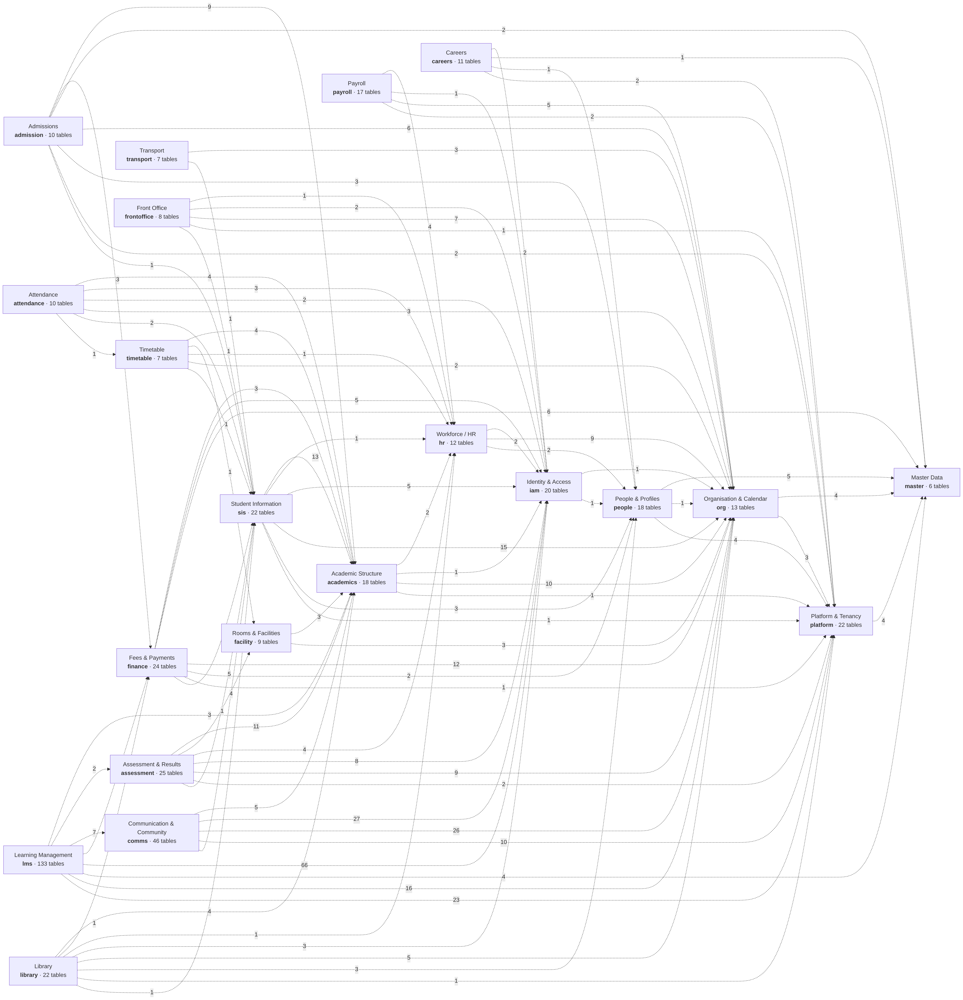

Mermaid source

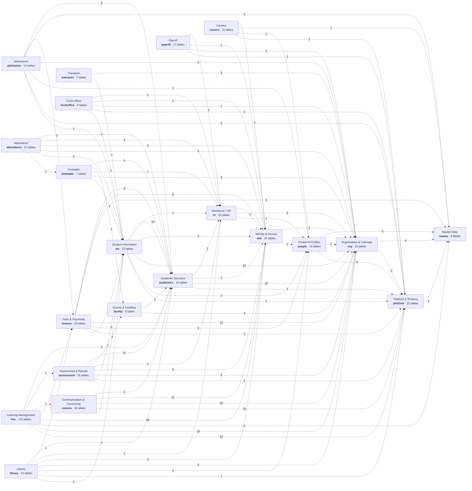
```mermaid
flowchart LR
    master["Master Data<br/><b>master</b> · 6 tables"]
    platform["Platform & Tenancy<br/><b>platform</b> · 22 tables"]
    iam["Identity & Access<br/><b>iam</b> · 20 tables"]
    org["Organisation & Calendar<br/><b>org</b> · 13 tables"]
    people["People & Profiles<br/><b>people</b> · 18 tables"]
    academics["Academic Structure<br/><b>academics</b> · 18 tables"]
    sis["Student Information<br/><b>sis</b> · 22 tables"]
    hr["Workforce / HR<br/><b>hr</b> · 12 tables"]
    payroll["Payroll<br/><b>payroll</b> · 17 tables"]
    admission["Admissions<br/><b>admission</b> · 10 tables"]
    attendance["Attendance<br/><b>attendance</b> · 10 tables"]
    facility["Rooms & Facilities<br/><b>facility</b> · 9 tables"]
    timetable["Timetable<br/><b>timetable</b> · 7 tables"]
    assessment["Assessment & Results<br/><b>assessment</b> · 25 tables"]
    lms["Learning Management<br/><b>lms</b> · 133 tables"]
    finance["Fees & Payments<br/><b>finance</b> · 24 tables"]
    library["Library<br/><b>library</b> · 22 tables"]
    transport["Transport<br/><b>transport</b> · 7 tables"]
    comms["Communication & Community<br/><b>comms</b> · 46 tables"]
    frontoffice["Front Office<br/><b>frontoffice</b> · 8 tables"]
    careers["Careers<br/><b>careers</b> · 11 tables"]
    academics -.->|2| hr
    academics -.->|1| iam
    academics -.->|10| org
    academics -.->|1| platform
    admission -.->|9| academics
    admission -.->|3| finance
    admission -.->|2| master
    admission -.->|6| org
    admission -.->|3| people
    admission -.->|2| platform
    admission -.->|1| sis
    assessment -.->|11| academics
    assessment -.->|1| facility
    assessment -.->|4| hr
    assessment -.->|8| iam
    assessment -.->|9| org
    assessment -.->|2| platform
    assessment -.->|5| sis
    attendance -.->|4| academics
    attendance -.->|3| hr
    attendance -.->|2| iam
    attendance -.->|3| org
    attendance -.->|2| sis
    attendance -.->|1| timetable
    careers -.->|2| iam
    careers -.->|1| master
    careers -.->|1| people
    careers -.->|2| platform
    comms -.->|5| academics
    comms -.->|27| iam
    comms -.->|26| org
    comms -.->|10| platform
    comms -.->|4| sis
    facility -.->|3| academics
    facility -.->|3| org
    finance -.->|3| academics
    finance -.->|5| iam
    finance -.->|6| master
    finance -.->|12| org
    finance -.->|2| people
    finance -.->|1| platform
    finance -.->|6| sis
    frontoffice -.->|1| hr
    frontoffice -.->|2| iam
    frontoffice -.->|7| org
    frontoffice -.->|1| platform
    frontoffice -.->|1| sis
    hr -.->|2| iam
    hr -.->|9| org
    hr -.->|2| people
    iam -.->|1| org
    iam -.->|1| people
    library -.->|4| academics
    library -.->|1| finance
    library -.->|1| hr
    library -.->|3| iam
    library -.->|5| org
    library -.->|3| people
    library -.->|1| platform
    library -.->|1| sis
    lms -.->|3| academics
    lms -.->|2| assessment
    lms -.->|7| comms
    lms -.->|3| finance
    lms -.->|66| iam
    lms -.->|4| master
    lms -.->|16| org
    lms -.->|23| platform
    org -.->|4| master
    org -.->|3| platform
    payroll -.->|4| hr
    payroll -.->|1| iam
    payroll -.->|5| org
    payroll -.->|2| platform
    people -.->|5| master
    people -.->|1| org
    people -.->|4| platform
    platform -.->|4| master
    sis -.->|13| academics
    sis -.->|1| hr
    sis -.->|5| iam
    sis -.->|15| org
    sis -.->|3| people
    sis -.->|1| platform
    timetable -.->|4| academics
    timetable -.->|1| facility
    timetable -.->|1| hr
    timetable -.->|2| org
    timetable -.->|1| sis
    transport -.->|3| org
    transport -.->|1| sis
```

### Master Data

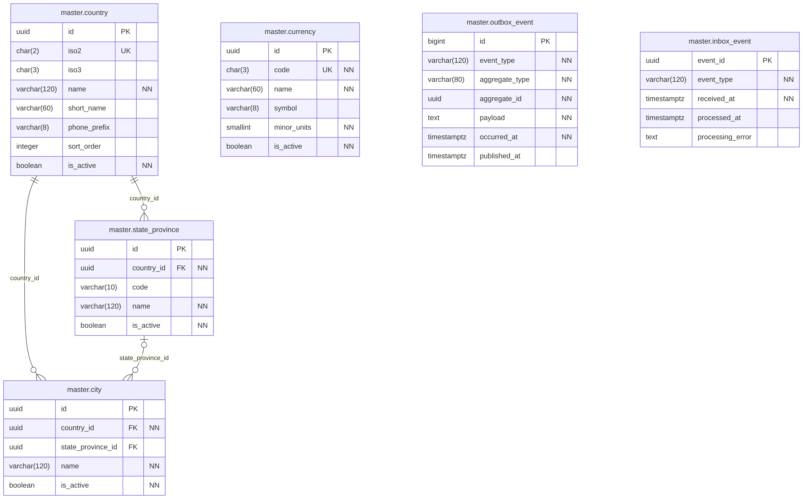

Mermaid source

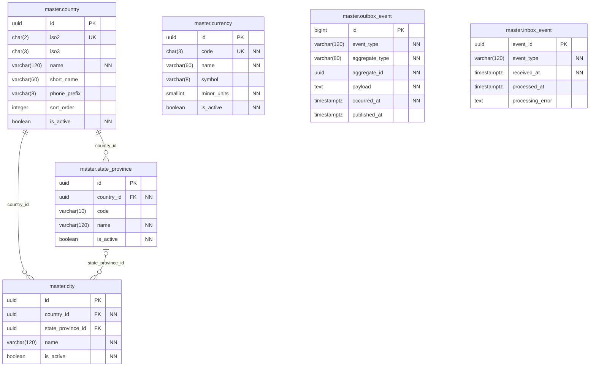
```mermaid
erDiagram
    master__country["master.country"] {
        uuid id PK
        char(2) iso2 UK
        char(3) iso3
        varchar(120) name "NN"
        varchar(60) short_name
        varchar(8) phone_prefix
        integer sort_order
        boolean is_active "NN"
    }
    master__state_province["master.state_province"] {
        uuid id PK
        uuid country_id FK "NN"
        varchar(10) code
        varchar(120) name "NN"
        boolean is_active "NN"
    }
    master__city["master.city"] {
        uuid id PK
        uuid country_id FK "NN"
        uuid state_province_id FK
        varchar(120) name "NN"
        boolean is_active "NN"
    }
    master__currency["master.currency"] {
        uuid id PK
        char(3) code UK "NN"
        varchar(60) name "NN"
        varchar(8) symbol
        smallint minor_units "NN"
        boolean is_active "NN"
    }
    master__outbox_event["master.outbox_event"] {
        bigint id PK
        varchar(120) event_type "NN"
        varchar(80) aggregate_type "NN"
        uuid aggregate_id "NN"
        text payload "NN"
        timestamptz occurred_at "NN"
        timestamptz published_at
    }
    master__inbox_event["master.inbox_event"] {
        uuid event_id PK
        varchar(120) event_type "NN"
        timestamptz received_at "NN"
        timestamptz processed_at
        text processing_error
    }
    master__country ||--o{ master__state_province : "country_id"
    master__country ||--o{ master__city : "country_id"
    master__state_province |o--o{ master__city : "state_province_id"
```

### Platform & Tenancy

Mermaid source

```mermaid
erDiagram
    platform__tenant["platform.tenant"] {
        uuid id PK
        varchar(50) code UK "NN"
        varchar(200) name "NN"
        varchar(200) legal_name
        varchar(30) status "NN"
        varchar(320) primary_email
        varchar(20) primary_phone
        uuid country_id FK "→ master.country (logical)"
        uuid default_currency_id FK "→ master.currency (logical)"
        varchar(64) timezone "NN"
        varchar(10) locale "NN"
    }
    platform__saas_plan["platform.saas_plan"] {
        uuid id PK
        varchar(50) code UK "NN"
        varchar(120) display_name "NN"
        smallint billing_cycle_months "NN"
        numeric price "12,2 · NN"
        uuid currency_id FK "→ master.currency (logical)"
        integer sort_order "NN"
        boolean is_active "NN"
        integer max_members
        integer max_events
        integer max_folders
        integer max_files
        integer max_videos
        integer max_audios
        integer max_bulletins
        integer max_groups
    }
    platform__tenant_subscription["platform.tenant_subscription"] {
        uuid id PK
        uuid institution_id FK "→ org.institution (logical)"
        uuid plan_id FK
        uuid requested_by_user_id FK "NN · → iam.user_account (logical)"
        varchar(30) status "NN"
        date start_date
        date end_date
        integer max_members
        integer max_events
        integer max_folders
        integer max_files
        integer max_videos
        integer max_audios
        integer max_bulletins
        integer max_groups
        numeric price "14,2"
        uuid currency_id FK "→ master.currency (logical)"
        integer billing_cycle_months
        varchar(60) gateway_name
        varchar(120) gateway_txn_ref
        numeric amount_paid "14,2"
        varchar(30) payment_mode
        varchar(40) gateway_status
        varchar(300) gateway_error
        timestamptz paid_at
        varchar(200) payer_name
        varchar(150) payer_email
        varchar(20) payer_phone
        text gateway_raw_response
    }
    platform__file_object["platform.file_object"] {
        uuid id PK
        varchar(50) storage_disk "NN"
        text storage_key "NN"
        bigint storage_generation
        varchar(255) file_name "NN"
        varchar(255) original_name
        varchar(150) mime_type
        bigint size_bytes "NN"
        char(64) checksum_sha256
        varchar(80) owner_entity_type
        uuid owner_entity_id
        varchar(80) collection_name
        integer sort_order
        varchar(30) file_kind
        boolean is_shared "NN"
        varchar(30) processing_status "NN"
        integer processing_attempts "NN"
        text processing_error
        varchar(20) status "NN"
        timestamptz scanned_at
        uuid uploaded_by_user_id FK "→ iam.user_account (logical)"
    }
    platform__entity_attachment["platform.entity_attachment"] {
        uuid id PK
        varchar(80) entity_type "NN"
        uuid entity_id "NN"
        uuid file_id FK "NN"
        integer sort_order "NN"
        varchar(30) purpose "NN"
        varchar(255) title
    }
    platform__tag["platform.tag"] {
        uuid id PK
        varchar(50) tag_type "NN"
        varchar(120) name "NN"
        varchar(140) slug "NN"
        integer sort_order
        varchar(50) code
    }
    platform__tag_assignment["platform.tag_assignment"] {
        uuid id PK
        uuid tag_id FK "NN"
        varchar(80) entity_type "NN"
        uuid entity_id "NN"
    }
    platform__entity_note["platform.entity_note"] {
        uuid id PK
        uuid institution_id FK "NN · → org.institution (logical)"
        varchar(80) entity_type "NN"
        uuid entity_id "NN"
        text note_text "NN"
    }
    platform__audit_log["platform.audit_log"] {
        uuid id PK
        varchar(100) log_name
        text description "NN"
        varchar(50) event
        varchar(80) subject_type
        uuid subject_id
        varchar(80) causer_type
        uuid causer_id
        jsonb properties
        uuid batch_id
        inet ip_address
        timestamptz occurred_at PK
    }
    platform__reserved_keyword["platform.reserved_keyword"] {
        uuid id PK
        varchar(120) keyword UK "NN"
    }
    platform__sales_enquiry["platform.sales_enquiry"] {
        uuid id PK
        varchar(150) contact_name "NN"
        varchar(320) email "NN"
        varchar(20) phone "NN"
        varchar(200) organisation_name "NN"
        varchar(120) designation "NN"
        varchar(60) channel
        text message
        varchar(30) status "NN"
    }
    platform__system_setting["platform.system_setting"] {
        uuid id PK
        varchar(120) setting_key UK "NN"
        varchar(150) name "NN"
        text description
        text value
        varchar(50) input_type "NN"
        boolean is_active "NN"
    }
    platform__theme["platform.theme"] {
        uuid id PK
        varchar(120) name "NN"
        text description
        uuid thumbnail_file_id FK
        uuid thumbnail_alt_file_id FK
    }
    platform__upload_policy["platform.upload_policy"] {
        uuid id PK
        uuid role_id FK "→ iam.role (logical)"
        varchar(60) module_code "NN"
        varchar(60) operation_code
        bigint max_size_bytes
        varchar(500) allowed_extensions
    }
    platform__deletion_log["platform.deletion_log"] {
        uuid id PK
        varchar(80) entity_type "NN"
        uuid entity_id "NN"
        uuid cohort_id FK "→ lms.cohort (logical)"
        timestamptz deleted_at_ts "NN"
    }
    platform__storage_quota["platform.storage_quota"] {
        uuid id PK
        uuid user_id FK "→ iam.user_account (logical)"
        uuid institution_id FK "→ org.institution (logical)"
        bigint quota_bytes "NN"
        bigint used_bytes "NN"
        boolean is_active "NN"
    }
    platform__theme_token["platform.theme_token"] {
        uuid id PK
        uuid theme_id FK "NN"
        varchar(60) token_key "NN"
        varchar(200) value "NN"
    }
    platform__tenant_domain["platform.tenant_domain"] {
        uuid id PK
        varchar(255) host UK "NN"
        boolean is_primary "NN"
        boolean is_verified "NN"
        timestamptz verified_at
    }
    platform__operation["platform.operation"] {
        uuid id PK
        varchar(120) operation_name "NN"
        varchar(80) resource_type
        uuid resource_id
        varchar(20) status "NN"
        smallint progress_percent
        varchar(60) error_code
        varchar(500) error_message
        varchar(80) result_entity_type
        uuid result_entity_id
        uuid started_by_user_id
        timestamptz started_at "NN"
        timestamptz finished_at
    }
    platform__idempotency_key["platform.idempotency_key"] {
        uuid id PK
        uuid idempotency_key "NN"
        uuid user_id
        varchar(120) operation_name "NN"
        varchar(64) request_hash
        smallint response_status
        text response_body
        timestamptz locked_at
        timestamptz completed_at
        timestamptz expires_at "NN"
    }
    platform__outbox_event["platform.outbox_event"] {
        bigint id PK
        varchar(120) event_type "NN"
        varchar(80) aggregate_type "NN"
        uuid aggregate_id "NN"
        text payload "NN"
        timestamptz occurred_at "NN"
        timestamptz published_at
    }
    platform__inbox_event["platform.inbox_event"] {
        uuid event_id PK
        varchar(120) event_type "NN"
        timestamptz received_at "NN"
        timestamptz processed_at
        text processing_error
    }
    platform__saas_plan |o--o{ platform__tenant_subscription : "plan_id"
    platform__file_object ||--o{ platform__entity_attachment : "file_id"
    platform__tag ||--o{ platform__tag_assignment : "tag_id"
    platform__file_object |o--o{ platform__theme : "thumbnail_file_id"
    platform__file_object |o--o{ platform__theme : "thumbnail_alt_file_id"
    platform__theme ||--o{ platform__theme_token : "theme_id"
```

### Identity & Access

Mermaid source

```mermaid
erDiagram
    iam__user_account["iam.user_account"] {
        uuid id PK
        uuid person_id FK "→ people.person (logical)"
        varchar(150) username
        varchar(320) email
        varchar(20) mobile_no
        text password_hash
        varchar(30) status "NN"
        timestamptz email_verified_at
        timestamptz mobile_verified_at
        boolean must_reset_password "NN"
        uuid referred_by_user_id FK
        timestamptz terms_accepted_at
        varchar(10) locale
        varchar(64) timezone
        timestamptz last_login_at
        timestamptz account_expires_at
        integer failed_login_count "NN"
        uuid last_login_role_id FK
        timestamptz registered_at
        date joined_on
        varchar(100) external_ref
        text signature
        boolean use_signature "NN"
        varchar(40) user_type
    }
    iam__role["iam.role"] {
        uuid id PK
        varchar(80) code "NN"
        varchar(120) display_name
        text description
        boolean is_system "NN"
        boolean is_active "NN"
        integer authority_level
        uuid parent_role_id FK
    }
    iam__permission["iam.permission"] {
        uuid id PK
        varchar(120) code UK "NN"
        varchar(150) display_name
        text description
        varchar(50) module_code
        boolean is_navigation "NN"
        boolean is_modifiable "NN"
        boolean applies_to_all_roles "NN"
        boolean is_object_level "NN"
    }
    iam__role_permission["iam.role_permission"] {
        uuid id PK
        uuid role_id FK "NN"
        uuid permission_id FK "NN"
    }
    iam__user_role["iam.user_role"] {
        uuid id PK
        uuid user_id FK "NN"
        uuid role_id FK "NN"
        varchar(30) scope_type "NN"
        uuid scope_id
        date valid_from
        date valid_to
        boolean is_active "NN"
    }
    iam__user_permission["iam.user_permission"] {
        uuid id PK
        uuid user_id FK "NN"
        uuid permission_id FK "NN"
        varchar(30) effect "NN"
    }
    iam__user_department_access["iam.user_department_access"] {
        uuid id PK
        uuid user_id FK "NN"
        uuid department_id FK "NN · → org.department (logical)"
        boolean is_primary "NN"
    }
    iam__auth_token["iam.auth_token"] {
        uuid id PK
        uuid user_id FK "NN"
        varchar(30) token_type "NN"
        varchar(120) name
        char(64) token_hash UK "NN"
        varchar(320) sent_to
        inet ip_address
        timestamptz expires_at
        timestamptz last_used_at
        timestamptz revoked_at
        varchar(100) scopes
    }
    iam__user_device["iam.user_device"] {
        uuid id PK
        uuid user_id FK "NN"
        text device_identifier "NN"
        varchar(30) platform "NN"
        text push_token
        timestamptz last_seen_at
        boolean is_active "NN"
    }
    iam__user_preference["iam.user_preference"] {
        uuid id PK
        uuid user_id FK "NN"
        varchar(100) pref_key "NN"
        varchar(500) pref_value
    }
    iam__user_session["iam.user_session"] {
        uuid id PK
        uuid user_id FK "NN"
        varchar(128) session_ref UK "NN"
        uuid device_id FK
        inet ip_address
        varchar(500) user_agent
        timestamptz started_at "NN"
        timestamptz last_seen_at
        timestamptz ended_at
    }
    iam__mfa_credential["iam.mfa_credential"] {
        uuid id PK
        uuid user_id FK "NN"
        varchar(20) credential_type "NN"
        varchar(100) label
        text secret_enc "NN"
        timestamptz verified_at
        timestamptz last_used_at
        boolean is_active "NN"
    }
    iam__legacy_credential["iam.legacy_credential"] {
        uuid id PK
        uuid user_id FK,UK "NN"
        varchar(30) algorithm "NN"
        text password_hash "NN"
        varchar(120) salt
        timestamptz migrated_at
    }
    iam__outbox_event["iam.outbox_event"] {
        bigint id PK
        varchar(120) event_type "NN"
        varchar(80) aggregate_type "NN"
        uuid aggregate_id "NN"
        text payload "NN"
        timestamptz occurred_at "NN"
        timestamptz published_at
    }
    iam__inbox_event["iam.inbox_event"] {
        uuid event_id PK
        varchar(120) event_type "NN"
        timestamptz received_at "NN"
        timestamptz processed_at
        text processing_error
    }
    iam__idempotency_key["iam.idempotency_key"] {
        uuid id PK
        uuid idempotency_key "NN"
        uuid user_id
        varchar(120) operation_name "NN"
        varchar(64) request_hash
        smallint response_status
        text response_body
        timestamptz locked_at
        timestamptz completed_at
        timestamptz expires_at "NN"
    }
    iam__operation["iam.operation"] {
        uuid id PK
        varchar(120) operation_name "NN"
        varchar(80) resource_type
        uuid resource_id
        varchar(20) status "NN"
        smallint progress_percent
        varchar(60) error_code
        varchar(500) error_message
        varchar(80) result_entity_type
        uuid result_entity_id
        uuid started_by_user_id
        timestamptz started_at "NN"
        timestamptz finished_at
    }
    iam__setting_definition["iam.setting_definition"] {
        uuid id PK
        varchar(100) setting_key UK "NN"
        varchar(60) category "NN"
        varchar(20) value_type "NN"
        varchar(60) allowed_values
        integer min_value
        integer max_value
        varchar(500) default_value
        varchar(20) allowed_scopes "NN"
        boolean user_editable "NN"
        text description
        integer sort_order "NN"
    }
    iam__setting_value["iam.setting_value"] {
        uuid id PK
        varchar(20) scope_type "NN"
        uuid scope_id
        varchar(100) setting_key FK "NN"
        varchar(500) value "NN"
        boolean is_locked "NN"
    }
    iam__tenant_directory["iam.tenant_directory"] {
        varchar(60) tenant_code UK "NN"
        varchar(20) status "NN"
        timestamptz synced_at "NN"
    }
    iam__user_account |o--o{ iam__user_account : "referred_by_user_id"
    iam__role |o--o{ iam__user_account : "last_login_role_id"
    iam__role |o--o{ iam__role : "parent_role_id"
    iam__role ||--o{ iam__role_permission : "role_id"
    iam__permission ||--o{ iam__role_permission : "permission_id"
    iam__user_account ||--o{ iam__user_role : "user_id"
    iam__role ||--o{ iam__user_role : "role_id"
    iam__user_account ||--o{ iam__user_permission : "user_id"
    iam__permission ||--o{ iam__user_permission : "permission_id"
    iam__user_account ||--o{ iam__user_department_access : "user_id"
    iam__user_account ||--o{ iam__auth_token : "user_id"
    iam__user_account ||--o{ iam__user_device : "user_id"
    iam__user_account ||--o{ iam__user_preference : "user_id"
    iam__user_account ||--o{ iam__user_session : "user_id"
    iam__user_device |o--o{ iam__user_session : "device_id"
    iam__user_account ||--o{ iam__mfa_credential : "user_id"
    iam__user_account ||--o| iam__legacy_credential : "user_id"
    iam__setting_definition ||--o{ iam__setting_value : "setting_key"
```

### Organisation & Calendar

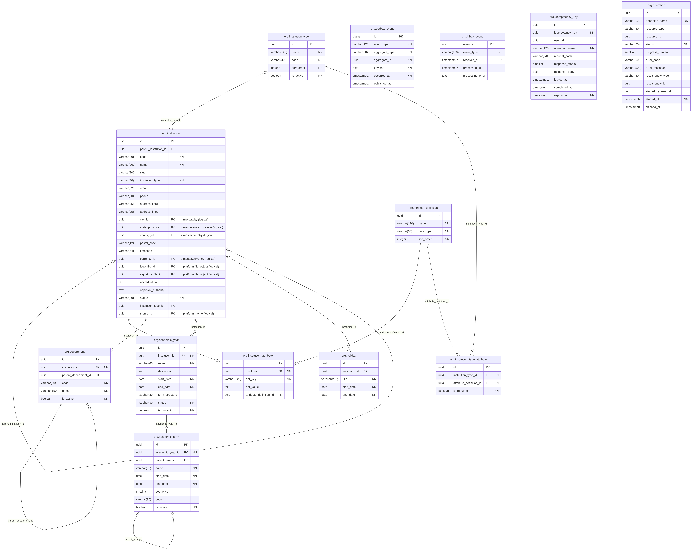

Mermaid source

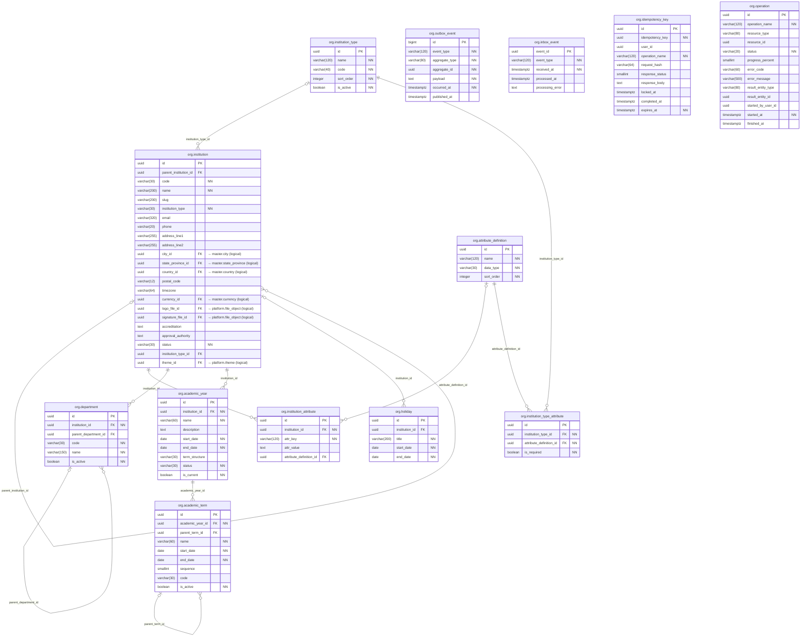
```mermaid
erDiagram
    org__institution["org.institution"] {
        uuid id PK
        uuid parent_institution_id FK
        varchar(30) code "NN"
        varchar(200) name "NN"
        varchar(200) slug
        varchar(30) institution_type "NN"
        varchar(320) email
        varchar(20) phone
        varchar(255) address_line1
        varchar(255) address_line2
        uuid city_id FK "→ master.city (logical)"
        uuid state_province_id FK "→ master.state_province (logical)"
        uuid country_id FK "→ master.country (logical)"
        varchar(12) postal_code
        varchar(64) timezone
        uuid currency_id FK "→ master.currency (logical)"
        uuid logo_file_id FK "→ platform.file_object (logical)"
        uuid signature_file_id FK "→ platform.file_object (logical)"
        text accreditation
        text approval_authority
        varchar(30) status "NN"
        uuid institution_type_id FK
        uuid theme_id FK "→ platform.theme (logical)"
    }
    org__institution_attribute["org.institution_attribute"] {
        uuid id PK
        uuid institution_id FK "NN"
        varchar(120) attr_key "NN"
        text attr_value
        uuid attribute_definition_id FK
    }
    org__department["org.department"] {
        uuid id PK
        uuid institution_id FK "NN"
        uuid parent_department_id FK
        varchar(30) code "NN"
        varchar(150) name "NN"
        boolean is_active "NN"
    }
    org__academic_year["org.academic_year"] {
        uuid id PK
        uuid institution_id FK "NN"
        varchar(60) name "NN"
        text description
        date start_date "NN"
        date end_date "NN"
        varchar(30) term_structure
        varchar(30) status "NN"
        boolean is_current "NN"
    }
    org__academic_term["org.academic_term"] {
        uuid id PK
        uuid academic_year_id FK "NN"
        uuid parent_term_id FK
        varchar(60) name "NN"
        date start_date "NN"
        date end_date "NN"
        smallint sequence
        varchar(30) code
        boolean is_active "NN"
    }
    org__institution_type["org.institution_type"] {
        uuid id PK
        varchar(120) name "NN"
        varchar(40) code "NN"
        integer sort_order "NN"
        boolean is_active "NN"
    }
    org__attribute_definition["org.attribute_definition"] {
        uuid id PK
        varchar(120) name "NN"
        varchar(30) data_type "NN"
        integer sort_order "NN"
    }
    org__institution_type_attribute["org.institution_type_attribute"] {
        uuid id PK
        uuid institution_type_id FK "NN"
        uuid attribute_definition_id FK "NN"
        boolean is_required "NN"
    }
    org__holiday["org.holiday"] {
        uuid id PK
        uuid institution_id FK
        varchar(200) title "NN"
        date start_date "NN"
        date end_date "NN"
    }
    org__outbox_event["org.outbox_event"] {
        bigint id PK
        varchar(120) event_type "NN"
        varchar(80) aggregate_type "NN"
        uuid aggregate_id "NN"
        text payload "NN"
        timestamptz occurred_at "NN"
        timestamptz published_at
    }
    org__inbox_event["org.inbox_event"] {
        uuid event_id PK
        varchar(120) event_type "NN"
        timestamptz received_at "NN"
        timestamptz processed_at
        text processing_error
    }
    org__idempotency_key["org.idempotency_key"] {
        uuid id PK
        uuid idempotency_key "NN"
        uuid user_id
        varchar(120) operation_name "NN"
        varchar(64) request_hash
        smallint response_status
        text response_body
        timestamptz locked_at
        timestamptz completed_at
        timestamptz expires_at "NN"
    }
    org__operation["org.operation"] {
        uuid id PK
        varchar(120) operation_name "NN"
        varchar(80) resource_type
        uuid resource_id
        varchar(20) status "NN"
        smallint progress_percent
        varchar(60) error_code
        varchar(500) error_message
        varchar(80) result_entity_type
        uuid result_entity_id
        uuid started_by_user_id
        timestamptz started_at "NN"
        timestamptz finished_at
    }
    org__institution |o--o{ org__institution : "parent_institution_id"
    org__institution_type |o--o{ org__institution : "institution_type_id"
    org__institution ||--o{ org__institution_attribute : "institution_id"
    org__attribute_definition |o--o{ org__institution_attribute : "attribute_definition_id"
    org__institution ||--o{ org__department : "institution_id"
    org__department |o--o{ org__department : "parent_department_id"
    org__institution ||--o{ org__academic_year : "institution_id"
    org__academic_year ||--o{ org__academic_term : "academic_year_id"
    org__academic_term |o--o{ org__academic_term : "parent_term_id"
    org__institution_type ||--o{ org__institution_type_attribute : "institution_type_id"
    org__attribute_definition ||--o{ org__institution_type_attribute : "attribute_definition_id"
    org__institution |o--o{ org__holiday : "institution_id"
```

### People & Profiles

Mermaid source

```mermaid
erDiagram
    people__honorific["people.honorific"] {
        uuid id PK
        varchar(40) name "NN"
        varchar(10) shortcut
        varchar(40) code "NN"
        integer sort_order "NN"
        boolean is_active "NN"
    }
    people__person["people.person"] {
        uuid id PK
        uuid honorific_id FK
        varchar(100) first_name
        varchar(100) middle_name
        varchar(100) last_name
        varchar(255) display_name "NN"
        date date_of_birth
        varchar(30) gender
        varchar(30) blood_group
        varchar(30) marital_status
        varchar(120) birth_place
        varchar(120) native_place
        uuid nationality_country_id FK "→ master.country (logical)"
        varchar(60) mother_tongue
        varchar(60) religion
        varchar(30) social_category
        varchar(60) social_sub_category
        varchar(30) national_id_type
        text national_id_enc
        varchar(100) visa_info
        varchar(320) primary_email
        varchar(20) primary_phone
        varchar(20) alternate_phone
        uuid photo_file_id FK "→ platform.file_object (logical)"
        text remarks
        varchar(30) work_phone
        varchar(500) website_url
        text about_me
    }
    people__person_address["people.person_address"] {
        uuid id PK
        uuid person_id FK "NN"
        varchar(30) address_type "NN"
        varchar(255) line1
        varchar(255) line2
        uuid city_id FK "→ master.city (logical)"
        varchar(120) city_name
        uuid state_province_id FK "→ master.state_province (logical)"
        uuid country_id FK "→ master.country (logical)"
        varchar(12) postal_code
        boolean is_primary "NN"
        varchar(100) state_name
        integer sort_order "NN"
    }
    people__emergency_contact["people.emergency_contact"] {
        uuid id PK
        uuid person_id FK "NN"
        uuid contact_person_id FK
        varchar(150) contact_name
        varchar(60) relationship
        varchar(20) phone
        smallint priority "NN"
    }
    people__qualification["people.qualification"] {
        uuid id PK
        varchar(120) name "NN"
        varchar(30) level "NN"
        boolean is_active "NN"
        varchar(40) code "NN"
        integer sort_order "NN"
    }
    people__education_history["people.education_history"] {
        uuid id PK
        uuid person_id FK "NN"
        uuid qualification_id FK
        varchar(200) institution_name "NN"
        varchar(150) location
        varchar(120) degree_type
        varchar(120) major
        varchar(30) grade_type
        varchar(30) grade
        date start_date
        date end_date
        varchar(200) certification
        varchar(200) minor
        varchar(30) study_mode
        integer sort_order "NN"
    }
    people__work_experience["people.work_experience"] {
        uuid id PK
        uuid person_id FK "NN"
        varchar(30) experience_type "NN"
        varchar(150) title "NN"
        varchar(200) company "NN"
        varchar(150) location "NN"
        date from_date "NN"
        date to_date
        boolean is_current "NN"
        text description
        varchar(500) company_website
        varchar(150) industry
        text responsibilities
        integer sort_order "NN"
    }
    people__certification["people.certification"] {
        uuid id PK
        uuid person_id FK "NN"
        varchar(200) name "NN"
        varchar(200) issuing_organization "NN"
        date issue_date "NN"
        boolean expires "NN"
        date expiration_date
        text description
    }
    people__skill["people.skill"] {
        uuid id PK
        varchar(120) name "NN"
        varchar(40) code "NN"
        integer sort_order "NN"
        boolean is_active "NN"
    }
    people__person_skill["people.person_skill"] {
        uuid id PK
        uuid person_id FK "NN"
        uuid skill_id FK "NN"
    }
    people__person_document["people.person_document"] {
        uuid id PK
        uuid person_id FK "NN"
        uuid institution_id FK "→ org.institution (logical)"
        varchar(30) document_type "NN"
        varchar(200) name "NN"
        uuid file_id FK "NN · → platform.file_object (logical)"
        integer document_version "NN"
        varchar(30) status "NN"
    }
    people__public_profile["people.public_profile"] {
        uuid id PK
        uuid person_id FK "NN"
        varchar(200) headline
        varchar(120) profession
        varchar(30) persona_category
        uuid cover_image_file_id FK "→ platform.file_object (logical)"
        varchar(120) city
        uuid country_id FK "→ master.country (logical)"
        varchar(200) college
        varchar(120) branch
        varchar(500) linkedin_url
        varchar(500) github_url
        varchar(500) twitter_url
        varchar(500) medium_url
        boolean hide_private_info "NN"
    }
    people__person_social_link["people.person_social_link"] {
        uuid id PK
        uuid person_id FK "NN"
        varchar(30) network "NN"
        varchar(255) handle "NN"
        integer sort_order "NN"
    }
    people__consent_record["people.consent_record"] {
        uuid id PK
        uuid person_id FK "NN"
        uuid given_by_person_id FK "NN"
        varchar(30) purpose "NN"
        varchar(30) policy_version "NN"
        timestamptz granted_at "NN"
        timestamptz withdrawn_at
        varchar(30) channel "NN"
        uuid recorded_by_user_id FK "→ iam.user_account (logical)"
        uuid evidence_file_id FK "→ platform.file_object (logical)"
        inet ip_address
    }
    people__outbox_event["people.outbox_event"] {
        bigint id PK
        varchar(120) event_type "NN"
        varchar(80) aggregate_type "NN"
        uuid aggregate_id "NN"
        text payload "NN"
        timestamptz occurred_at "NN"
        timestamptz published_at
    }
    people__inbox_event["people.inbox_event"] {
        uuid event_id PK
        varchar(120) event_type "NN"
        timestamptz received_at "NN"
        timestamptz processed_at
        text processing_error
    }
    people__idempotency_key["people.idempotency_key"] {
        uuid id PK
        uuid idempotency_key "NN"
        uuid user_id
        varchar(120) operation_name "NN"
        varchar(64) request_hash
        smallint response_status
        text response_body
        timestamptz locked_at
        timestamptz completed_at
        timestamptz expires_at "NN"
    }
    people__operation["people.operation"] {
        uuid id PK
        varchar(120) operation_name "NN"
        varchar(80) resource_type
        uuid resource_id
        varchar(20) status "NN"
        smallint progress_percent
        varchar(60) error_code
        varchar(500) error_message
        varchar(80) result_entity_type
        uuid result_entity_id
        uuid started_by_user_id
        timestamptz started_at "NN"
        timestamptz finished_at
    }
    people__honorific |o--o{ people__person : "honorific_id"
    people__person ||--o{ people__person_address : "person_id"
    people__person ||--o{ people__emergency_contact : "person_id"
    people__person |o--o{ people__emergency_contact : "contact_person_id"
    people__person ||--o{ people__education_history : "person_id"
    people__qualification |o--o{ people__education_history : "qualification_id"
    people__person ||--o{ people__work_experience : "person_id"
    people__person ||--o{ people__certification : "person_id"
    people__person ||--o{ people__person_skill : "person_id"
    people__skill ||--o{ people__person_skill : "skill_id"
    people__person ||--o{ people__person_document : "person_id"
    people__person ||--o{ people__public_profile : "person_id"
    people__person ||--o{ people__person_social_link : "person_id"
    people__person ||--o{ people__consent_record : "person_id"
    people__person ||--o{ people__consent_record : "given_by_person_id"
```

### Academic Structure

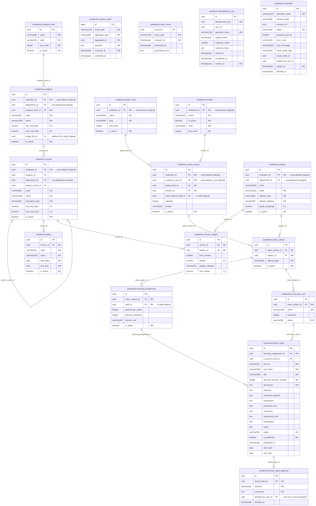

Mermaid source

```mermaid
erDiagram
    academics__program_level["academics.program_level"] {
        uuid id PK
        varchar(80) name "NN"
        varchar(40) code "NN"
        integer sort_order "NN"
        boolean is_active "NN"
    }
    academics__program["academics.program"] {
        uuid id PK
        uuid institution_id FK "NN · → org.institution (logical)"
        uuid department_id FK "→ org.department (logical)"
        uuid program_level_id FK "NN"
        varchar(30) code "NN"
        varchar(200) name "NN"
        numeric min_unit_load "6,2"
        numeric max_unit_load "6,2"
        uuid image_file_id FK "→ platform.file_object (logical)"
        boolean is_active "NN"
    }
    academics__course["academics.course"] {
        uuid id PK
        uuid institution_id FK "NN · → org.institution (logical)"
        uuid program_id FK
        uuid department_id FK "→ org.department (logical)"
        uuid parent_course_id FK
        varchar(30) code "NN"
        varchar(200) name "NN"
        varchar(30) evaluation_type "NN"
        numeric min_unit_load "6,2"
        numeric max_unit_load "6,2"
        boolean is_active "NN"
    }
    academics__batch["academics.batch"] {
        uuid id PK
        uuid course_id FK "NN"
        varchar(30) code "NN"
        varchar(150) name "NN"
        date start_date "NN"
        date end_date "NN"
        boolean is_active "NN"
    }
    academics__grade_level["academics.grade_level"] {
        uuid id PK
        uuid institution_id FK "NN · → org.institution (logical)"
        varchar(60) name "NN"
        varchar(60) slug "NN"
        integer sort_order
        boolean is_active "NN"
    }
    academics__section["academics.section"] {
        uuid id PK
        uuid institution_id FK "NN · → org.institution (logical)"
        varchar(30) name "NN"
        boolean is_active "NN"
        varchar(40) code "NN"
        integer sort_order "NN"
    }
    academics__class_section["academics.class_section"] {
        uuid id PK
        uuid institution_id FK "NN · → org.institution (logical)"
        uuid academic_year_id FK "NN · → org.academic_year (logical)"
        uuid grade_level_id FK "NN"
        uuid section_id FK "NN"
        uuid class_teacher_staff_id FK "→ hr.staff (logical)"
        integer capacity
        varchar(60) stream
        boolean is_active "NN"
    }
    academics__subject["academics.subject"] {
        uuid id PK
        uuid institution_id FK "NN · → org.institution (logical)"
        uuid department_id FK "→ org.department (logical)"
        varchar(256) code
        varchar(150) name "NN"
        varchar(30) delivery_type "NN"
        varchar(30) default_category "NN"
        numeric grade_weightage "6,2"
        boolean is_active "NN"
    }
    academics__course_subject["academics.course_subject"] {
        uuid id PK
        uuid course_id FK "NN"
        uuid subject_id FK "NN"
        smallint term_number
        numeric credits "5,2"
        varchar(30) subject_category
        numeric max_marks "7,2"
    }
    academics__class_subject["academics.class_subject"] {
        uuid id PK
        uuid class_section_id FK "NN"
        uuid subject_id FK "NN"
        varchar(30) offering_type "NN"
        boolean is_active "NN"
    }
    academics__teacher_subject["academics.teacher_subject"] {
        uuid id PK
        uuid staff_id FK "NN · → hr.staff (logical)"
        uuid subject_id FK "NN"
    }
    academics__teaching_assignment["academics.teaching_assignment"] {
        uuid id PK
        uuid class_subject_id FK "NN"
        uuid staff_id FK "NN · → hr.staff (logical)"
        integer periods_per_week
        integer periods_remaining
        varchar(40) teacher_role
        boolean is_active "NN"
    }
    academics__curriculum_unit["academics.curriculum_unit"] {
        uuid id PK
        uuid class_subject_id FK "NN"
        varchar(200) name "NN"
        integer sequence
        varchar(30) status "NN"
    }
    academics__lesson_plan["academics.lesson_plan"] {
        uuid id PK
        uuid teaching_assignment_id FK "NN"
        uuid curriculum_unit_id FK
        varchar(20) unit_no "NN"
        varchar(200) unit_name "NN"
        varchar(200) title "NN"
        integer planned_duration_minutes "NN"
        text description "NN"
        text objective
        text materials_required
        text introduction
        text procedure_text
        text conclusion
        text assessment_text
        text modification
        text notes
        varchar(30) status "NN"
        boolean is_published "NN"
        timestamptz published_at
        date start_date
        date end_date
    }
    academics__lesson_plan_approval["academics.lesson_plan_approval"] {
        uuid id PK
        uuid lesson_plan_id FK "NN"
        varchar(30) decision "NN"
        text comments "NN"
        uuid decided_by_user_id FK "→ iam.user_account (logical)"
        timestamptz decided_at
    }
    academics__outbox_event["academics.outbox_event"] {
        bigint id PK
        varchar(120) event_type "NN"
        varchar(80) aggregate_type "NN"
        uuid aggregate_id "NN"
        text payload "NN"
        timestamptz occurred_at "NN"
        timestamptz published_at
    }
    academics__inbox_event["academics.inbox_event"] {
        uuid event_id PK
        varchar(120) event_type "NN"
        timestamptz received_at "NN"
        timestamptz processed_at
        text processing_error
    }
    academics__idempotency_key["academics.idempotency_key"] {
        uuid id PK
        uuid idempotency_key "NN"
        uuid user_id
        varchar(120) operation_name "NN"
        varchar(64) request_hash
        smallint response_status
        text response_body
        timestamptz locked_at
        timestamptz completed_at
        timestamptz expires_at "NN"
    }
    academics__operation["academics.operation"] {
        uuid id PK
        varchar(120) operation_name "NN"
        varchar(80) resource_type
        uuid resource_id
        varchar(20) status "NN"
        smallint progress_percent
        varchar(60) error_code
        varchar(500) error_message
        varchar(80) result_entity_type
        uuid result_entity_id
        uuid started_by_user_id
        timestamptz started_at "NN"
        timestamptz finished_at
    }
    academics__program_level ||--o{ academics__program : "program_level_id"
    academics__program |o--o{ academics__course : "program_id"
    academics__course |o--o{ academics__course : "parent_course_id"
    academics__course ||--o{ academics__batch : "course_id"
    academics__grade_level ||--o{ academics__class_section : "grade_level_id"
    academics__section ||--o{ academics__class_section : "section_id"
    academics__course ||--o{ academics__course_subject : "course_id"
    academics__subject ||--o{ academics__course_subject : "subject_id"
    academics__class_section ||--o{ academics__class_subject : "class_section_id"
    academics__subject ||--o{ academics__class_subject : "subject_id"
    academics__subject ||--o{ academics__teacher_subject : "subject_id"
    academics__class_subject ||--o{ academics__teaching_assignment : "class_subject_id"
    academics__class_subject ||--o{ academics__curriculum_unit : "class_subject_id"
    academics__teaching_assignment ||--o{ academics__lesson_plan : "teaching_assignment_id"
    academics__curriculum_unit |o--o{ academics__lesson_plan : "curriculum_unit_id"
    academics__lesson_plan ||--o{ academics__lesson_plan_approval : "lesson_plan_id"
```

### Student Information

Mermaid source

```mermaid
erDiagram
    sis__student_category["sis.student_category"] {
        uuid id PK
        uuid institution_id FK "NN · → org.institution (logical)"
        varchar(30) code "NN"
        varchar(120) name "NN"
        integer sort_order "NN"
        boolean is_active "NN"
    }
    sis__student["sis.student"] {
        uuid id PK
        uuid person_id FK "NN · → people.person (logical)"
        uuid user_id FK "→ iam.user_account (logical)"
        uuid institution_id FK "NN · → org.institution (logical)"
        varchar(30) admission_number
        date admission_date
        date joining_date
        uuid student_category_id FK
        varchar(40) government_student_id
        varchar(40) bonafide_certificate_number
        varchar(30) status "NN"
        date exit_date
        text exit_reason
    }
    sis__guardian["sis.guardian"] {
        uuid id PK
        uuid person_id FK "NN · → people.person (logical)"
        uuid user_id FK "→ iam.user_account (logical)"
        varchar(30) profession
        varchar(120) sub_occupation
        varchar(120) designation
        varchar(200) organization_name
        numeric annual_income "14,2"
        uuid qualification_id FK "→ people.qualification (logical)"
        varchar(20) mobile
        varchar(320) email
    }
    sis__relationship_type["sis.relationship_type"] {
        uuid id PK
        varchar(60) name "NN"
        varchar(40) code "NN"
        integer sort_order "NN"
        boolean is_active "NN"
    }
    sis__student_guardian["sis.student_guardian"] {
        uuid id PK
        uuid student_id FK "NN"
        uuid guardian_id FK "NN"
        uuid relationship_type_id FK
        boolean is_primary_contact "NN"
        boolean receives_communication "NN"
        boolean can_pick_up "NN"
        varchar(30) status "NN"
        boolean is_legal_guardian "NN"
        boolean has_custody "NN"
    }
    sis__student_sibling["sis.student_sibling"] {
        uuid id PK
        uuid student_id FK "NN"
        uuid sibling_student_id FK
        varchar(150) sibling_name
        text details
    }
    sis__student_enrollment["sis.student_enrollment"] {
        uuid id PK
        uuid student_id FK "NN"
        uuid academic_year_id FK "NN · → org.academic_year (logical)"
        uuid class_section_id FK "→ academics.class_section (logical)"
        varchar(20) roll_number
        varchar(40) id_card_number
        varchar(40) board_registration_number
        varchar(30) enrollment_status "NN"
        varchar(30) result_status "NN"
        date enrolled_on
        date left_on
        date effective_from
        date effective_to
        uuid previous_enrollment_id FK
        varchar(30) change_reason "NN"
    }
    sis__program_enrollment["sis.program_enrollment"] {
        uuid id PK
        uuid student_id FK "NN"
        uuid course_id FK "NN · → academics.course (logical)"
        uuid batch_id FK "→ academics.batch (logical)"
        uuid academic_year_id FK "→ org.academic_year (logical)"
        uuid academic_term_id FK "→ org.academic_term (logical)"
        varchar(20) roll_number
        varchar(30) status "NN"
    }
    sis__program_enrollment_subject["sis.program_enrollment_subject"] {
        uuid id PK
        uuid program_enrollment_id FK "NN"
        uuid subject_id FK "NN · → academics.subject (logical)"
    }
    sis__subject_registration["sis.subject_registration"] {
        uuid id PK
        uuid student_id FK "NN"
        uuid course_id FK "NN · → academics.course (logical)"
        uuid batch_id FK "→ academics.batch (logical)"
        varchar(40) reference_no
        varchar(30) status "NN"
        numeric min_unit_load "6,2"
        numeric max_unit_load "6,2"
        boolean read_by_student "NN"
        boolean read_by_guardian "NN"
        uuid academic_year_id FK "NN · → org.academic_year (logical)"
        uuid academic_term_id FK "→ org.academic_term (logical)"
        uuid program_enrollment_id FK "NN"
    }
    sis__subject_registration_line["sis.subject_registration_line"] {
        uuid id PK
        uuid subject_registration_id FK "NN"
        uuid subject_id FK "NN · → academics.subject (logical)"
        varchar(30) selection_type "NN"
        uuid course_subject_id FK "NN · → academics.course_subject (logical)"
    }
    sis__promotion["sis.promotion"] {
        uuid id PK
        uuid student_id FK "NN"
        uuid institution_id FK "NN · → org.institution (logical)"
        uuid from_academic_year_id FK "NN · → org.academic_year (logical)"
        uuid from_grade_level_id FK "NN · → academics.grade_level (logical)"
        uuid from_section_id FK "→ academics.section (logical)"
        uuid to_academic_year_id FK "→ org.academic_year (logical)"
        uuid to_grade_level_id FK "→ academics.grade_level (logical)"
        uuid to_section_id FK "→ academics.section (logical)"
        uuid based_on_exam_session_id FK "→ assessment.exam_session (logical)"
        text remarks
        varchar(30) status "NN"
    }
    sis__student_health_record["sis.student_health_record"] {
        uuid id PK
        uuid student_id FK "NN"
        uuid academic_year_id FK "→ org.academic_year (logical)"
        numeric height_cm "5,2"
        numeric weight_kg "5,2"
        text medical_conditions
        text medication_needs
        text medication_allergies
        text food_allergies
        text other_allergies
        text other_medical_info
    }
    sis__discipline_incident["sis.discipline_incident"] {
        uuid id PK
        uuid institution_id FK "NN · → org.institution (logical)"
        uuid academic_year_id FK "NN · → org.academic_year (logical)"
        uuid class_section_id FK "→ academics.class_section (logical)"
        uuid student_id FK "NN"
        timestamptz incident_at "NN"
        uuid reported_by_user_id FK "NN · → iam.user_account (logical)"
        varchar(30) incident_type "NN"
        text details "NN"
        text response
        boolean action_taken "NN"
        varchar(30) evidence_media_type
        uuid evidence_file_id FK "→ platform.file_object (logical)"
        boolean notify_guardians "NN"
        boolean seen_by_guardian "NN"
    }
    sis__activity_type["sis.activity_type"] {
        uuid id PK
        varchar(120) name "NN"
        boolean is_active "NN"
        varchar(40) code "NN"
        integer sort_order "NN"
    }
    sis__student_activity["sis.student_activity"] {
        uuid id PK
        uuid student_id FK "NN"
        uuid staff_id FK "→ hr.staff (logical)"
        uuid activity_type_id FK
        date activity_date
        text description
    }
    sis__student_leave_request["sis.student_leave_request"] {
        uuid id PK
        uuid student_id FK "NN"
        uuid academic_year_id FK "→ org.academic_year (logical)"
        date from_date "NN"
        date to_date "NN"
        varchar(20) day_part "NN"
        varchar(500) reason
        varchar(20) status "NN"
        uuid requested_by_user_id FK "→ iam.user_account (logical)"
        uuid decided_by_user_id FK "→ iam.user_account (logical)"
        timestamptz decided_at
        varchar(300) decision_note
    }
    sis__outbox_event["sis.outbox_event"] {
        bigint id PK
        varchar(120) event_type "NN"
        varchar(80) aggregate_type "NN"
        uuid aggregate_id "NN"
        text payload "NN"
        timestamptz occurred_at "NN"
        timestamptz published_at
    }
    sis__inbox_event["sis.inbox_event"] {
        uuid event_id PK
        varchar(120) event_type "NN"
        timestamptz received_at "NN"
        timestamptz processed_at
        text processing_error
    }
    sis__idempotency_key["sis.idempotency_key"] {
        uuid id PK
        uuid idempotency_key "NN"
        uuid user_id
        varchar(120) operation_name "NN"
        varchar(64) request_hash
        smallint response_status
        text response_body
        timestamptz locked_at
        timestamptz completed_at
        timestamptz expires_at "NN"
    }
    sis__operation["sis.operation"] {
        uuid id PK
        varchar(120) operation_name "NN"
        varchar(80) resource_type
        uuid resource_id
        varchar(20) status "NN"
        smallint progress_percent
        varchar(60) error_code
        varchar(500) error_message
        varchar(80) result_entity_type
        uuid result_entity_id
        uuid started_by_user_id
        timestamptz started_at "NN"
        timestamptz finished_at
    }
    sis__number_sequence["sis.number_sequence"] {
        uuid id PK
        uuid institution_id FK "→ org.institution (logical)"
        varchar(40) sequence_code "NN"
        varchar(20) period_key "NN"
        varchar(20) prefix
        smallint padding "NN"
        bigint next_value "NN"
    }
    sis__student_category |o--o{ sis__student : "student_category_id"
    sis__student ||--o{ sis__student_guardian : "student_id"
    sis__guardian ||--o{ sis__student_guardian : "guardian_id"
    sis__relationship_type |o--o{ sis__student_guardian : "relationship_type_id"
    sis__student ||--o{ sis__student_sibling : "student_id"
    sis__student |o--o{ sis__student_sibling : "sibling_student_id"
    sis__student ||--o{ sis__student_enrollment : "student_id"
    sis__student ||--o{ sis__program_enrollment : "student_id"
    sis__program_enrollment ||--o{ sis__program_enrollment_subject : "program_enrollment_id"
    sis__student ||--o{ sis__subject_registration : "student_id"
    sis__subject_registration ||--o{ sis__subject_registration_line : "subject_registration_id"
    sis__student ||--o{ sis__promotion : "student_id"
    sis__student ||--o{ sis__student_health_record : "student_id"
    sis__student ||--o{ sis__discipline_incident : "student_id"
    sis__student ||--o{ sis__student_activity : "student_id"
    sis__activity_type |o--o{ sis__student_activity : "activity_type_id"
    sis__student ||--o{ sis__student_leave_request : "student_id"
    sis__program_enrollment ||--o{ sis__subject_registration : "program_enrollment_id"
    sis__student_enrollment |o--o{ sis__student_enrollment : "previous_enrollment_id"
```

### Workforce / HR

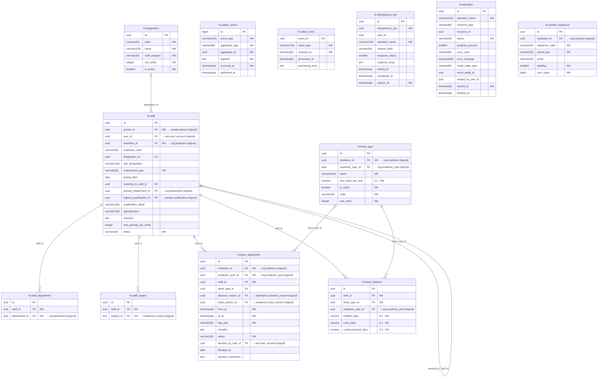

Mermaid source

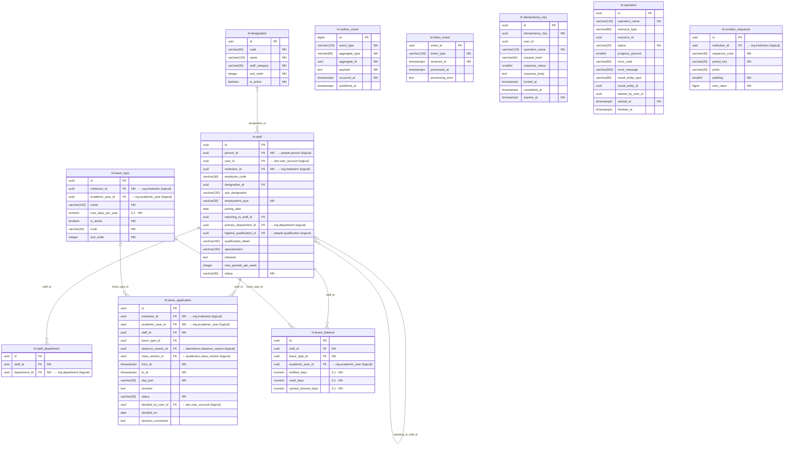
```mermaid
erDiagram
    hr__designation["hr.designation"] {
        uuid id PK
        varchar(60) code "NN"
        varchar(120) name "NN"
        varchar(30) staff_category "NN"
        integer sort_order "NN"
        boolean is_active "NN"
    }
    hr__staff["hr.staff"] {
        uuid id PK
        uuid person_id FK "NN · → people.person (logical)"
        uuid user_id FK "→ iam.user_account (logical)"
        uuid institution_id FK "NN · → org.institution (logical)"
        varchar(30) employee_code
        uuid designation_id FK
        varchar(120) sub_designation
        varchar(30) employment_type "NN"
        date joining_date
        uuid reporting_to_staff_id FK
        uuid primary_department_id FK "→ org.department (logical)"
        uuid highest_qualification_id FK "→ people.qualification (logical)"
        varchar(150) qualification_detail
        varchar(150) specialization
        text interests
        integer max_periods_per_week
        varchar(30) status "NN"
    }
    hr__staff_department["hr.staff_department"] {
        uuid id PK
        uuid staff_id FK "NN"
        uuid department_id FK "NN · → org.department (logical)"
    }
    hr__leave_type["hr.leave_type"] {
        uuid id PK
        uuid institution_id FK "NN · → org.institution (logical)"
        uuid academic_year_id FK "→ org.academic_year (logical)"
        varchar(100) name "NN"
        numeric max_days_per_year "5,1 · NN"
        boolean is_active "NN"
        varchar(40) code "NN"
        integer sort_order "NN"
    }
    hr__leave_application["hr.leave_application"] {
        uuid id PK
        uuid institution_id FK "NN · → org.institution (logical)"
        uuid academic_year_id FK "NN · → org.academic_year (logical)"
        uuid staff_id FK "NN"
        uuid leave_type_id FK
        uuid absence_reason_id FK "→ attendance.absence_reason (logical)"
        uuid class_section_id FK "→ academics.class_section (logical)"
        timestamptz from_at "NN"
        timestamptz to_at "NN"
        varchar(30) day_part "NN"
        text remarks
        varchar(30) status "NN"
        uuid decided_by_user_id FK "→ iam.user_account (logical)"
        date decided_on
        text decision_comments
    }
    hr__leave_balance["hr.leave_balance"] {
        uuid id PK
        uuid staff_id FK "NN"
        uuid leave_type_id FK "NN"
        uuid academic_year_id FK "→ org.academic_year (logical)"
        numeric entitled_days "5,1 · NN"
        numeric used_days "5,1 · NN"
        numeric carried_forward_days "5,1 · NN"
    }
    hr__outbox_event["hr.outbox_event"] {
        bigint id PK
        varchar(120) event_type "NN"
        varchar(80) aggregate_type "NN"
        uuid aggregate_id "NN"
        text payload "NN"
        timestamptz occurred_at "NN"
        timestamptz published_at
    }
    hr__inbox_event["hr.inbox_event"] {
        uuid event_id PK
        varchar(120) event_type "NN"
        timestamptz received_at "NN"
        timestamptz processed_at
        text processing_error
    }
    hr__idempotency_key["hr.idempotency_key"] {
        uuid id PK
        uuid idempotency_key "NN"
        uuid user_id
        varchar(120) operation_name "NN"
        varchar(64) request_hash
        smallint response_status
        text response_body
        timestamptz locked_at
        timestamptz completed_at
        timestamptz expires_at "NN"
    }
    hr__operation["hr.operation"] {
        uuid id PK
        varchar(120) operation_name "NN"
        varchar(80) resource_type
        uuid resource_id
        varchar(20) status "NN"
        smallint progress_percent
        varchar(60) error_code
        varchar(500) error_message
        varchar(80) result_entity_type
        uuid result_entity_id
        uuid started_by_user_id
        timestamptz started_at "NN"
        timestamptz finished_at
    }
    hr__number_sequence["hr.number_sequence"] {
        uuid id PK
        uuid institution_id FK "→ org.institution (logical)"
        varchar(40) sequence_code "NN"
        varchar(20) period_key "NN"
        varchar(20) prefix
        smallint padding "NN"
        bigint next_value "NN"
    }
    hr__designation |o--o{ hr__staff : "designation_id"
    hr__staff ||--o{ hr__staff_department : "staff_id"
    hr__staff ||--o{ hr__leave_application : "staff_id"
    hr__leave_type |o--o{ hr__leave_application : "leave_type_id"
    hr__staff ||--o{ hr__leave_balance : "staff_id"
    hr__leave_type ||--o{ hr__leave_balance : "leave_type_id"
    hr__staff |o--o{ hr__staff : "reporting_to_staff_id"
```

### Payroll

Mermaid source

```mermaid
erDiagram
    payroll__pay_component["payroll.pay_component"] {
        uuid id PK
        varchar(40) code "NN"
        varchar(120) name "NN"
        varchar(30) component_type "NN"
        integer sort_order "NN"
        boolean is_active "NN"
    }
    payroll__pay_category["payroll.pay_category"] {
        uuid id PK
        varchar(120) name "NN"
        varchar(40) code "NN"
        integer sort_order "NN"
        boolean is_active "NN"
    }
    payroll__salary_template["payroll.salary_template"] {
        uuid id PK
        uuid institution_id FK "NN · → org.institution (logical)"
        varchar(120) name "NN"
        boolean is_active "NN"
    }
    payroll__salary_template_component["payroll.salary_template_component"] {
        uuid id PK
        uuid salary_template_id FK "NN"
        uuid pay_component_id FK "NN"
        uuid pay_category_id FK "NN"
        numeric value "14,4"
    }
    payroll__staff_salary["payroll.staff_salary"] {
        uuid id PK
        uuid staff_id FK "NN · → hr.staff (logical)"
        uuid salary_template_id FK "NN"
        numeric gross_salary "14,2 · NN"
        date effective_date "NN"
        text remarks
    }
    payroll__staff_salary_component["payroll.staff_salary_component"] {
        uuid id PK
        uuid staff_salary_id FK "NN"
        uuid salary_template_component_id FK "NN"
        numeric amount "14,2 · NN"
    }
    payroll__payslip["payroll.payslip"] {
        uuid id PK
        uuid institution_id FK "NN · → org.institution (logical)"
        varchar(40) payslip_number "NN"
        uuid staff_id FK "NN · → hr.staff (logical)"
        uuid staff_salary_id FK "NN"
        date period_start "NN"
        date period_end "NN"
        numeric pay_percentage "5,2 · NN"
        numeric leave_days "5,1 · NN"
        integer late_count
        numeric leave_deduction "14,2 · NN"
        varchar(30) status "NN"
        text remarks
        numeric gross_amount "14,2"
        numeric deduction_total "14,2"
        numeric net_amount "14,2"
        uuid document_file_id FK "→ platform.file_object (logical)"
    }
    payroll__payslip_line["payroll.payslip_line"] {
        uuid id PK
        uuid payslip_id FK "NN"
        uuid staff_salary_component_id FK "NN"
        numeric amount "14,2 · NN"
        varchar(40) component_code
        varchar(150) component_name
        varchar(20) component_type
    }
    payroll__payment_type["payroll.payment_type"] {
        uuid id PK
        varchar(80) name "NN"
        varchar(40) code "NN"
        integer sort_order "NN"
        boolean is_active "NN"
    }
    payroll__disbursement_account["payroll.disbursement_account"] {
        uuid id PK
        uuid institution_id FK "NN · → org.institution (logical)"
        uuid managed_by_user_id FK "NN · → iam.user_account (logical)"
        varchar(120) name "NN"
        varchar(40) account_key "NN"
        text account_number_enc "NN"
        varchar(20) bank_routing_code "NN"
        varchar(150) branch_name
        varchar(120) extra_reference
    }
    payroll__payroll_payment["payroll.payroll_payment"] {
        uuid id PK
        uuid institution_id FK "NN · → org.institution (logical)"
        varchar(40) transaction_number "NN"
        uuid payment_type_id FK
        uuid disbursement_account_id FK
        uuid staff_id FK "NN · → hr.staff (logical)"
        uuid payslip_id FK
        date transaction_date "NN"
        numeric amount "14,2 · NN"
        varchar(30) payment_method "NN"
        text transaction_details
        varchar(80) reference_number
        uuid attachment_file_id FK "→ platform.file_object (logical)"
        text remarks
    }
    payroll__staff_bank_account["payroll.staff_bank_account"] {
        uuid id PK
        uuid staff_id FK "NN · → hr.staff (logical)"
        varchar(200) account_holder_name "NN"
        text account_number_enc "NN"
        varchar(20) account_number_masked
        varchar(20) ifsc_code
        varchar(120) bank_name
        varchar(150) branch_name
        boolean is_primary "NN"
        boolean is_active "NN"
    }
    payroll__outbox_event["payroll.outbox_event"] {
        bigint id PK
        varchar(120) event_type "NN"
        varchar(80) aggregate_type "NN"
        uuid aggregate_id "NN"
        text payload "NN"
        timestamptz occurred_at "NN"
        timestamptz published_at
    }
    payroll__inbox_event["payroll.inbox_event"] {
        uuid event_id PK
        varchar(120) event_type "NN"
        timestamptz received_at "NN"
        timestamptz processed_at
        text processing_error
    }
    payroll__idempotency_key["payroll.idempotency_key"] {
        uuid id PK
        uuid idempotency_key "NN"
        uuid user_id
        varchar(120) operation_name "NN"
        varchar(64) request_hash
        smallint response_status
        text response_body
        timestamptz locked_at
        timestamptz completed_at
        timestamptz expires_at "NN"
    }
    payroll__operation["payroll.operation"] {
        uuid id PK
        varchar(120) operation_name "NN"
        varchar(80) resource_type
        uuid resource_id
        varchar(20) status "NN"
        smallint progress_percent
        varchar(60) error_code
        varchar(500) error_message
        varchar(80) result_entity_type
        uuid result_entity_id
        uuid started_by_user_id
        timestamptz started_at "NN"
        timestamptz finished_at
    }
    payroll__number_sequence["payroll.number_sequence"] {
        uuid id PK
        uuid institution_id FK "→ org.institution (logical)"
        varchar(40) sequence_code "NN"
        varchar(20) period_key "NN"
        varchar(20) prefix
        smallint padding "NN"
        bigint next_value "NN"
    }
    payroll__salary_template ||--o{ payroll__salary_template_component : "salary_template_id"
    payroll__pay_component ||--o{ payroll__salary_template_component : "pay_component_id"
    payroll__pay_category ||--o{ payroll__salary_template_component : "pay_category_id"
    payroll__salary_template ||--o{ payroll__staff_salary : "salary_template_id"
    payroll__staff_salary ||--o{ payroll__staff_salary_component : "staff_salary_id"
    payroll__salary_template_component ||--o{ payroll__staff_salary_component : "salary_template_component_id"
    payroll__staff_salary ||--o{ payroll__payslip : "staff_salary_id"
    payroll__payslip ||--o{ payroll__payslip_line : "payslip_id"
    payroll__staff_salary_component ||--o{ payroll__payslip_line : "staff_salary_component_id"
    payroll__payment_type |o--o{ payroll__payroll_payment : "payment_type_id"
    payroll__disbursement_account |o--o{ payroll__payroll_payment : "disbursement_account_id"
    payroll__payslip |o--o{ payroll__payroll_payment : "payslip_id"
```

### Admissions

Mermaid source

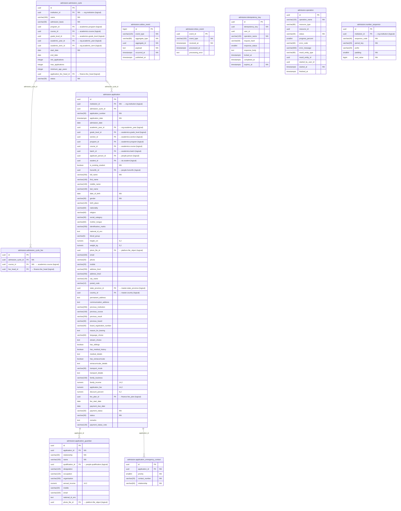
```mermaid
erDiagram
    admission__admission_cycle["admission.admission_cycle"] {
        uuid id PK
        uuid institution_id FK "NN · → org.institution (logical)"
        varchar(150) name "NN"
        varchar(30) admission_basis "NN"
        uuid program_id FK "→ academics.program (logical)"
        uuid course_id FK "→ academics.course (logical)"
        uuid grade_level_id FK "→ academics.grade_level (logical)"
        uuid academic_year_id FK "→ org.academic_year (logical)"
        uuid academic_term_id FK "→ org.academic_term (logical)"
        date start_date "NN"
        date end_date
        integer min_applications
        integer max_applications
        integer minimum_age_years
        uuid application_fee_head_id FK "→ finance.fee_head (logical)"
        varchar(30) status "NN"
    }
    admission__admission_cycle_fee["admission.admission_cycle_fee"] {
        uuid id PK
        uuid admission_cycle_id FK "NN"
        uuid course_id FK "NN · → academics.course (logical)"
        uuid fee_head_id FK "→ finance.fee_head (logical)"
    }
    admission__application["admission.application"] {
        uuid id PK
        uuid institution_id FK "NN · → org.institution (logical)"
        uuid admission_cycle_id FK
        varchar(30) application_number "NN"
        timestamptz application_date "NN"
        date admission_date
        uuid academic_year_id FK "→ org.academic_year (logical)"
        uuid grade_level_id FK "→ academics.grade_level (logical)"
        uuid section_id FK "→ academics.section (logical)"
        uuid program_id FK "→ academics.program (logical)"
        uuid course_id FK "→ academics.course (logical)"
        uuid batch_id FK "→ academics.batch (logical)"
        uuid applicant_person_id FK "→ people.person (logical)"
        uuid student_id FK "→ sis.student (logical)"
        boolean is_existing_student "NN"
        uuid honorific_id FK "→ people.honorific (logical)"
        varchar(255) full_name "NN"
        varchar(100) first_name
        varchar(100) middle_name
        varchar(100) last_name
        date date_of_birth "NN"
        varchar(30) gender "NN"
        varchar(120) birth_place
        varchar(60) nationality
        varchar(60) religion
        varchar(30) social_category
        varchar(60) mother_tongue
        varchar(255) identification_marks
        text national_id_enc
        varchar(5) blood_group
        numeric height_cm "5,2"
        numeric weight_kg "5,2"
        uuid photo_file_id FK "→ platform.file_object (logical)"
        varchar(320) email
        varchar(20) phone
        varchar(20) mobile
        varchar(255) address_line1
        varchar(255) address_line2
        varchar(120) city_name
        varchar(12) postal_code
        uuid state_province_id FK "→ master.state_province (logical)"
        uuid country_id FK "→ master.country (logical)"
        text permanent_address
        text communication_address
        varchar(255) previous_institution
        varchar(150) previous_course
        varchar(255) previous_result
        varchar(30) previous_board
        varchar(40) board_registration_number
        text reason_for_leaving
        varchar(60) language_choice
        text stream_choice
        boolean has_siblings
        boolean has_medical_history
        text medical_details
        boolean has_extracurricular
        text extracurricular_details
        varchar(30) transport_mode
        text transport_details
        varchar(150) family_business
        numeric family_income "14,2"
        numeric application_fee "14,2"
        numeric discount_percent "5,2"
        uuid fee_plan_id FK "→ finance.fee_plan (logical)"
        date fee_start_date
        date payment_due_date
        varchar(30) payment_status "NN"
        varchar(30) status "NN"
        text remarks
        varchar(120) payment_status_note
    }
    admission__application_guardian["admission.application_guardian"] {
        uuid id PK
        uuid application_id FK "NN"
        varchar(30) relationship "NN"
        varchar(150) name "NN"
        uuid qualification_id FK "→ people.qualification (logical)"
        varchar(120) designation
        varchar(120) occupation
        varchar(200) organisation
        numeric annual_income "14,2"
        varchar(20) mobile
        varchar(320) email
        text national_id_enc
        uuid photo_file_id FK "→ platform.file_object (logical)"
    }
    admission__application_emergency_contact["admission.application_emergency_contact"] {
        uuid id PK
        uuid application_id FK "NN"
        smallint priority "NN"
        varchar(20) contact_number "NN"
        varchar(60) relationship "NN"
    }
    admission__outbox_event["admission.outbox_event"] {
        bigint id PK
        varchar(120) event_type "NN"
        varchar(80) aggregate_type "NN"
        uuid aggregate_id "NN"
        text payload "NN"
        timestamptz occurred_at "NN"
        timestamptz published_at
    }
    admission__inbox_event["admission.inbox_event"] {
        uuid event_id PK
        varchar(120) event_type "NN"
        timestamptz received_at "NN"
        timestamptz processed_at
        text processing_error
    }
    admission__idempotency_key["admission.idempotency_key"] {
        uuid id PK
        uuid idempotency_key "NN"
        uuid user_id
        varchar(120) operation_name "NN"
        varchar(64) request_hash
        smallint response_status
        text response_body
        timestamptz locked_at
        timestamptz completed_at
        timestamptz expires_at "NN"
    }
    admission__operation["admission.operation"] {
        uuid id PK
        varchar(120) operation_name "NN"
        varchar(80) resource_type
        uuid resource_id
        varchar(20) status "NN"
        smallint progress_percent
        varchar(60) error_code
        varchar(500) error_message
        varchar(80) result_entity_type
        uuid result_entity_id
        uuid started_by_user_id
        timestamptz started_at "NN"
        timestamptz finished_at
    }
    admission__number_sequence["admission.number_sequence"] {
        uuid id PK
        uuid institution_id FK "→ org.institution (logical)"
        varchar(40) sequence_code "NN"
        varchar(20) period_key "NN"
        varchar(20) prefix
        smallint padding "NN"
        bigint next_value "NN"
    }
    admission__admission_cycle ||--o{ admission__admission_cycle_fee : "admission_cycle_id"
    admission__admission_cycle |o--o{ admission__application : "admission_cycle_id"
    admission__application ||--o{ admission__application_guardian : "application_id"
    admission__application ||--o{ admission__application_emergency_contact : "application_id"
```

### Attendance

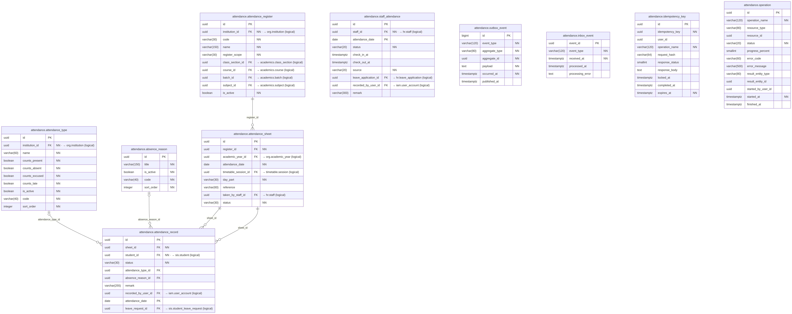

Mermaid source

```mermaid
erDiagram
    attendance__attendance_type["attendance.attendance_type"] {
        uuid id PK
        uuid institution_id FK "NN · → org.institution (logical)"
        varchar(60) name "NN"
        boolean counts_present "NN"
        boolean counts_absent "NN"
        boolean counts_excused "NN"
        boolean counts_late "NN"
        boolean is_active "NN"
        varchar(40) code "NN"
        integer sort_order "NN"
    }
    attendance__absence_reason["attendance.absence_reason"] {
        uuid id PK
        varchar(150) title "NN"
        boolean is_active "NN"
        varchar(40) code "NN"
        integer sort_order "NN"
    }
    attendance__attendance_register["attendance.attendance_register"] {
        uuid id PK
        uuid institution_id FK "NN · → org.institution (logical)"
        varchar(30) code "NN"
        varchar(150) name "NN"
        varchar(30) register_scope "NN"
        uuid class_section_id FK "→ academics.class_section (logical)"
        uuid course_id FK "→ academics.course (logical)"
        uuid batch_id FK "→ academics.batch (logical)"
        uuid subject_id FK "→ academics.subject (logical)"
        boolean is_active "NN"
    }
    attendance__attendance_sheet["attendance.attendance_sheet"] {
        uuid id PK
        uuid register_id FK "NN"
        uuid academic_year_id FK "→ org.academic_year (logical)"
        date attendance_date "NN"
        uuid timetable_session_id FK "→ timetable.session (logical)"
        varchar(30) day_part "NN"
        varchar(60) reference
        uuid taken_by_staff_id FK "→ hr.staff (logical)"
        varchar(30) status "NN"
    }
    attendance__attendance_record["attendance.attendance_record"] {
        uuid id PK
        uuid sheet_id FK "NN"
        uuid student_id FK "NN · → sis.student (logical)"
        varchar(30) status "NN"
        uuid attendance_type_id FK
        uuid absence_reason_id FK
        varchar(255) remark
        uuid recorded_by_user_id FK "→ iam.user_account (logical)"
        date attendance_date PK
        uuid leave_request_id FK "→ sis.student_leave_request (logical)"
    }
    attendance__staff_attendance["attendance.staff_attendance"] {
        uuid id PK
        uuid staff_id FK "NN · → hr.staff (logical)"
        date attendance_date PK
        varchar(20) status "NN"
        timestamptz check_in_at
        timestamptz check_out_at
        varchar(20) source "NN"
        uuid leave_application_id FK "→ hr.leave_application (logical)"
        uuid recorded_by_user_id FK "→ iam.user_account (logical)"
        varchar(300) remark
    }
    attendance__outbox_event["attendance.outbox_event"] {
        bigint id PK
        varchar(120) event_type "NN"
        varchar(80) aggregate_type "NN"
        uuid aggregate_id "NN"
        text payload "NN"
        timestamptz occurred_at "NN"
        timestamptz published_at
    }
    attendance__inbox_event["attendance.inbox_event"] {
        uuid event_id PK
        varchar(120) event_type "NN"
        timestamptz received_at "NN"
        timestamptz processed_at
        text processing_error
    }
    attendance__idempotency_key["attendance.idempotency_key"] {
        uuid id PK
        uuid idempotency_key "NN"
        uuid user_id
        varchar(120) operation_name "NN"
        varchar(64) request_hash
        smallint response_status
        text response_body
        timestamptz locked_at
        timestamptz completed_at
        timestamptz expires_at "NN"
    }
    attendance__operation["attendance.operation"] {
        uuid id PK
        varchar(120) operation_name "NN"
        varchar(80) resource_type
        uuid resource_id
        varchar(20) status "NN"
        smallint progress_percent
        varchar(60) error_code
        varchar(500) error_message
        varchar(80) result_entity_type
        uuid result_entity_id
        uuid started_by_user_id
        timestamptz started_at "NN"
        timestamptz finished_at
    }
    attendance__attendance_register ||--o{ attendance__attendance_sheet : "register_id"
    attendance__attendance_sheet ||--o{ attendance__attendance_record : "sheet_id"
    attendance__attendance_type |o--o{ attendance__attendance_record : "attendance_type_id"
    attendance__absence_reason |o--o{ attendance__attendance_record : "absence_reason_id"
    attendance__attendance_sheet ||--o{ attendance__attendance_record : "sheet_id"
```

### Rooms & Facilities

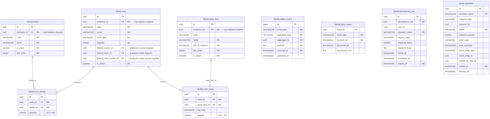

Mermaid source

```mermaid
erDiagram
    facility__facility["facility.facility"] {
        uuid id PK
        uuid institution_id FK "NN · → org.institution (logical)"
        varchar(30) code "NN"
        varchar(120) name "NN"
        boolean is_active "NN"
        integer sort_order "NN"
    }
    facility__room["facility.room"] {
        uuid id PK
        uuid institution_id FK "NN · → org.institution (logical)"
        varchar(30) code "NN"
        varchar(120) name "NN"
        varchar(30) room_type "NN"
        integer capacity "NN"
        uuid default_course_id FK "→ academics.course (logical)"
        uuid default_batch_id FK "→ academics.batch (logical)"
        uuid default_class_section_id FK "→ academics.class_section (logical)"
        boolean is_active "NN"
    }
    facility__room_facility["facility.room_facility"] {
        uuid id PK
        uuid room_id FK "NN"
        uuid facility_id FK "NN"
        numeric quantity "10,2 · NN"
    }
    facility__asset_item["facility.asset_item"] {
        uuid id PK
        uuid institution_id FK "NN · → org.institution (logical)"
        varchar(40) code
        varchar(150) name "NN"
        varchar(20) unit_of_measure "NN"
        integer sort_order "NN"
        boolean is_active "NN"
    }
    facility__room_asset["facility.room_asset"] {
        uuid id PK
        uuid room_id FK "NN"
        uuid asset_item_id FK "NN"
        varchar(40) tag_code
        numeric quantity "10,2 · NN"
    }
    facility__outbox_event["facility.outbox_event"] {
        bigint id PK
        varchar(120) event_type "NN"
        varchar(80) aggregate_type "NN"
        uuid aggregate_id "NN"
        text payload "NN"
        timestamptz occurred_at "NN"
        timestamptz published_at
    }
    facility__inbox_event["facility.inbox_event"] {
        uuid event_id PK
        varchar(120) event_type "NN"
        timestamptz received_at "NN"
        timestamptz processed_at
        text processing_error
    }
    facility__idempotency_key["facility.idempotency_key"] {
        uuid id PK
        uuid idempotency_key "NN"
        uuid user_id
        varchar(120) operation_name "NN"
        varchar(64) request_hash
        smallint response_status
        text response_body
        timestamptz locked_at
        timestamptz completed_at
        timestamptz expires_at "NN"
    }
    facility__operation["facility.operation"] {
        uuid id PK
        varchar(120) operation_name "NN"
        varchar(80) resource_type
        uuid resource_id
        varchar(20) status "NN"
        smallint progress_percent
        varchar(60) error_code
        varchar(500) error_message
        varchar(80) result_entity_type
        uuid result_entity_id
        uuid started_by_user_id
        timestamptz started_at "NN"
        timestamptz finished_at
    }
    facility__room ||--o{ facility__room_facility : "room_id"
    facility__facility ||--o{ facility__room_facility : "facility_id"
    facility__room ||--o{ facility__room_asset : "room_id"
    facility__asset_item ||--o{ facility__room_asset : "asset_item_id"
```

### Timetable

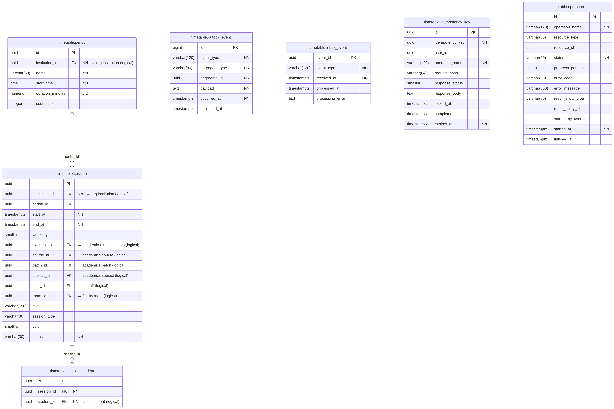

Mermaid source

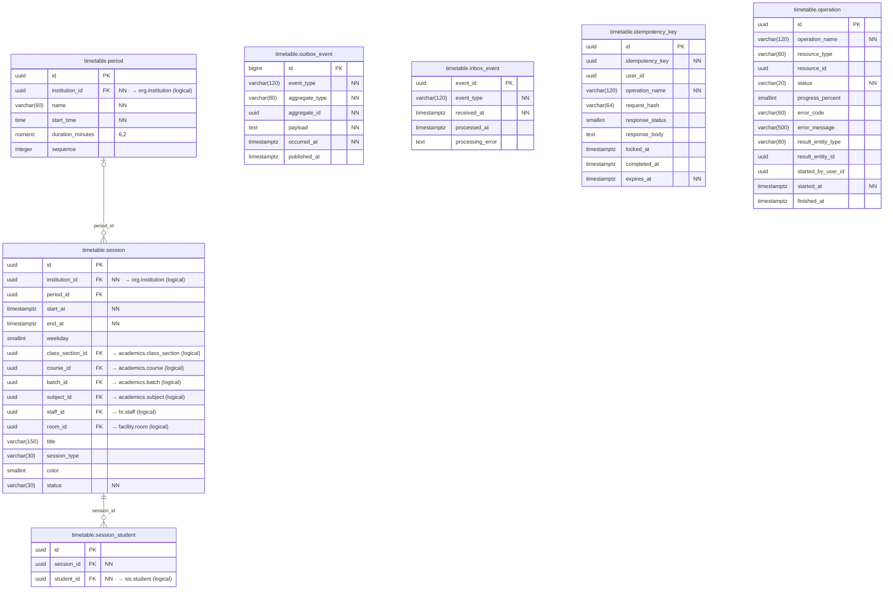
```mermaid
erDiagram
    timetable__period["timetable.period"] {
        uuid id PK
        uuid institution_id FK "NN · → org.institution (logical)"
        varchar(60) name "NN"
        time start_time "NN"
        numeric duration_minutes "6,2"
        integer sequence
    }
    timetable__session["timetable.session"] {
        uuid id PK
        uuid institution_id FK "NN · → org.institution (logical)"
        uuid period_id FK
        timestamptz start_at "NN"
        timestamptz end_at "NN"
        smallint weekday
        uuid class_section_id FK "→ academics.class_section (logical)"
        uuid course_id FK "→ academics.course (logical)"
        uuid batch_id FK "→ academics.batch (logical)"
        uuid subject_id FK "→ academics.subject (logical)"
        uuid staff_id FK "→ hr.staff (logical)"
        uuid room_id FK "→ facility.room (logical)"
        varchar(150) title
        varchar(30) session_type
        smallint color
        varchar(30) status "NN"
    }
    timetable__session_student["timetable.session_student"] {
        uuid id PK
        uuid session_id FK "NN"
        uuid student_id FK "NN · → sis.student (logical)"
    }
    timetable__outbox_event["timetable.outbox_event"] {
        bigint id PK
        varchar(120) event_type "NN"
        varchar(80) aggregate_type "NN"
        uuid aggregate_id "NN"
        text payload "NN"
        timestamptz occurred_at "NN"
        timestamptz published_at
    }
    timetable__inbox_event["timetable.inbox_event"] {
        uuid event_id PK
        varchar(120) event_type "NN"
        timestamptz received_at "NN"
        timestamptz processed_at
        text processing_error
    }
    timetable__idempotency_key["timetable.idempotency_key"] {
        uuid id PK
        uuid idempotency_key "NN"
        uuid user_id
        varchar(120) operation_name "NN"
        varchar(64) request_hash
        smallint response_status
        text response_body
        timestamptz locked_at
        timestamptz completed_at
        timestamptz expires_at "NN"
    }
    timetable__operation["timetable.operation"] {
        uuid id PK
        varchar(120) operation_name "NN"
        varchar(80) resource_type
        uuid resource_id
        varchar(20) status "NN"
        smallint progress_percent
        varchar(60) error_code
        varchar(500) error_message
        varchar(80) result_entity_type
        uuid result_entity_id
        uuid started_by_user_id
        timestamptz started_at "NN"
        timestamptz finished_at
    }
    timetable__period |o--o{ timetable__session : "period_id"
    timetable__session ||--o{ timetable__session_student : "session_id"
```

### Assessment & Results

Mermaid source

```mermaid
erDiagram
    assessment__homework["assessment.homework"] {
        uuid id PK
        uuid institution_id FK "NN · → org.institution (logical)"
        uuid academic_year_id FK "NN · → org.academic_year (logical)"
        uuid class_section_id FK "NN · → academics.class_section (logical)"
        uuid subject_id FK "→ academics.subject (logical)"
        uuid assigned_by_staff_id FK "→ hr.staff (logical)"
        text description
        uuid attachment_file_id FK "→ platform.file_object (logical)"
        timestamptz assigned_on
        timestamptz due_at
        varchar(30) status "NN"
    }
    assessment__homework_approval["assessment.homework_approval"] {
        uuid id PK
        uuid homework_id FK "NN"
        varchar(30) decision "NN"
        text comments
        uuid decided_by_user_id FK "→ iam.user_account (logical)"
        timestamptz decided_at
    }
    assessment__homework_submission["assessment.homework_submission"] {
        uuid id PK
        uuid homework_id FK "NN"
        uuid student_id FK "NN · → sis.student (logical)"
        date submitted_on
        varchar(30) status "NN"
        uuid checked_by_user_id FK "→ iam.user_account (logical)"
        date checked_on
        text teacher_comments
        text student_reply
    }
    assessment__assignment_type["assessment.assignment_type"] {
        uuid id PK
        varchar(30) code "NN"
        varchar(120) name "NN"
        varchar(30) grading_basis "NN"
        integer sort_order "NN"
        boolean is_active "NN"
    }
    assessment__assignment["assessment.assignment"] {
        uuid id PK
        uuid institution_id FK "NN · → org.institution (logical)"
        uuid academic_year_id FK "→ org.academic_year (logical)"
        varchar(200) title "NN"
        text description
        uuid assignment_type_id FK
        uuid class_section_id FK "→ academics.class_section (logical)"
        uuid course_id FK "→ academics.course (logical)"
        uuid batch_id FK "→ academics.batch (logical)"
        uuid assigned_by_staff_id FK "→ hr.staff (logical)"
        uuid reviewer_staff_id FK "→ hr.staff (logical)"
        numeric max_marks "8,2"
        timestamptz issued_on
        timestamptz due_at
        uuid attachment_file_id FK "→ platform.file_object (logical)"
        varchar(30) status "NN"
    }
    assessment__assignment_subject["assessment.assignment_subject"] {
        uuid id PK
        uuid assignment_id FK "NN"
        uuid subject_id FK "NN · → academics.subject (logical)"
    }
    assessment__assignment_allocation["assessment.assignment_allocation"] {
        uuid id PK
        uuid assignment_id FK "NN"
        uuid student_id FK "NN · → sis.student (logical)"
    }
    assessment__assignment_approval["assessment.assignment_approval"] {
        uuid id PK
        uuid assignment_id FK "NN"
        varchar(30) decision "NN"
        text comments
        uuid decided_by_user_id FK "→ iam.user_account (logical)"
        timestamptz decided_at
    }
    assessment__assignment_submission["assessment.assignment_submission"] {
        uuid id PK
        uuid assignment_id FK "NN"
        uuid student_id FK "NN · → sis.student (logical)"
        text content
        timestamptz submitted_at "NN"
        varchar(30) status "NN"
        numeric marks_obtained "8,2"
        uuid graded_by_user_id FK "→ iam.user_account (logical)"
        date graded_on
        text feedback
    }
    assessment__grading_scheme["assessment.grading_scheme"] {
        uuid id PK
        uuid institution_id FK "NN · → org.institution (logical)"
        uuid academic_year_id FK "→ org.academic_year (logical)"
        varchar(120) name "NN"
        varchar(30) scheme_type "NN"
        varchar(30) grading_method "NN"
        text criteria
        boolean is_active "NN"
        boolean is_template "NN"
    }
    assessment__grading_band["assessment.grading_band"] {
        uuid id PK
        uuid grading_scheme_id FK "NN"
        numeric min_percent "5,2 · NN"
        numeric max_percent "5,2 · NN"
        varchar(30) grade_label "NN"
        numeric grade_point "4,2"
        boolean is_pass "NN"
        text description
    }
    assessment__exam_type["assessment.exam_type"] {
        uuid id PK
        varchar(30) code "NN"
        varchar(120) name "NN"
        integer sort_order "NN"
        boolean is_active "NN"
    }
    assessment__exam_session["assessment.exam_session"] {
        uuid id PK
        uuid institution_id FK "NN · → org.institution (logical)"
        uuid academic_year_id FK "→ org.academic_year (logical)"
        uuid academic_term_id FK "→ org.academic_term (logical)"
        uuid exam_type_id FK "NN"
        varchar(30) code "NN"
        varchar(150) name "NN"
        uuid grade_level_id FK "→ academics.grade_level (logical)"
        uuid course_id FK "→ academics.course (logical)"
        uuid batch_id FK "→ academics.batch (logical)"
        varchar(30) evaluation_type "NN"
        date start_date "NN"
        date end_date "NN"
        varchar(255) venue
        varchar(30) status "NN"
    }
    assessment__exam["assessment.exam"] {
        uuid id PK
        uuid exam_session_id FK "NN"
        uuid subject_id FK "NN · → academics.subject (logical)"
        uuid class_section_id FK "→ academics.class_section (logical)"
        varchar(30) code "NN"
        varchar(150) name "NN"
        timestamptz start_at "NN"
        timestamptz end_at "NN"
        numeric total_marks "8,2 · NN"
        numeric pass_marks "8,2 · NN"
        varchar(30) status "NN"
        boolean results_entered "NN"
        text notes
    }
    assessment__exam_invigilator["assessment.exam_invigilator"] {
        uuid id PK
        uuid exam_id FK "NN"
        uuid staff_id FK "NN · → hr.staff (logical)"
    }
    assessment__result_template["assessment.result_template"] {
        uuid id PK
        uuid exam_session_id FK "NN"
        uuid grading_scheme_id FK
        varchar(150) name "NN"
        date result_date "NN"
        varchar(30) status "NN"
    }
    assessment__result_template_band["assessment.result_template_band"] {
        uuid id PK
        uuid result_template_id FK "NN"
        uuid grading_band_id FK "NN"
    }
    assessment__marksheet["assessment.marksheet"] {
        uuid id PK
        uuid exam_session_id FK "NN"
        uuid result_template_id FK "NN"
        varchar(150) name "NN"
        date generated_on "NN"
        uuid generated_by_user_id FK "NN · → iam.user_account (logical)"
        varchar(30) status "NN"
        integer total_passed
        integer total_failed
        timestamptz published_at
        uuid published_by_user_id FK "→ iam.user_account (logical)"
        boolean visible_to_guardians "NN"
    }
    assessment__marksheet_line["assessment.marksheet_line"] {
        uuid id PK
        uuid marksheet_id FK "NN"
        uuid student_id FK "NN · → sis.student (logical)"
        numeric total_marks "10,2"
        numeric percentage "6,2"
        varchar(30) grade_label
        varchar(30) result_status
        date generated_on "NN"
        numeric credits_attempted "6,2"
        numeric credits_earned "6,2"
        numeric grade_points "6,3"
        numeric sgpa "5,3"
        numeric cgpa "5,3"
    }
    assessment__exam_result["assessment.exam_result"] {
        uuid id PK
        uuid exam_id FK "NN"
        uuid student_id FK "NN · → sis.student (logical)"
        uuid room_id FK "→ facility.room (logical)"
        varchar(20) attendance_status "NN"
        numeric marks "7,2"
        numeric max_marks "7,2"
        varchar(20) grade_label
        numeric grade_point "5,2"
        numeric credits "5,2"
        varchar(20) result_status
        varchar(300) note
        uuid marksheet_line_id FK
        uuid evaluated_by_user_id FK "→ iam.user_account (logical)"
        timestamptz evaluated_at
    }
    assessment__result_change_log["assessment.result_change_log"] {
        uuid id PK
        uuid exam_result_id FK "NN"
        uuid changed_by_user_id FK "NN · → iam.user_account (logical)"
        timestamptz changed_at "NN"
        numeric old_marks "7,2"
        numeric new_marks "7,2"
        varchar(20) old_result_status
        varchar(20) new_result_status
        varchar(20) old_grade_label
        varchar(20) new_grade_label
        varchar(300) reason "NN"
    }
    assessment__outbox_event["assessment.outbox_event"] {
        bigint id PK
        varchar(120) event_type "NN"
        varchar(80) aggregate_type "NN"
        uuid aggregate_id "NN"
        text payload "NN"
        timestamptz occurred_at "NN"
        timestamptz published_at
    }
    assessment__inbox_event["assessment.inbox_event"] {
        uuid event_id PK
        varchar(120) event_type "NN"
        timestamptz received_at "NN"
        timestamptz processed_at
        text processing_error
    }
    assessment__idempotency_key["assessment.idempotency_key"] {
        uuid id PK
        uuid idempotency_key "NN"
        uuid user_id
        varchar(120) operation_name "NN"
        varchar(64) request_hash
        smallint response_status
        text response_body
        timestamptz locked_at
        timestamptz completed_at
        timestamptz expires_at "NN"
    }
    assessment__operation["assessment.operation"] {
        uuid id PK
        varchar(120) operation_name "NN"
        varchar(80) resource_type
        uuid resource_id
        varchar(20) status "NN"
        smallint progress_percent
        varchar(60) error_code
        varchar(500) error_message
        varchar(80) result_entity_type
        uuid result_entity_id
        uuid started_by_user_id
        timestamptz started_at "NN"
        timestamptz finished_at
    }
    assessment__homework ||--o{ assessment__homework_approval : "homework_id"
    assessment__homework ||--o{ assessment__homework_submission : "homework_id"
    assessment__assignment_type |o--o{ assessment__assignment : "assignment_type_id"
    assessment__assignment ||--o{ assessment__assignment_subject : "assignment_id"
    assessment__assignment ||--o{ assessment__assignment_allocation : "assignment_id"
    assessment__assignment ||--o{ assessment__assignment_approval : "assignment_id"
    assessment__assignment ||--o{ assessment__assignment_submission : "assignment_id"
    assessment__grading_scheme ||--o{ assessment__grading_band : "grading_scheme_id"
    assessment__exam_type ||--o{ assessment__exam_session : "exam_type_id"
    assessment__exam_session ||--o{ assessment__exam : "exam_session_id"
    assessment__exam ||--o{ assessment__exam_invigilator : "exam_id"
    assessment__exam_session ||--o{ assessment__result_template : "exam_session_id"
    assessment__grading_scheme |o--o{ assessment__result_template : "grading_scheme_id"
    assessment__result_template ||--o{ assessment__result_template_band : "result_template_id"
    assessment__grading_band ||--o{ assessment__result_template_band : "grading_band_id"
    assessment__exam_session ||--o{ assessment__marksheet : "exam_session_id"
    assessment__result_template ||--o{ assessment__marksheet : "result_template_id"
    assessment__marksheet ||--o{ assessment__marksheet_line : "marksheet_id"
    assessment__exam ||--o{ assessment__exam_result : "exam_id"
    assessment__marksheet_line |o--o{ assessment__exam_result : "marksheet_line_id"
    assessment__exam_result ||--o{ assessment__result_change_log : "exam_result_id"
```

### Learning Management — Courses, versions & catalogue

Mermaid source

```mermaid
erDiagram
    lms__category["lms.category"] {
        uuid id PK
        varchar(120) name "NN"
        varchar(40) code "NN"
        integer sort_order "NN"
        boolean is_active "NN"
    }
    lms__course["lms.course"] {
        uuid id PK
        uuid institution_id FK "→ org.institution (logical)"
        varchar(200) title "NN"
        text short_introduction
        text description
        uuid image_file_id FK "→ platform.file_object (logical)"
        varchar(500) video_url
        uuid category_id FK
        varchar(30) status "NN"
        boolean is_published "NN"
        date published_on
        boolean is_upcoming "NN"
        boolean is_featured "NN"
        boolean disable_self_learning "NN"
        boolean enforce_lesson_order "NN"
        boolean certification_enabled "NN"
        boolean paid_certificate "NN"
        uuid default_evaluator_id FK
        boolean is_paid "NN"
        numeric price "14,2"
        uuid currency_id FK "→ master.currency (logical)"
        numeric price_usd "14,2"
        varchar(30) card_gradient
        varchar(64) timezone
        boolean publish_notification_sent "NN"
        integer enrollment_count "NN"
        integer lesson_count "NN"
        numeric average_rating "3,2"
        varchar(50) code
        varchar(100) state_standard_code
        numeric credits "6,2"
        text prerequisites
        text corequisites
        date effective_from
        varchar(30) lifecycle_status "NN"
        date deactivated_on
        integer version_major "NN"
        integer version_minor "NN"
        uuid previous_version_id FK
        uuid root_course_id FK
        text author_comments
        varchar(100) external_ref
        integer nominal_duration
        varchar(30) delivery_modality
        boolean is_shared "NN"
        timestamptz content_updated_at
        varchar(30) grade_display "NN"
        uuid grading_scheme_id FK "→ assessment.grading_scheme (logical)"
        boolean is_in_catalog "NN"
        text catalog_description
        timestamptz catalog_visible_from
        timestamptz catalog_visible_until
        text outline
        integer workload_hours
        varchar(30) catalog_status "NN"
    }
    lms__course_teacher["lms.course_teacher"] {
        uuid id PK
        uuid course_id FK "NN"
        uuid user_id FK "NN · → iam.user_account (logical)"
        integer sort_order "NN"
    }
    lms__related_course["lms.related_course"] {
        uuid id PK
        uuid course_id FK "NN"
        uuid related_course_id FK "NN"
        integer sort_order "NN"
        uuid author_profile_id FK
    }
    lms__course_mentor["lms.course_mentor"] {
        uuid id PK
        uuid course_id FK "NN"
        uuid user_id FK "NN · → iam.user_account (logical)"
    }
    lms__course_author_profile["lms.course_author_profile"] {
        uuid id PK
        uuid course_id FK "NN"
        varchar(200) name "NN"
        text bio
        uuid photo_file_id FK "→ platform.file_object (logical)"
        varchar(255) qualification
        integer sort_order "NN"
    }
    lms__course_preview["lms.course_preview"] {
        uuid id PK
        uuid course_id FK "NN"
        varchar(30) preview_kind "NN"
        uuid file_id FK "NN · → platform.file_object (logical)"
        varchar(100) icon
        varchar(255) title
        text description
        integer sort_order "NN"
    }
    lms__course_testimonial["lms.course_testimonial"] {
        uuid id PK
        uuid course_id FK "NN"
        varchar(255) title
        text quote
        uuid photo_file_id FK "→ platform.file_object (logical)"
        varchar(255) current_position
        integer sort_order "NN"
    }
    lms__catalog_banner["lms.catalog_banner"] {
        uuid id PK
        uuid course_id FK "NN"
        varchar(30) placement "NN"
        uuid image_file_id FK "→ platform.file_object (logical)"
        integer sort_order "NN"
    }
    lms__enrollment_request["lms.enrollment_request"] {
        uuid id PK
        uuid course_id FK "NN"
        uuid cohort_id FK
        uuid user_id FK "NN · → iam.user_account (logical)"
        timestamptz requested_at "NN"
        varchar(30) status "NN"
        uuid decided_by FK "→ iam.user_account (logical)"
        timestamptz decided_at
    }
    lms__course_review["lms.course_review"] {
        uuid id PK
        uuid course_id FK "NN"
        uuid user_id FK "NN · → iam.user_account (logical)"
        numeric rating "3,2 · NN"
        text review
    }
    lms__course_interest["lms.course_interest"] {
        uuid id PK
        uuid course_id FK "NN"
        uuid user_id FK "NN · → iam.user_account (logical)"
        boolean email_sent "NN"
    }
    lms__learning_objective["lms.learning_objective"] {
        uuid id PK
        uuid course_id FK
        uuid chapter_id FK
        text objective "NN"
        integer sort_order "NN"
        uuid copied_from_id FK
    }
    lms__chapter["lms.chapter"] {
        uuid id PK "drawn on: Outline, content delivery & progress"
    }
    lms__cohort["lms.cohort"] {
        uuid id PK "drawn on: Cohorts, schedules & live classes"
    }
    lms__evaluator["lms.evaluator"] {
        uuid id PK "drawn on: Evaluation, certificates, badges & programs"
    }
    lms__category |o--o{ lms__course : "category_id"
    lms__evaluator |o--o{ lms__course : "default_evaluator_id"
    lms__course |o--o{ lms__course : "previous_version_id"
    lms__course |o--o{ lms__course : "root_course_id"
    lms__course ||--o{ lms__course_teacher : "course_id"
    lms__course ||--o{ lms__related_course : "course_id"
    lms__course ||--o{ lms__related_course : "related_course_id"
    lms__course_author_profile |o--o{ lms__related_course : "author_profile_id"
    lms__course ||--o{ lms__course_mentor : "course_id"
    lms__course ||--o{ lms__course_review : "course_id"
    lms__course ||--o{ lms__course_interest : "course_id"
    lms__course |o--o{ lms__learning_objective : "course_id"
    lms__chapter |o--o{ lms__learning_objective : "chapter_id"
    lms__learning_objective |o--o{ lms__learning_objective : "copied_from_id"
    lms__course ||--o{ lms__course_author_profile : "course_id"
    lms__course ||--o{ lms__course_preview : "course_id"
    lms__course ||--o{ lms__course_testimonial : "course_id"
    lms__course ||--o{ lms__catalog_banner : "course_id"
    lms__course ||--o{ lms__enrollment_request : "course_id"
    lms__cohort |o--o{ lms__enrollment_request : "cohort_id"
```

### Learning Management — Outline, content delivery & progress

Mermaid source

```mermaid
erDiagram
    lms__chapter["lms.chapter"] {
        uuid id PK
        uuid course_id FK "NN"
        varchar(200) title "NN"
        integer sort_order "NN"
        boolean is_scorm_package "NN"
        uuid scorm_package_file_id FK "→ platform.file_object (logical)"
        text scorm_package_path
        text scorm_manifest_file
        text scorm_launch_file
        uuid cohort_id FK
        uuid parent_chapter_id FK
        text description
        integer chapter_number
        integer start_day
        time start_time
        integer due_day
        time due_time
        timestamptz starts_at
        timestamptz ends_at
        boolean allow_delete "NN"
        boolean allow_edit_details "NN"
        boolean allow_edit_dates "NN"
        uuid copied_from_id FK
        boolean is_original "NN"
    }
    lms__lesson["lms.lesson"] {
        uuid id PK
        uuid chapter_id FK "NN"
        varchar(200) title "NN"
        integer sort_order "NN"
        boolean include_in_preview "NN"
        text body
        jsonb content
        text teacher_notes
        jsonb teacher_content
        varchar(60) youtube_video_id
        text embedded_question
        varchar(30) file_type
        boolean is_scorm_package "NN"
        integer version "NN"
        uuid superseded_by_id FK
        timestamptz published_at
    }
    lms__lesson_activity["lms.lesson_activity"] {
        uuid id PK
        uuid lesson_id FK "NN"
        uuid quiz_id FK
        uuid assignment_id FK
        uuid exercise_id FK
        boolean teacher_only "NN"
        integer sort_order "NN"
    }
    lms__content_item["lms.content_item"] {
        uuid id PK
        uuid chapter_id FK
        uuid course_id FK
        uuid cohort_id FK
        varchar(30) item_kind "NN"
        uuid lesson_id FK
        uuid file_id FK "→ platform.file_object (logical)"
        uuid assignment_id FK
        uuid quiz_id FK
        uuid discussion_prompt_id FK
        uuid participation_activity_id FK
        uuid web_resource_id FK
        uuid ebook_id FK
        uuid external_tool_resource_id FK
        uuid live_class_id FK
        varchar(1000) link_url
        varchar(255) title
        integer sort_order "NN"
        boolean is_active "NN"
        boolean is_always_visible "NN"
        timestamptz visible_from
        timestamptz visible_until
        boolean visible_until_cohort_end "NN"
        timestamptz attempt_from
        timestamptz due_at
        boolean attempt_until_cohort_end "NN"
        integer visible_start_day
        time visible_start_time
        integer visible_end_day
        time visible_end_time
        integer attempt_start_day
        time attempt_start_time
        integer attempt_end_day
        time attempt_end_time
        boolean late_submission_allowed "NN"
        integer late_submission_days
        boolean is_graded "NN"
        numeric points "8,2"
        numeric weight_percent "5,2"
        uuid grading_category_id FK
        uuid rubric_id FK
        boolean plagiarism_check_required "NN"
        boolean show_in_calendar "NN"
        boolean allow_delete "NN"
        boolean allow_edit_details "NN"
        boolean allow_edit_dates "NN"
        boolean allow_edit_grading "NN"
        uuid copied_from_id FK
        boolean is_original "NN"
        bigint view_count "NN"
        bigint like_count "NN"
        numeric rating_total "12,2 · NN"
        integer rating_count "NN"
        uuid exercise_id FK
    }
    lms__content_item_rating["lms.content_item_rating"] {
        uuid id PK
        uuid content_item_id FK "NN"
        uuid cohort_id FK
        uuid user_id FK "NN · → iam.user_account (logical)"
        boolean is_like
        integer rating
    }
    lms__content_view_session["lms.content_view_session"] {
        uuid id PK
        uuid user_id FK "NN · → iam.user_account (logical)"
        uuid content_item_id FK
        uuid file_id FK "→ platform.file_object (logical)"
        uuid cohort_id FK
        timestamptz started_at PK
        timestamptz ended_at
        text location
        varchar(128) session_ref
    }
    lms__video_watch["lms.video_watch"] {
        uuid id PK
        uuid lesson_id FK "NN"
        uuid user_id FK "NN · → iam.user_account (logical)"
        varchar(500) video_source "NN"
        numeric watch_seconds "12,2 · NN"
    }
    lms__lesson_progress["lms.lesson_progress"] {
        uuid id PK
        uuid user_id FK "NN · → iam.user_account (logical)"
        uuid course_id FK "NN"
        uuid chapter_id FK "NN"
        uuid lesson_id FK
        varchar(30) status "NN"
        boolean is_scorm_chapter "NN"
        text scorm_suspend_data
        varchar(1000) scorm_location
        numeric scorm_score "6,2"
        integer scorm_total_time_seconds
    }
    lms__enrollment["lms.enrollment"] {
        uuid id PK
        uuid course_id FK "NN"
        uuid user_id FK "NN · → iam.user_account (logical)"
        varchar(30) member_type "NN"
        varchar(30) member_role "NN"
        numeric progress_percent "5,2 · NN"
        uuid current_lesson_id FK
        uuid source_cohort_id FK
        uuid payment_id FK "→ finance.payment (logical)"
        boolean purchased_certificate "NN"
        uuid certificate_id FK
    }
    lms__bookmark["lms.bookmark"] {
        uuid id PK
        uuid user_id FK "NN · → iam.user_account (logical)"
        varchar(255) title "NN"
        varchar(1000) url "NN"
        varchar(60) module_code
        uuid cohort_id FK
        timestamptz saved_at "NN"
    }
    lms__annotation["lms.annotation"] {
        uuid id PK
        uuid user_id FK "NN · → iam.user_account (logical)"
        uuid content_item_id FK
        uuid cohort_id FK
        uuid ebook_id FK
        uuid file_id FK "→ platform.file_object (logical)"
        varchar(30) annotation_type "NN"
        varchar(40) annotation_subtype
        varchar(20) page_number
        varchar(40) start_char_pos
        varchar(40) char_count
        text location
        text annotated_text
        varchar(255) title
        text description
        text embed_code
        varchar(1000) url
        uuid media_file_id FK "→ platform.file_object (logical)"
        varchar(30) visibility "NN"
        uuid forum_topic_id FK
        uuid lesson_id FK
    }
    lms__annotation_share["lms.annotation_share"] {
        uuid id PK
        uuid annotation_id FK "NN"
        uuid shared_with_user_id FK "NN · → iam.user_account (logical)"
        timestamptz shared_at "NN"
    }
    lms__access_log["lms.access_log"] {
        uuid id PK
        uuid user_id FK "→ iam.user_account (logical)"
        timestamptz accessed_at PK
        varchar(120) operation
        varchar(1000) url
        text params
        boolean is_async "NN"
        varchar(128) session_ref
        uuid cohort_id FK
        varchar(100) role_name
        varchar(20) course_week
        varchar(100) analytics_link_ref
        varchar(500) user_agent
        varchar(1000) referer
        inet ip_address
    }
    lms__assignment["lms.assignment"] {
        uuid id PK "drawn on: Assignments, exercises & plagiarism checks"
    }
    lms__certificate["lms.certificate"] {
        uuid id PK "drawn on: Evaluation, certificates, badges & programs"
    }
    lms__cohort["lms.cohort"] {
        uuid id PK "drawn on: Cohorts, schedules & live classes"
    }
    lms__course["lms.course"] {
        uuid id PK "drawn on: Courses, versions & catalogue"
    }
    lms__discussion_prompt["lms.discussion_prompt"] {
        uuid id PK "drawn on: Repository resources & external tools"
    }
    lms__ebook["lms.ebook"] {
        uuid id PK "drawn on: Repository resources & external tools"
    }
    lms__external_tool_resource["lms.external_tool_resource"] {
        uuid id PK "drawn on: Repository resources & external tools"
    }
    lms__forum_topic["lms.forum_topic"] {
        uuid id PK "drawn on: Discussions"
    }
    lms__grading_category["lms.grading_category"] {
        uuid id PK "drawn on: Gradebook, rubrics & conditional release"
    }
    lms__live_class["lms.live_class"] {
        uuid id PK "drawn on: Cohorts, schedules & live classes"
    }
    lms__participation_activity["lms.participation_activity"] {
        uuid id PK "drawn on: Repository resources & external tools"
    }
    lms__programming_exercise["lms.programming_exercise"] {
        uuid id PK "drawn on: Assignments, exercises & plagiarism checks"
    }
    lms__quiz["lms.quiz"] {
        uuid id PK "drawn on: Quizzes & question bank"
    }
    lms__rubric["lms.rubric"] {
        uuid id PK "drawn on: Gradebook, rubrics & conditional release"
    }
    lms__web_resource["lms.web_resource"] {
        uuid id PK "drawn on: Repository resources & external tools"
    }
    lms__course ||--o{ lms__chapter : "course_id"
    lms__cohort |o--o{ lms__chapter : "cohort_id"
    lms__chapter |o--o{ lms__chapter : "parent_chapter_id"
    lms__chapter |o--o{ lms__chapter : "copied_from_id"
    lms__chapter ||--o{ lms__lesson : "chapter_id"
    lms__lesson ||--o{ lms__lesson_activity : "lesson_id"
    lms__quiz |o--o{ lms__lesson_activity : "quiz_id"
    lms__assignment |o--o{ lms__lesson_activity : "assignment_id"
    lms__programming_exercise |o--o{ lms__lesson_activity : "exercise_id"
    lms__course ||--o{ lms__enrollment : "course_id"
    lms__lesson |o--o{ lms__enrollment : "current_lesson_id"
    lms__cohort |o--o{ lms__enrollment : "source_cohort_id"
    lms__certificate |o--o{ lms__enrollment : "certificate_id"
    lms__course ||--o{ lms__lesson_progress : "course_id"
    lms__chapter ||--o{ lms__lesson_progress : "chapter_id"
    lms__lesson |o--o{ lms__lesson_progress : "lesson_id"
    lms__lesson ||--o{ lms__video_watch : "lesson_id"
    lms__chapter |o--o{ lms__content_item : "chapter_id"
    lms__course |o--o{ lms__content_item : "course_id"
    lms__cohort |o--o{ lms__content_item : "cohort_id"
    lms__lesson |o--o{ lms__content_item : "lesson_id"
    lms__assignment |o--o{ lms__content_item : "assignment_id"
    lms__quiz |o--o{ lms__content_item : "quiz_id"
    lms__discussion_prompt |o--o{ lms__content_item : "discussion_prompt_id"
    lms__participation_activity |o--o{ lms__content_item : "participation_activity_id"
    lms__web_resource |o--o{ lms__content_item : "web_resource_id"
    lms__ebook |o--o{ lms__content_item : "ebook_id"
    lms__external_tool_resource |o--o{ lms__content_item : "external_tool_resource_id"
    lms__live_class |o--o{ lms__content_item : "live_class_id"
    lms__grading_category |o--o{ lms__content_item : "grading_category_id"
    lms__rubric |o--o{ lms__content_item : "rubric_id"
    lms__content_item |o--o{ lms__content_item : "copied_from_id"
    lms__content_item ||--o{ lms__content_item_rating : "content_item_id"
    lms__cohort |o--o{ lms__content_item_rating : "cohort_id"
    lms__content_item |o--o{ lms__annotation : "content_item_id"
    lms__cohort |o--o{ lms__annotation : "cohort_id"
    lms__ebook |o--o{ lms__annotation : "ebook_id"
    lms__forum_topic |o--o{ lms__annotation : "forum_topic_id"
    lms__annotation ||--o{ lms__annotation_share : "annotation_id"
    lms__content_item |o--o{ lms__content_view_session : "content_item_id"
    lms__cohort |o--o{ lms__content_view_session : "cohort_id"
    lms__cohort |o--o{ lms__bookmark : "cohort_id"
    lms__cohort |o--o{ lms__access_log : "cohort_id"
    lms__programming_exercise |o--o{ lms__content_item : "exercise_id"
    lms__lesson |o--o{ lms__annotation : "lesson_id"
    lms__lesson |o--o{ lms__lesson : "superseded_by_id"
```

### Learning Management — Repository resources & external tools

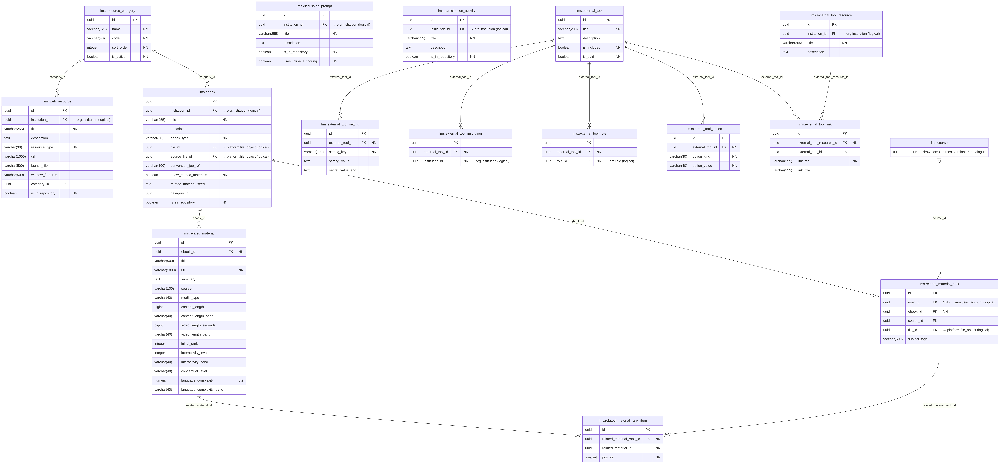

Mermaid source

```mermaid
erDiagram
    lms__web_resource["lms.web_resource"] {
        uuid id PK
        uuid institution_id FK "→ org.institution (logical)"
        varchar(255) title "NN"
        text description
        varchar(30) resource_type "NN"
        varchar(1000) url
        varchar(500) launch_file
        varchar(500) window_features
        uuid category_id FK
        boolean is_in_repository "NN"
    }
    lms__resource_category["lms.resource_category"] {
        uuid id PK
        varchar(120) name "NN"
        varchar(40) code "NN"
        integer sort_order "NN"
        boolean is_active "NN"
    }
    lms__ebook["lms.ebook"] {
        uuid id PK
        uuid institution_id FK "→ org.institution (logical)"
        varchar(255) title "NN"
        text description
        varchar(30) ebook_type "NN"
        uuid file_id FK "→ platform.file_object (logical)"
        uuid source_file_id FK "→ platform.file_object (logical)"
        varchar(100) conversion_job_ref
        boolean show_related_materials "NN"
        text related_material_seed
        uuid category_id FK
        boolean is_in_repository "NN"
    }
    lms__related_material["lms.related_material"] {
        uuid id PK
        uuid ebook_id FK "NN"
        varchar(500) title
        varchar(1000) url "NN"
        text summary
        varchar(100) source
        varchar(40) media_type
        bigint content_length
        varchar(40) content_length_band
        bigint video_length_seconds
        varchar(40) video_length_band
        integer initial_rank
        integer interactivity_level
        varchar(40) interactivity_band
        varchar(40) conceptual_level
        numeric language_complexity "6,2"
        varchar(40) language_complexity_band
    }
    lms__related_material_rank["lms.related_material_rank"] {
        uuid id PK
        uuid user_id FK "NN · → iam.user_account (logical)"
        uuid ebook_id FK "NN"
        uuid course_id FK
        uuid file_id FK "→ platform.file_object (logical)"
        varchar(500) subject_tags
    }
    lms__related_material_rank_item["lms.related_material_rank_item"] {
        uuid id PK
        uuid related_material_rank_id FK "NN"
        uuid related_material_id FK "NN"
        smallint position "NN"
    }
    lms__discussion_prompt["lms.discussion_prompt"] {
        uuid id PK
        uuid institution_id FK "→ org.institution (logical)"
        varchar(255) title "NN"
        text description
        boolean is_in_repository "NN"
        boolean uses_inline_authoring "NN"
    }
    lms__participation_activity["lms.participation_activity"] {
        uuid id PK
        uuid institution_id FK "→ org.institution (logical)"
        varchar(255) title "NN"
        text description
        boolean is_in_repository "NN"
    }
    lms__external_tool["lms.external_tool"] {
        uuid id PK
        varchar(200) title "NN"
        text description
        boolean is_included "NN"
        boolean is_paid "NN"
    }
    lms__external_tool_setting["lms.external_tool_setting"] {
        uuid id PK
        uuid external_tool_id FK "NN"
        varchar(100) setting_key "NN"
        text setting_value
        text secret_value_enc
    }
    lms__external_tool_institution["lms.external_tool_institution"] {
        uuid id PK
        uuid external_tool_id FK "NN"
        uuid institution_id FK "NN · → org.institution (logical)"
    }
    lms__external_tool_role["lms.external_tool_role"] {
        uuid id PK
        uuid external_tool_id FK "NN"
        uuid role_id FK "NN · → iam.role (logical)"
    }
    lms__external_tool_option["lms.external_tool_option"] {
        uuid id PK
        uuid external_tool_id FK "NN"
        varchar(30) option_kind "NN"
        varchar(40) option_value "NN"
    }
    lms__external_tool_resource["lms.external_tool_resource"] {
        uuid id PK
        uuid institution_id FK "→ org.institution (logical)"
        varchar(255) title "NN"
        text description
    }
    lms__external_tool_link["lms.external_tool_link"] {
        uuid id PK
        uuid external_tool_resource_id FK "NN"
        uuid external_tool_id FK
        varchar(255) link_ref "NN"
        varchar(255) link_title
    }
    lms__course["lms.course"] {
        uuid id PK "drawn on: Courses, versions & catalogue"
    }
    lms__resource_category |o--o{ lms__web_resource : "category_id"
    lms__resource_category |o--o{ lms__ebook : "category_id"
    lms__ebook ||--o{ lms__related_material : "ebook_id"
    lms__ebook ||--o{ lms__related_material_rank : "ebook_id"
    lms__course |o--o{ lms__related_material_rank : "course_id"
    lms__external_tool ||--o{ lms__external_tool_setting : "external_tool_id"
    lms__external_tool ||--o{ lms__external_tool_institution : "external_tool_id"
    lms__external_tool ||--o{ lms__external_tool_role : "external_tool_id"
    lms__external_tool ||--o{ lms__external_tool_option : "external_tool_id"
    lms__external_tool_resource ||--o{ lms__external_tool_link : "external_tool_resource_id"
    lms__external_tool |o--o{ lms__external_tool_link : "external_tool_id"
    lms__related_material_rank ||--o{ lms__related_material_rank_item : "related_material_rank_id"
    lms__related_material ||--o{ lms__related_material_rank_item : "related_material_id"
```

### Learning Management — Quizzes & question bank

Mermaid source

```mermaid
erDiagram
    lms__quiz["lms.quiz"] {
        uuid id PK
        varchar(200) title "NN"
        uuid course_id FK
        uuid lesson_id FK
        integer max_attempts
        integer passing_percentage "NN"
        numeric total_marks "8,2 · NN"
        boolean show_answers "NN"
        boolean show_submission_history "NN"
        boolean shuffle_questions "NN"
        integer limit_questions_to
        integer duration_minutes
        boolean proctoring_enabled "NN"
        integer max_violations
        boolean negative_marking_enabled "NN"
        numeric negative_marks "8,2"
        boolean scheduling_enabled "NN"
        timestamptz schedule_start
        timestamptz schedule_end
        uuid institution_id FK "→ org.institution (logical)"
        text description
        boolean is_auto_graded "NN"
        boolean is_adaptive "NN"
        boolean equal_question_weighting "NN"
        numeric marks_per_question "8,2"
        boolean allow_pause "NN"
        varchar(30) attempt_scoring "NN"
        boolean drop_lowest_attempt "NN"
        boolean draws_from_pool "NN"
        boolean show_feedback "NN"
        boolean is_in_repository "NN"
        integer version "NN"
        uuid superseded_by_id FK
        timestamptz published_at
    }
    lms__question["lms.question"] {
        uuid id PK
        varchar(30) question_code
        text question_text
        varchar(30) question_type "NN"
        boolean allows_multiple "NN"
        numeric marks "8,2"
        varchar(255) title
        boolean shuffle_options "NN"
        varchar(20) option_label_style
        integer max_selections
        varchar(20) difficulty
        text general_feedback
        text correct_feedback
        text incorrect_feedback
        text model_answer
        boolean true_false_answer
        varchar(50) numeric_answer
        varchar(50) numeric_tolerance
        boolean numeric_is_range "NN"
        boolean case_sensitive "NN"
        boolean allow_superscript "NN"
        boolean allow_subscript "NN"
        boolean is_retired "NN"
        integer version "NN"
        uuid superseded_by_id FK
        timestamptz published_at
    }
    lms__question_option["lms.question_option"] {
        uuid id PK
        uuid question_id FK "NN"
        smallint sort_order "NN"
        text option_text "NN"
        boolean is_correct "NN"
        text explanation
        varchar(10) label
    }
    lms__question_accepted_answer["lms.question_accepted_answer"] {
        uuid id PK
        uuid question_id FK "NN"
        smallint sort_order "NN"
        text answer_text "NN"
    }
    lms__question_blank["lms.question_blank"] {
        uuid id PK
        uuid question_id FK "NN"
        varchar(500) blank_text "NN"
        integer sort_order "NN"
    }
    lms__question_blank_answer["lms.question_blank_answer"] {
        uuid id PK
        uuid question_blank_id FK "NN"
        varchar(500) answer_text "NN"
        text feedback
    }
    lms__question_hotspot["lms.question_hotspot"] {
        uuid id PK
        uuid question_id FK "NN"
        varchar(40) hotspot_type "NN"
        uuid image_file_id FK "→ platform.file_object (logical)"
    }
    lms__question_hotspot_region["lms.question_hotspot_region"] {
        uuid id PK
        uuid question_hotspot_id FK "NN"
        varchar(200) label
        varchar(40) shape "NN"
        varchar(1000) coordinates "NN"
        boolean is_correct "NN"
        text feedback
    }
    lms__question_match_pair["lms.question_match_pair"] {
        uuid id PK
        uuid question_id FK "NN"
        varchar(500) left_text "NN"
        varchar(500) right_text "NN"
        integer sort_order "NN"
    }
    lms__question_pattern["lms.question_pattern"] {
        uuid id PK
        uuid question_id FK "NN"
        text model_answer "NN"
        varchar(1000) pattern "NN"
        integer sort_order "NN"
    }
    lms__question_pool["lms.question_pool"] {
        uuid id PK
        varchar(200) title "NN"
        text description
    }
    lms__question_pool_item["lms.question_pool_item"] {
        uuid id PK
        uuid question_pool_id FK "NN"
        uuid question_id FK "NN"
    }
    lms__quiz_question["lms.quiz_question"] {
        uuid id PK
        uuid quiz_id FK "NN"
        uuid question_id FK "NN"
        numeric marks "8,2 · NN"
        integer sort_order "NN"
    }
    lms__quiz_question_history["lms.quiz_question_history"] {
        uuid id PK
        uuid quiz_id FK "NN"
        uuid question_id FK "NN"
        numeric marks "8,2"
        integer sort_order
        timestamptz superseded_at "NN"
    }
    lms__quiz_submission["lms.quiz_submission"] {
        uuid id PK
        uuid quiz_id FK "NN"
        uuid user_id FK "NN · → iam.user_account (logical)"
        uuid course_id FK
        numeric score "8,2"
        numeric score_out_of "8,2"
        numeric percentage "5,2"
        numeric passing_percentage "5,2"
        integer violation_count "NN"
        varchar(60) submission_reason
        uuid content_item_id FK
        uuid cohort_id FK
        varchar(30) status "NN"
        timestamptz started_at
        timestamptz submitted_at
        integer time_taken_seconds
        integer answered_count
        integer correct_count
        integer incorrect_count
        boolean is_reassigned "NN"
        uuid reassigned_from_id FK
        text teacher_comment
        integer attempt_number "NN"
    }
    lms__quiz_answer["lms.quiz_answer"] {
        uuid id PK
        uuid quiz_submission_id FK "NN"
        uuid question_id FK
        text question_text
        varchar(30) question_type
        text answer
        boolean is_correct
        numeric marks_awarded "8,2"
        numeric marks_possible "8,2"
        integer sort_order
        text feedback
        uuid graded_by FK "→ iam.user_account (logical)"
        uuid learning_objective_id FK
        bigint time_spent_ms
    }
    lms__quiz_violation["lms.quiz_violation"] {
        uuid id PK
        uuid quiz_submission_id FK "NN"
        varchar(30) event_type "NN"
        varchar(30) severity "NN"
        timestamptz occurred_at "NN"
    }
    lms__content_author["lms.content_author"] {
        uuid id PK
        uuid user_id FK "NN · → iam.user_account (logical)"
        uuid quiz_id FK
        uuid question_id FK
        uuid assignment_id FK
        uuid exercise_id FK
        uuid learning_program_id FK
    }
    lms__assignment["lms.assignment"] {
        uuid id PK "drawn on: Assignments, exercises & plagiarism checks"
    }
    lms__cohort["lms.cohort"] {
        uuid id PK "drawn on: Cohorts, schedules & live classes"
    }
    lms__content_item["lms.content_item"] {
        uuid id PK "drawn on: Outline, content delivery & progress"
    }
    lms__course["lms.course"] {
        uuid id PK "drawn on: Courses, versions & catalogue"
    }
    lms__learning_objective["lms.learning_objective"] {
        uuid id PK "drawn on: Courses, versions & catalogue"
    }
    lms__learning_program["lms.learning_program"] {
        uuid id PK "drawn on: Evaluation, certificates, badges & programs"
    }
    lms__lesson["lms.lesson"] {
        uuid id PK "drawn on: Outline, content delivery & progress"
    }
    lms__programming_exercise["lms.programming_exercise"] {
        uuid id PK "drawn on: Assignments, exercises & plagiarism checks"
    }
    lms__course |o--o{ lms__quiz : "course_id"
    lms__lesson |o--o{ lms__quiz : "lesson_id"
    lms__question ||--o{ lms__question_option : "question_id"
    lms__question ||--o{ lms__question_accepted_answer : "question_id"
    lms__quiz ||--o{ lms__quiz_question : "quiz_id"
    lms__question ||--o{ lms__quiz_question : "question_id"
    lms__quiz ||--o{ lms__quiz_submission : "quiz_id"
    lms__course |o--o{ lms__quiz_submission : "course_id"
    lms__content_item |o--o{ lms__quiz_submission : "content_item_id"
    lms__cohort |o--o{ lms__quiz_submission : "cohort_id"
    lms__quiz_submission |o--o{ lms__quiz_submission : "reassigned_from_id"
    lms__quiz_submission ||--o{ lms__quiz_answer : "quiz_submission_id"
    lms__question |o--o{ lms__quiz_answer : "question_id"
    lms__learning_objective |o--o{ lms__quiz_answer : "learning_objective_id"
    lms__quiz_submission ||--o{ lms__quiz_violation : "quiz_submission_id"
    lms__quiz |o--o{ lms__content_author : "quiz_id"
    lms__question |o--o{ lms__content_author : "question_id"
    lms__assignment |o--o{ lms__content_author : "assignment_id"
    lms__programming_exercise |o--o{ lms__content_author : "exercise_id"
    lms__learning_program |o--o{ lms__content_author : "learning_program_id"
    lms__quiz ||--o{ lms__quiz_question_history : "quiz_id"
    lms__question ||--o{ lms__quiz_question_history : "question_id"
    lms__question ||--o{ lms__question_blank : "question_id"
    lms__question_blank ||--o{ lms__question_blank_answer : "question_blank_id"
    lms__question ||--o{ lms__question_hotspot : "question_id"
    lms__question_hotspot ||--o{ lms__question_hotspot_region : "question_hotspot_id"
    lms__question ||--o{ lms__question_match_pair : "question_id"
    lms__question ||--o{ lms__question_pattern : "question_id"
    lms__question_pool ||--o{ lms__question_pool_item : "question_pool_id"
    lms__question ||--o{ lms__question_pool_item : "question_id"
    lms__quiz |o--o{ lms__quiz : "superseded_by_id"
    lms__question |o--o{ lms__question : "superseded_by_id"
```

### Learning Management — Assignments, exercises & plagiarism checks

Mermaid source

```mermaid
erDiagram
    lms__assignment["lms.assignment"] {
        uuid id PK
        varchar(200) title "NN"
        text question "NN"
        varchar(30) submission_type "NN"
        uuid course_id FK
        boolean is_graded "NN"
        boolean show_model_answer "NN"
        text model_answer
        boolean scheduling_enabled "NN"
        timestamptz schedule_start
        timestamptz schedule_end
        uuid institution_id FK "→ org.institution (logical)"
        varchar(30) submission_mode "NN"
        integer min_group_size
        integer max_group_size
        numeric peer_review_points "8,2"
        boolean uses_inline_authoring "NN"
        boolean is_in_repository "NN"
        integer version "NN"
        uuid superseded_by_id FK
        timestamptz published_at
    }
    lms__assignment_submission["lms.assignment_submission"] {
        uuid id PK
        uuid assignment_id FK "NN"
        uuid user_id FK "NN · → iam.user_account (logical)"
        uuid lesson_id FK
        uuid course_id FK
        varchar(30) submission_type
        text question_snapshot
        text answer
        uuid attachment_file_id FK "→ platform.file_object (logical)"
        varchar(30) status "NN"
        uuid evaluator_user_id FK "→ iam.user_account (logical)"
        text evaluator_comments
        uuid content_item_id FK
        uuid group_id FK
        varchar(255) title
        timestamptz submitted_at
        boolean is_final "NN"
        timestamptz finalized_at
    }
    lms__assignment_group["lms.assignment_group"] {
        uuid id PK
        uuid content_item_id FK "NN"
        uuid cohort_id FK "NN"
        varchar(120) name "NN"
        numeric points "8,2"
        boolean is_active "NN"
        uuid discussion_topic_id FK
        boolean is_reassigned "NN"
    }
    lms__assignment_group_member["lms.assignment_group_member"] {
        uuid id PK
        uuid assignment_group_id FK "NN"
        uuid user_id FK "NN · → iam.user_account (logical)"
        uuid content_item_id FK "NN"
        varchar(30) status "NN"
    }
    lms__peer_review["lms.peer_review"] {
        uuid id PK
        uuid assignment_group_id FK "NN"
        uuid reviewer_user_id FK "NN · → iam.user_account (logical)"
        uuid reviewee_user_id FK "NN · → iam.user_account (logical)"
        numeric points "8,2"
    }
    lms__programming_exercise["lms.programming_exercise"] {
        uuid id PK
        varchar(200) title "NN"
        text problem_statement "NN"
        varchar(30) language "NN"
        text starter_code
    }
    lms__exercise_test_case["lms.exercise_test_case"] {
        uuid id PK
        uuid exercise_id FK "NN"
        integer sort_order "NN"
        text input
        text expected_output "NN"
        boolean is_hidden "NN"
    }
    lms__exercise_submission["lms.exercise_submission"] {
        uuid id PK
        uuid exercise_id FK "NN"
        uuid user_id FK "NN · → iam.user_account (logical)"
        text code "NN"
        boolean is_full_code "NN"
        varchar(30) status
    }
    lms__exercise_test_result["lms.exercise_test_result"] {
        uuid id PK
        uuid exercise_submission_id FK "NN"
        uuid test_case_id FK
        text input
        text expected_output
        text actual_output
        varchar(30) status "NN"
    }
    lms__plagiarism_account["lms.plagiarism_account"] {
        uuid id PK
        varchar(40) provider "NN"
        varchar(100) account_ref "NN"
        varchar(100) sub_account_ref
        varchar(500) api_url
        text shared_secret_enc
        boolean is_default "NN"
        uuid default_teacher_user_id FK "→ iam.user_account (logical)"
        varchar(255) default_teacher_email
        varchar(100) default_teacher_first_name
        varchar(100) default_teacher_last_name
    }
    lms__plagiarism_cohort_link["lms.plagiarism_cohort_link"] {
        uuid id PK
        uuid cohort_id FK "NN"
        uuid plagiarism_account_id FK "NN"
        varchar(100) account_ref
        varchar(100) provider_class_ref
        varchar(255) provider_class_title
        timestamptz provider_class_end_at
        varchar(100) provider_assignment_ref
        varchar(255) provider_assignment_title
        timestamptz provider_assignment_start_at
        timestamptz provider_assignment_due_at
        text provider_assignment_instructions
        boolean student_report_access "NN"
        varchar(255) teacher_email
        varchar(100) teacher_first_name
        varchar(100) teacher_last_name
        boolean class_created "NN"
        boolean assignment_created "NN"
    }
    lms__plagiarism_user_link["lms.plagiarism_user_link"] {
        uuid id PK
        uuid user_id FK "NN · → iam.user_account (logical)"
        uuid plagiarism_account_id FK "NN"
        varchar(100) account_ref
        varchar(100) provider_user_ref "NN"
    }
    lms__plagiarism_report["lms.plagiarism_report"] {
        uuid id PK
        uuid plagiarism_account_id FK
        uuid entity_attachment_id FK "→ platform.entity_attachment (logical)"
        uuid file_id FK "NN · → platform.file_object (logical)"
        varchar(30) item_kind
        varchar(100) provider_submission_ref
        varchar(100) provider_object_ref
        timestamptz submitted_at
        timestamptz provider_submitted_at
        varchar(40) status
        varchar(20) similarity_score
        varchar(1000) report_url
        numeric tolerance "6,2"
        varchar(40) grademark_status
        varchar(40) error_code
        text error_text
        timestamptz last_checked_at
        timestamptz received_at
    }
    lms__cohort["lms.cohort"] {
        uuid id PK "drawn on: Cohorts, schedules & live classes"
    }
    lms__content_item["lms.content_item"] {
        uuid id PK "drawn on: Outline, content delivery & progress"
    }
    lms__course["lms.course"] {
        uuid id PK "drawn on: Courses, versions & catalogue"
    }
    lms__forum_topic["lms.forum_topic"] {
        uuid id PK "drawn on: Discussions"
    }
    lms__lesson["lms.lesson"] {
        uuid id PK "drawn on: Outline, content delivery & progress"
    }
    lms__course |o--o{ lms__assignment : "course_id"
    lms__assignment ||--o{ lms__assignment_submission : "assignment_id"
    lms__lesson |o--o{ lms__assignment_submission : "lesson_id"
    lms__course |o--o{ lms__assignment_submission : "course_id"
    lms__content_item |o--o{ lms__assignment_submission : "content_item_id"
    lms__assignment_group |o--o{ lms__assignment_submission : "group_id"
    lms__programming_exercise ||--o{ lms__exercise_test_case : "exercise_id"
    lms__programming_exercise ||--o{ lms__exercise_submission : "exercise_id"
    lms__exercise_submission ||--o{ lms__exercise_test_result : "exercise_submission_id"
    lms__exercise_test_case |o--o{ lms__exercise_test_result : "test_case_id"
    lms__content_item ||--o{ lms__assignment_group : "content_item_id"
    lms__cohort ||--o{ lms__assignment_group : "cohort_id"
    lms__forum_topic |o--o{ lms__assignment_group : "discussion_topic_id"
    lms__assignment_group ||--o{ lms__assignment_group_member : "assignment_group_id"
    lms__content_item ||--o{ lms__assignment_group_member : "content_item_id"
    lms__assignment_group ||--o{ lms__peer_review : "assignment_group_id"
    lms__cohort ||--o{ lms__plagiarism_cohort_link : "cohort_id"
    lms__plagiarism_account ||--o{ lms__plagiarism_cohort_link : "plagiarism_account_id"
    lms__plagiarism_account ||--o{ lms__plagiarism_user_link : "plagiarism_account_id"
    lms__plagiarism_account |o--o{ lms__plagiarism_report : "plagiarism_account_id"
    lms__assignment |o--o{ lms__assignment : "superseded_by_id"
```

### Learning Management — Gradebook, rubrics & conditional release

Mermaid source

```mermaid
erDiagram
    lms__grading_category["lms.grading_category"] {
        uuid id PK
        uuid course_id FK
        uuid cohort_id FK
        varchar(120) name "NN"
        numeric weight_percent "5,2"
        boolean equal_item_weighting "NN"
    }
    lms__gradebook_entry["lms.gradebook_entry"] {
        uuid id PK
        uuid cohort_id FK "NN"
        uuid content_item_id FK "NN"
        uuid user_id FK "→ iam.user_account (logical)"
        uuid group_id FK
        uuid quiz_submission_id FK
        uuid forum_topic_id FK
        numeric points "8,2"
        numeric auto_points "8,2"
        numeric manual_points "8,2"
        numeric peer_points "8,2"
        text feedback
        text teacher_comment
        varchar(30) status "NN"
        uuid graded_by FK "→ iam.user_account (logical)"
        timestamptz graded_at
        boolean is_published "NN"
        timestamptz published_at
        numeric points_possible "7,2"
    }
    lms__grade_change_log["lms.grade_change_log"] {
        uuid id PK
        uuid gradebook_entry_id FK "NN"
        numeric points "8,2"
        numeric auto_points "8,2"
        numeric manual_points "8,2"
        text comment
        boolean was_published
        timestamptz published_at
        uuid changed_by FK "NN · → iam.user_account (logical)"
        timestamptz changed_at "NN"
        uuid student_user_id FK "→ iam.user_account (logical)"
    }
    lms__item_override["lms.item_override"] {
        uuid id PK
        uuid content_item_id FK "NN"
        uuid user_id FK "→ iam.user_account (logical)"
        uuid group_id FK
        timestamptz available_from
        timestamptz due_at
        integer extra_attempts
        integer extra_time_minutes
        varchar(200) reason
    }
    lms__reassignment_log["lms.reassignment_log"] {
        uuid id PK
        uuid content_item_id FK "NN"
        uuid user_id FK "→ iam.user_account (logical)"
        uuid group_id FK
        uuid quiz_submission_id FK
        text comment
        uuid reassigned_by FK "NN · → iam.user_account (logical)"
        timestamptz reassigned_at "NN"
    }
    lms__rubric["lms.rubric"] {
        uuid id PK
        uuid institution_id FK "→ org.institution (logical)"
        varchar(200) title "NN"
        boolean is_default "NN"
        integer version "NN"
        uuid superseded_by_id FK
        timestamptz published_at
    }
    lms__rubric_criterion["lms.rubric_criterion"] {
        uuid id PK
        uuid rubric_id FK "NN"
        varchar(200) name "NN"
        varchar(200) group_name
        numeric weight_percent "6,2"
        numeric group_weight_percent "6,2"
        integer sort_order "NN"
    }
    lms__rubric_level["lms.rubric_level"] {
        uuid id PK
        uuid rubric_id FK "NN"
        varchar(100) label "NN"
        text description
        numeric score_percent "6,2"
        integer sort_order "NN"
    }
    lms__rubric_cell["lms.rubric_cell"] {
        uuid id PK
        uuid rubric_id FK "NN"
        uuid rubric_criterion_id FK "NN"
        uuid rubric_level_id FK "NN"
        text description
        integer sort_order "NN"
    }
    lms__rubric_assessment["lms.rubric_assessment"] {
        uuid id PK
        uuid content_item_id FK "NN"
        uuid user_id FK "→ iam.user_account (logical)"
        uuid group_id FK
        uuid rubric_cell_id FK "NN"
        text comment
        integer rubric_version
        numeric points_awarded "7,2"
    }
    lms__release_rule["lms.release_rule"] {
        uuid id PK
        uuid course_id FK
        uuid cohort_id FK
        uuid source_content_item_id FK "NN"
        varchar(200) title
        boolean stop_if_true "NN"
        boolean is_disabled "NN"
        boolean reassign_source "NN"
        integer sort_order "NN"
        uuid copied_from_id FK
    }
    lms__release_rule_condition["lms.release_rule_condition"] {
        uuid id PK
        uuid release_rule_id FK "NN"
        varchar(45) operator "NN"
        varchar(45) value
        varchar(45) value2
        integer sort_order "NN"
        varchar(45) condition_type "NN"
    }
    lms__release_rule_target["lms.release_rule_target"] {
        uuid id PK
        uuid release_rule_id FK "NN"
        uuid content_item_id FK
        uuid chapter_id FK
    }
    lms__release_grant["lms.release_grant"] {
        uuid id PK
        uuid content_item_id FK "NN"
        uuid chapter_id FK
        uuid user_id FK "NN · → iam.user_account (logical)"
        boolean is_released "NN"
        boolean access_granted "NN"
    }
    lms__student_alert["lms.student_alert"] {
        uuid id PK
        uuid user_id FK "NN · → iam.user_account (logical)"
        uuid cohort_id FK
        uuid course_id FK
        varchar(100) metric_code
        uuid content_item_id FK
        timestamptz sent_at "NN"
        uuid sent_by FK "→ iam.user_account (logical)"
        varchar(255) subject
        text message
        text details
        timestamptz read_at
    }
    lms__assignment_group["lms.assignment_group"] {
        uuid id PK "drawn on: Assignments, exercises & plagiarism checks"
    }
    lms__chapter["lms.chapter"] {
        uuid id PK "drawn on: Outline, content delivery & progress"
    }
    lms__cohort["lms.cohort"] {
        uuid id PK "drawn on: Cohorts, schedules & live classes"
    }
    lms__content_item["lms.content_item"] {
        uuid id PK "drawn on: Outline, content delivery & progress"
    }
    lms__course["lms.course"] {
        uuid id PK "drawn on: Courses, versions & catalogue"
    }
    lms__forum_topic["lms.forum_topic"] {
        uuid id PK "drawn on: Discussions"
    }
    lms__quiz_submission["lms.quiz_submission"] {
        uuid id PK "drawn on: Quizzes & question bank"
    }
    lms__course |o--o{ lms__grading_category : "course_id"
    lms__cohort |o--o{ lms__grading_category : "cohort_id"
    lms__content_item ||--o{ lms__item_override : "content_item_id"
    lms__assignment_group |o--o{ lms__item_override : "group_id"
    lms__cohort ||--o{ lms__gradebook_entry : "cohort_id"
    lms__content_item ||--o{ lms__gradebook_entry : "content_item_id"
    lms__assignment_group |o--o{ lms__gradebook_entry : "group_id"
    lms__quiz_submission |o--o{ lms__gradebook_entry : "quiz_submission_id"
    lms__forum_topic |o--o{ lms__gradebook_entry : "forum_topic_id"
    lms__gradebook_entry ||--o{ lms__grade_change_log : "gradebook_entry_id"
    lms__content_item ||--o{ lms__reassignment_log : "content_item_id"
    lms__assignment_group |o--o{ lms__reassignment_log : "group_id"
    lms__quiz_submission |o--o{ lms__reassignment_log : "quiz_submission_id"
    lms__rubric ||--o{ lms__rubric_criterion : "rubric_id"
    lms__rubric ||--o{ lms__rubric_level : "rubric_id"
    lms__rubric ||--o{ lms__rubric_cell : "rubric_id"
    lms__rubric_criterion ||--o{ lms__rubric_cell : "rubric_criterion_id"
    lms__rubric_level ||--o{ lms__rubric_cell : "rubric_level_id"
    lms__content_item ||--o{ lms__rubric_assessment : "content_item_id"
    lms__assignment_group |o--o{ lms__rubric_assessment : "group_id"
    lms__rubric_cell ||--o{ lms__rubric_assessment : "rubric_cell_id"
    lms__course |o--o{ lms__release_rule : "course_id"
    lms__cohort |o--o{ lms__release_rule : "cohort_id"
    lms__content_item ||--o{ lms__release_rule : "source_content_item_id"
    lms__release_rule |o--o{ lms__release_rule : "copied_from_id"
    lms__release_rule ||--o{ lms__release_rule_condition : "release_rule_id"
    lms__release_rule ||--o{ lms__release_rule_target : "release_rule_id"
    lms__content_item |o--o{ lms__release_rule_target : "content_item_id"
    lms__chapter |o--o{ lms__release_rule_target : "chapter_id"
    lms__content_item ||--o{ lms__release_grant : "content_item_id"
    lms__chapter |o--o{ lms__release_grant : "chapter_id"
    lms__cohort |o--o{ lms__student_alert : "cohort_id"
    lms__course |o--o{ lms__student_alert : "course_id"
    lms__content_item |o--o{ lms__student_alert : "content_item_id"
    lms__rubric |o--o{ lms__rubric : "superseded_by_id"
```

### Learning Management — Cohorts, schedules & live classes

Mermaid source

```mermaid
erDiagram
    lms__cohort["lms.cohort"] {
        uuid id PK
        uuid institution_id FK "→ org.institution (logical)"
        varchar(200) title "NN"
        text description
        text details
        uuid category_id FK
        varchar(30) medium "NN"
        date start_date "NN"
        date end_date "NN"
        time start_time
        time end_time
        varchar(64) timezone "NN"
        integer seat_count
        boolean is_published "NN"
        boolean allow_self_enrollment "NN"
        boolean allow_future_access "NN"
        boolean is_paid "NN"
        numeric price "14,2"
        uuid currency_id FK "→ master.currency (logical)"
        numeric price_usd "14,2"
        boolean show_live_class "NN"
        boolean evaluation_enabled "NN"
        date evaluation_end_date
        boolean certification_enabled "NN"
        varchar(30) conferencing_provider
        uuid conferencing_account_id FK
        uuid timetable_template_id FK
        uuid confirmation_template_id FK "→ comms.message_template (logical)"
        uuid meta_image_file_id FK "→ platform.file_object (logical)"
        uuid intro_video_file_id FK "→ platform.file_object (logical)"
        text custom_component
        text custom_script
        boolean publish_notification_sent "NN"
        varchar(50) code
        uuid academic_term_id FK "→ org.academic_term (logical)"
        uuid program_id FK "→ academics.program (logical)"
        varchar(100) external_ref
        varchar(30) lifecycle_status "NN"
        timestamptz staff_access_from
        timestamptz staff_access_until
        timestamptz student_access_from
        timestamptz student_access_until
        boolean has_schedule "NN"
        boolean staff_can_edit_schedule "NN"
        varchar(30) grade_display "NN"
        uuid grading_scheme_id FK "→ assessment.grading_scheme (logical)"
        timestamptz enrollment_opens_at
        timestamptz enrollment_closes_at
        uuid class_subject_id FK "→ academics.class_subject (logical)"
        uuid batch_id FK "→ academics.batch (logical)"
        uuid academic_year_id FK "→ org.academic_year (logical)"
    }
    lms__cohort_course["lms.cohort_course"] {
        uuid id PK
        uuid cohort_id FK "NN"
        uuid course_id FK "NN"
        uuid evaluator_id FK
    }
    lms__cohort_teacher["lms.cohort_teacher"] {
        uuid id PK
        uuid cohort_id FK "NN"
        uuid user_id FK "NN · → iam.user_account (logical)"
        uuid role_id FK "→ iam.role (logical)"
        varchar(100) role_label
        boolean is_active "NN"
        boolean has_office_hours "NN"
        timestamptz removed_at
    }
    lms__cohort_enrollment["lms.cohort_enrollment"] {
        uuid id PK
        uuid cohort_id FK "NN"
        uuid user_id FK "NN · → iam.user_account (logical)"
        uuid payment_id FK "→ finance.payment (logical)"
        uuid acquisition_source_id FK "→ finance.acquisition_source (logical)"
        boolean confirmation_email_sent "NN"
        boolean is_active "NN"
        boolean is_self_enrolled "NN"
        varchar(10) final_grade
        numeric final_gpa "4,2"
        uuid graded_by FK "→ iam.user_account (logical)"
        timestamptz graded_at
        boolean grade_published "NN"
        timestamptz grade_published_at
        text teacher_comment
        boolean has_accommodation "NN"
        varchar(100) accommodation_ref
        smallint survey_status
        timestamptz removed_at
        varchar(30) removal_reason
    }
    lms__cohort_feedback["lms.cohort_feedback"] {
        uuid id PK
        uuid cohort_id FK "NN"
        uuid user_id FK "NN · → iam.user_account (logical)"
        text feedback "NN"
        numeric content_rating "3,2"
        numeric teacher_rating "3,2"
        numeric value_rating "3,2"
    }
    lms__cohort_group["lms.cohort_group"] {
        uuid id PK
        uuid cohort_id FK "NN"
        varchar(120) name "NN"
        text description
        boolean is_disabled "NN"
    }
    lms__cohort_schedule_slot["lms.cohort_schedule_slot"] {
        uuid id PK
        uuid cohort_id FK "NN"
        varchar(30) slot_type "NN"
        uuid cohort_teacher_id FK
        varchar(30) weekday "NN"
        time start_time "NN"
        time end_time "NN"
        varchar(200) venue
    }
    lms__cohort_session["lms.cohort_session"] {
        uuid id PK
        uuid cohort_id FK "NN"
        timestamptz starts_at "NN"
        timestamptz ends_at "NN"
        text description
        varchar(200) venue
        boolean is_cancelled "NN"
    }
    lms__cohort_holiday["lms.cohort_holiday"] {
        uuid id PK
        uuid cohort_id FK "NN"
        uuid holiday_id FK "→ org.holiday (logical)"
        varchar(200) title "NN"
        date start_date "NN"
        date end_date "NN"
        boolean is_included "NN"
    }
    lms__timetable_template["lms.timetable_template"] {
        uuid id PK
        varchar(150) title "NN"
    }
    lms__timetable_entry["lms.timetable_entry"] {
        uuid id PK
        uuid cohort_id FK
        uuid timetable_template_id FK
        uuid lesson_id FK
        uuid quiz_id FK
        uuid assignment_id FK
        uuid exercise_id FK
        uuid live_class_id FK
        date entry_date
        integer day_number
        time start_time
        time end_time
        integer duration_minutes
        boolean is_milestone "NN"
    }
    lms__timetable_legend["lms.timetable_legend"] {
        uuid id PK
        uuid cohort_id FK
        uuid timetable_template_id FK
        varchar(30) item_kind "NN"
        varchar(20) color "NN"
        varchar(60) label "NN"
    }
    lms__live_class["lms.live_class"] {
        uuid id PK
        uuid cohort_id FK
        varchar(200) title "NN"
        text description
        date class_date "NN"
        time start_time "NN"
        integer duration_minutes "NN"
        varchar(64) timezone "NN"
        uuid host_user_id FK "NN · → iam.user_account (logical)"
        varchar(30) conferencing_provider "NN"
        uuid conferencing_account_id FK
        varchar(120) meeting_id
        varchar(120) meeting_uuid
        text start_url_enc
        text join_url
        text meeting_password_enc
        varchar(30) auto_recording "NN"
        uuid calendar_event_id FK "→ comms.event (logical)"
        integer attendee_count
        varchar(30) invite_status "NN"
        integer invite_attempts "NN"
        text moderator_password_enc
        text welcome_message
        varchar(50) provider_created_ref
        varchar(1000) recording_url
        integer invitee_count
        integer prep_minutes
        integer extension_minutes
        boolean show_in_calendar "NN"
        boolean host_joined "NN"
        boolean is_active "NN"
        timestamptz ended_at
    }
    lms__live_class_participant["lms.live_class_participant"] {
        uuid id PK
        uuid live_class_id FK "NN"
        uuid user_id FK "NN · → iam.user_account (logical)"
        timestamptz joined_at "NN"
        timestamptz left_at
        integer duration_minutes
        text join_url_enc
        boolean is_presenter "NN"
        boolean attended "NN"
        varchar(30) invite_status
    }
    lms__conferencing_account["lms.conferencing_account"] {
        uuid id PK
        varchar(30) provider "NN"
        varchar(120) account_name "NN"
        uuid owner_user_id FK "NN · → iam.user_account (logical)"
        boolean is_enabled "NN"
        varchar(120) external_account_id
        varchar(200) client_id
        text client_secret_enc
        varchar(200) external_calendar_id
    }
    lms__conferencing_token["lms.conferencing_token"] {
        uuid id PK
        uuid conferencing_account_id FK "NN"
        varchar(20) token_type "NN"
        text token_enc "NN"
        timestamptz expires_at
    }
    lms__mentorship["lms.mentorship"] {
        uuid id PK
        uuid mentor_user_id FK "NN · → iam.user_account (logical)"
        uuid mentee_user_id FK "NN · → iam.user_account (logical)"
        date valid_from
        date valid_to
    }
    lms__assignment["lms.assignment"] {
        uuid id PK "drawn on: Assignments, exercises & plagiarism checks"
    }
    lms__category["lms.category"] {
        uuid id PK "drawn on: Courses, versions & catalogue"
    }
    lms__course["lms.course"] {
        uuid id PK "drawn on: Courses, versions & catalogue"
    }
    lms__evaluator["lms.evaluator"] {
        uuid id PK "drawn on: Evaluation, certificates, badges & programs"
    }
    lms__lesson["lms.lesson"] {
        uuid id PK "drawn on: Outline, content delivery & progress"
    }
    lms__programming_exercise["lms.programming_exercise"] {
        uuid id PK "drawn on: Assignments, exercises & plagiarism checks"
    }
    lms__quiz["lms.quiz"] {
        uuid id PK "drawn on: Quizzes & question bank"
    }
    lms__category |o--o{ lms__cohort : "category_id"
    lms__conferencing_account |o--o{ lms__cohort : "conferencing_account_id"
    lms__timetable_template |o--o{ lms__cohort : "timetable_template_id"
    lms__cohort ||--o{ lms__cohort_course : "cohort_id"
    lms__course ||--o{ lms__cohort_course : "course_id"
    lms__evaluator |o--o{ lms__cohort_course : "evaluator_id"
    lms__cohort ||--o{ lms__cohort_teacher : "cohort_id"
    lms__cohort |o--o{ lms__timetable_entry : "cohort_id"
    lms__timetable_template |o--o{ lms__timetable_entry : "timetable_template_id"
    lms__lesson |o--o{ lms__timetable_entry : "lesson_id"
    lms__quiz |o--o{ lms__timetable_entry : "quiz_id"
    lms__assignment |o--o{ lms__timetable_entry : "assignment_id"
    lms__programming_exercise |o--o{ lms__timetable_entry : "exercise_id"
    lms__live_class |o--o{ lms__timetable_entry : "live_class_id"
    lms__cohort |o--o{ lms__timetable_legend : "cohort_id"
    lms__timetable_template |o--o{ lms__timetable_legend : "timetable_template_id"
    lms__cohort ||--o{ lms__cohort_enrollment : "cohort_id"
    lms__cohort ||--o{ lms__cohort_feedback : "cohort_id"
    lms__cohort |o--o{ lms__live_class : "cohort_id"
    lms__conferencing_account |o--o{ lms__live_class : "conferencing_account_id"
    lms__live_class ||--o{ lms__live_class_participant : "live_class_id"
    lms__cohort ||--o{ lms__cohort_group : "cohort_id"
    lms__cohort ||--o{ lms__cohort_schedule_slot : "cohort_id"
    lms__cohort_teacher |o--o{ lms__cohort_schedule_slot : "cohort_teacher_id"
    lms__cohort ||--o{ lms__cohort_session : "cohort_id"
    lms__cohort ||--o{ lms__cohort_holiday : "cohort_id"
    lms__conferencing_account ||--o{ lms__conferencing_token : "conferencing_account_id"
```

### Learning Management — Discussions

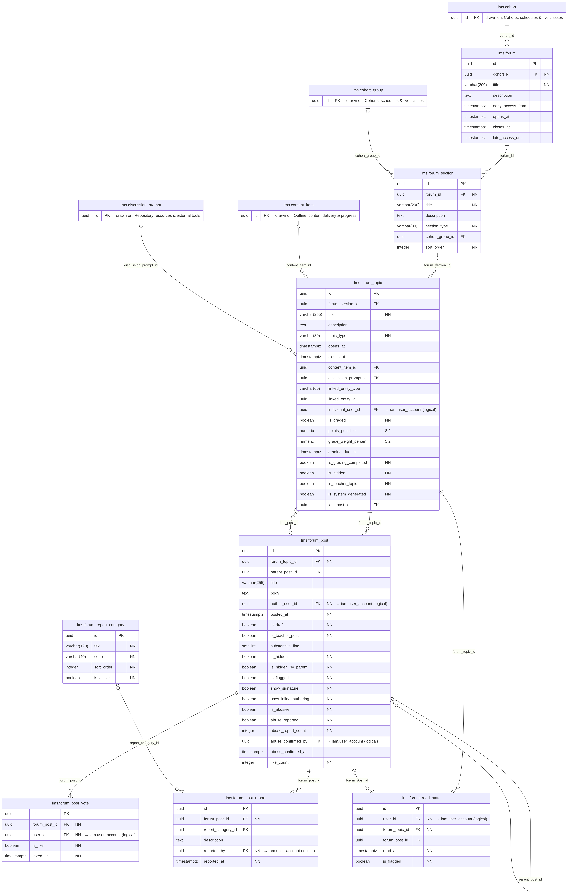

Mermaid source

```mermaid
erDiagram
    lms__forum["lms.forum"] {
        uuid id PK
        uuid cohort_id FK "NN"
        varchar(200) title "NN"
        text description
        timestamptz early_access_from
        timestamptz opens_at
        timestamptz closes_at
        timestamptz late_access_until
    }
    lms__forum_section["lms.forum_section"] {
        uuid id PK
        uuid forum_id FK "NN"
        varchar(200) title "NN"
        text description
        varchar(30) section_type "NN"
        uuid cohort_group_id FK
        integer sort_order "NN"
    }
    lms__forum_topic["lms.forum_topic"] {
        uuid id PK
        uuid forum_section_id FK
        varchar(255) title "NN"
        text description
        varchar(30) topic_type "NN"
        timestamptz opens_at
        timestamptz closes_at
        uuid content_item_id FK
        uuid discussion_prompt_id FK
        varchar(60) linked_entity_type
        uuid linked_entity_id
        uuid individual_user_id FK "→ iam.user_account (logical)"
        boolean is_graded "NN"
        numeric points_possible "8,2"
        numeric grade_weight_percent "5,2"
        timestamptz grading_due_at
        boolean is_grading_completed "NN"
        boolean is_hidden "NN"
        boolean is_teacher_topic "NN"
        boolean is_system_generated "NN"
        uuid last_post_id FK
    }
    lms__forum_post["lms.forum_post"] {
        uuid id PK
        uuid forum_topic_id FK "NN"
        uuid parent_post_id FK
        varchar(255) title
        text body
        uuid author_user_id FK "NN · → iam.user_account (logical)"
        timestamptz posted_at "NN"
        boolean is_draft "NN"
        boolean is_teacher_post "NN"
        smallint substantive_flag
        boolean is_hidden "NN"
        boolean is_hidden_by_parent "NN"
        boolean is_flagged "NN"
        boolean show_signature "NN"
        boolean uses_inline_authoring "NN"
        boolean is_abusive "NN"
        boolean abuse_reported "NN"
        integer abuse_report_count "NN"
        uuid abuse_confirmed_by FK "→ iam.user_account (logical)"
        timestamptz abuse_confirmed_at
        integer like_count "NN"
    }
    lms__forum_post_vote["lms.forum_post_vote"] {
        uuid id PK
        uuid forum_post_id FK "NN"
        uuid user_id FK "NN · → iam.user_account (logical)"
        boolean is_like "NN"
        timestamptz voted_at "NN"
    }
    lms__forum_report_category["lms.forum_report_category"] {
        uuid id PK
        varchar(120) title "NN"
        varchar(40) code "NN"
        integer sort_order "NN"
        boolean is_active "NN"
    }
    lms__forum_post_report["lms.forum_post_report"] {
        uuid id PK
        uuid forum_post_id FK "NN"
        uuid report_category_id FK
        text description
        uuid reported_by FK "NN · → iam.user_account (logical)"
        timestamptz reported_at "NN"
    }
    lms__forum_read_state["lms.forum_read_state"] {
        uuid id PK
        uuid user_id FK "NN · → iam.user_account (logical)"
        uuid forum_topic_id FK "NN"
        uuid forum_post_id FK
        timestamptz read_at "NN"
        boolean is_flagged "NN"
    }
    lms__cohort["lms.cohort"] {
        uuid id PK "drawn on: Cohorts, schedules & live classes"
    }
    lms__cohort_group["lms.cohort_group"] {
        uuid id PK "drawn on: Cohorts, schedules & live classes"
    }
    lms__content_item["lms.content_item"] {
        uuid id PK "drawn on: Outline, content delivery & progress"
    }
    lms__discussion_prompt["lms.discussion_prompt"] {
        uuid id PK "drawn on: Repository resources & external tools"
    }
    lms__cohort ||--o{ lms__forum : "cohort_id"
    lms__forum ||--o{ lms__forum_section : "forum_id"
    lms__cohort_group |o--o{ lms__forum_section : "cohort_group_id"
    lms__forum_section |o--o{ lms__forum_topic : "forum_section_id"
    lms__content_item |o--o{ lms__forum_topic : "content_item_id"
    lms__discussion_prompt |o--o{ lms__forum_topic : "discussion_prompt_id"
    lms__forum_post |o--o{ lms__forum_topic : "last_post_id"
    lms__forum_topic ||--o{ lms__forum_post : "forum_topic_id"
    lms__forum_post |o--o{ lms__forum_post : "parent_post_id"
    lms__forum_post ||--o{ lms__forum_post_vote : "forum_post_id"
    lms__forum_post ||--o{ lms__forum_post_report : "forum_post_id"
    lms__forum_report_category |o--o{ lms__forum_post_report : "report_category_id"
    lms__forum_topic ||--o{ lms__forum_read_state : "forum_topic_id"
    lms__forum_post |o--o{ lms__forum_read_state : "forum_post_id"
```

### Learning Management — Evaluation, certificates, badges & programs

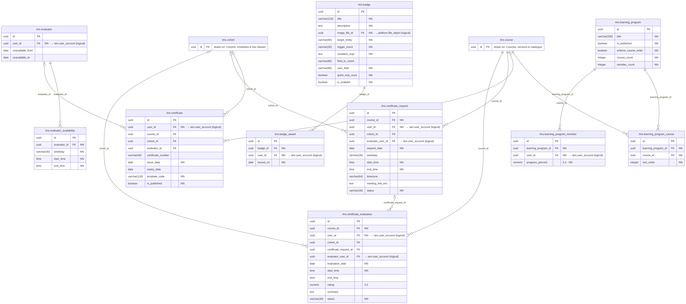

Mermaid source

```mermaid
erDiagram
    lms__evaluator["lms.evaluator"] {
        uuid id PK
        uuid user_id FK "NN · → iam.user_account (logical)"
        date unavailable_from
        date unavailable_to
    }
    lms__evaluator_availability["lms.evaluator_availability"] {
        uuid id PK
        uuid evaluator_id FK "NN"
        varchar(30) weekday "NN"
        time start_time "NN"
        time end_time "NN"
    }
    lms__certificate["lms.certificate"] {
        uuid id PK
        uuid user_id FK "NN · → iam.user_account (logical)"
        uuid course_id FK
        uuid cohort_id FK
        uuid evaluator_id FK
        varchar(40) certificate_number
        date issue_date "NN"
        date expiry_date
        varchar(120) template_code "NN"
        boolean is_published "NN"
    }
    lms__certificate_request["lms.certificate_request"] {
        uuid id PK
        uuid course_id FK "NN"
        uuid user_id FK "NN · → iam.user_account (logical)"
        uuid cohort_id FK
        uuid evaluator_user_id FK "→ iam.user_account (logical)"
        date request_date "NN"
        varchar(30) weekday
        time start_time "NN"
        time end_time "NN"
        varchar(64) timezone
        text meeting_link_enc
        varchar(30) status "NN"
    }
    lms__certificate_evaluation["lms.certificate_evaluation"] {
        uuid id PK
        uuid course_id FK "NN"
        uuid user_id FK "NN · → iam.user_account (logical)"
        uuid cohort_id FK
        uuid certificate_request_id FK
        uuid evaluator_user_id FK "→ iam.user_account (logical)"
        date evaluation_date "NN"
        time start_time "NN"
        time end_time
        numeric rating "3,2"
        text summary
        varchar(30) status "NN"
    }
    lms__badge["lms.badge"] {
        uuid id PK
        varchar(120) title "NN"
        text description "NN"
        uuid image_file_id FK "NN · → platform.file_object (logical)"
        varchar(80) target_entity "NN"
        varchar(30) trigger_event "NN"
        text condition_expr "NN"
        varchar(80) field_to_check
        varchar(80) user_field "NN"
        boolean grant_only_once "NN"
        boolean is_enabled "NN"
    }
    lms__badge_award["lms.badge_award"] {
        uuid id PK
        uuid badge_id FK "NN"
        uuid user_id FK "NN · → iam.user_account (logical)"
        date issued_on "NN"
    }
    lms__learning_program["lms.learning_program"] {
        uuid id PK
        varchar(200) title "NN"
        boolean is_published "NN"
        boolean enforce_course_order "NN"
        integer course_count "NN"
        integer member_count "NN"
    }
    lms__learning_program_course["lms.learning_program_course"] {
        uuid id PK
        uuid learning_program_id FK "NN"
        uuid course_id FK "NN"
        integer sort_order "NN"
    }
    lms__learning_program_member["lms.learning_program_member"] {
        uuid id PK
        uuid learning_program_id FK "NN"
        uuid user_id FK "NN · → iam.user_account (logical)"
        numeric progress_percent "5,2 · NN"
    }
    lms__cohort["lms.cohort"] {
        uuid id PK "drawn on: Cohorts, schedules & live classes"
    }
    lms__course["lms.course"] {
        uuid id PK "drawn on: Courses, versions & catalogue"
    }
    lms__evaluator ||--o{ lms__evaluator_availability : "evaluator_id"
    lms__learning_program ||--o{ lms__learning_program_course : "learning_program_id"
    lms__course ||--o{ lms__learning_program_course : "course_id"
    lms__learning_program ||--o{ lms__learning_program_member : "learning_program_id"
    lms__course |o--o{ lms__certificate : "course_id"
    lms__cohort |o--o{ lms__certificate : "cohort_id"
    lms__evaluator |o--o{ lms__certificate : "evaluator_id"
    lms__course ||--o{ lms__certificate_request : "course_id"
    lms__cohort |o--o{ lms__certificate_request : "cohort_id"
    lms__course ||--o{ lms__certificate_evaluation : "course_id"
    lms__cohort |o--o{ lms__certificate_evaluation : "cohort_id"
    lms__certificate_request |o--o{ lms__certificate_evaluation : "certificate_request_id"
    lms__badge ||--o{ lms__badge_award : "badge_id"
```

### Learning Management — Files, import/export, settings & events

Mermaid source

```mermaid
erDiagram
    lms__drive_item["lms.drive_item"] {
        uuid id PK
        uuid owner_user_id FK "NN · → iam.user_account (logical)"
        uuid file_id FK "→ platform.file_object (logical)"
        varchar(40) item_type
        varchar(100) icon
        varchar(255) title "NN"
        text description
        varchar(500) keywords
        bigint size_bytes
        varchar(1000) link_url
        timestamptz uploaded_at "NN"
        uuid course_id FK
        boolean is_shared "NN"
        integer like_count "NN"
        integer dislike_count "NN"
    }
    lms__drive_item_share["lms.drive_item_share"] {
        uuid id PK
        uuid drive_item_id FK "NN"
        uuid user_id FK "NN · → iam.user_account (logical)"
        varchar(30) reaction
    }
    lms__import_export_job["lms.import_export_job"] {
        uuid id PK
        uuid institution_id FK "→ org.institution (logical)"
        varchar(30) direction "NN"
        varchar(30) package_format "NN"
        varchar(30) scope "NN"
        uuid course_id FK
        uuid cohort_id FK
        uuid target_chapter_id FK
        boolean add_to_repository "NN"
        uuid package_file_id FK "→ platform.file_object (logical)"
        uuid requested_by FK "NN · → iam.user_account (logical)"
        date requested_on "NN"
        date started_on
        varchar(30) status "NN"
        varchar(30) unarchive_status
        text error_log
        varchar(50) cohort_code
        date cohort_start_date
        varchar(50) course_code
        varchar(20) course_version
        varchar(200) course_title
    }
    lms__settings["lms.settings"] {
        uuid id PK
        varchar(500) livecode_url
        uuid default_currency_id FK "→ master.currency (logical)"
        boolean apply_gst "NN"
        boolean show_usd_equivalent "NN"
        boolean apply_rounding "NN"
        varchar(60) payment_gateway
        boolean identify_user_category "NN"
        boolean persona_captured "NN"
        boolean lms_is_default_home "NN"
        boolean send_calendar_invite_for_evaluations "NN"
        boolean allow_guest_access "NN"
        boolean disable_signup "NN"
        boolean disable_pwa "NN"
        boolean allow_job_posting "NN"
        boolean certified_members_page "NN"
        boolean prevent_skipping_videos "NN"
        integer lesson_dwell_seconds "NN"
        boolean enforce_video_completion "NN"
        boolean enforce_quiz_completion "NN"
        boolean enforce_quiz_passing "NN"
        boolean enforce_open_ended_quiz_passing "NN"
        boolean enforce_assignment_completion "NN"
        boolean enforce_assignment_passing "NN"
        boolean enforce_exercise_completion "NN"
        boolean enforce_exercise_passing "NN"
        boolean show_courses "NN"
        boolean show_students "NN"
        boolean show_assessments "NN"
        boolean show_live_class "NN"
        boolean show_discussions "NN"
        boolean show_emails "NN"
        boolean show_dashboard "NN"
        boolean show_day_view "NN"
        varchar(30) text_direction "NN"
        varchar(30) notify_published_courses
        varchar(30) notify_published_cohorts
        boolean send_payment_reminders_cohort "NN"
        boolean send_payment_reminders_course "NN"
        uuid mentor_request_template_id FK "→ comms.message_template (logical)"
        uuid mentor_status_template_id FK "→ comms.message_template (logical)"
        uuid cohort_confirmation_template_id FK "→ comms.message_template (logical)"
        uuid certificate_template_id FK "→ comms.message_template (logical)"
        uuid payment_reminder_template_id FK "→ comms.message_template (logical)"
        text custom_signup_content
        text meta_description
        text meta_keywords
        uuid meta_image_file_id FK "→ platform.file_object (logical)"
        varchar(320) contact_us_email
        varchar(500) contact_us_url
        text unsplash_access_key_enc
        boolean demo_data_present "NN"
    }
    lms__settings_sidebar_item["lms.settings_sidebar_item"] {
        uuid id PK
        uuid settings_id FK "NN"
        integer sort_order "NN"
        varchar(30) item_type "NN"
        varchar(60) item_key
        varchar(120) title
        varchar(60) icon
        varchar(255) web_page_route
        varchar(255) route
        varchar(500) url
        boolean is_standard "NN"
        boolean is_hidden "NN"
        boolean open_in_new_window "NN"
    }
    lms__settings_primary_country["lms.settings_primary_country"] {
        uuid id PK
        uuid settings_id FK "NN"
        uuid country_id FK "NN · → master.country (logical)"
    }
    lms__outbox_event["lms.outbox_event"] {
        bigint id PK
        varchar(120) event_type "NN"
        varchar(80) aggregate_type "NN"
        uuid aggregate_id "NN"
        text payload "NN"
        timestamptz occurred_at "NN"
        timestamptz published_at
    }
    lms__inbox_event["lms.inbox_event"] {
        uuid event_id PK
        varchar(120) event_type "NN"
        timestamptz received_at "NN"
        timestamptz processed_at
        text processing_error
    }
    lms__idempotency_key["lms.idempotency_key"] {
        uuid id PK
        uuid idempotency_key "NN"
        uuid user_id
        varchar(120) operation_name "NN"
        varchar(64) request_hash
        smallint response_status
        text response_body
        timestamptz locked_at
        timestamptz completed_at
        timestamptz expires_at "NN"
    }
    lms__operation["lms.operation"] {
        uuid id PK
        varchar(120) operation_name "NN"
        varchar(80) resource_type
        uuid resource_id
        varchar(20) status "NN"
        smallint progress_percent
        varchar(60) error_code
        varchar(500) error_message
        varchar(80) result_entity_type
        uuid result_entity_id
        uuid started_by_user_id
        timestamptz started_at "NN"
        timestamptz finished_at
    }
    lms__number_sequence["lms.number_sequence"] {
        uuid id PK
        uuid institution_id FK "→ org.institution (logical)"
        varchar(40) sequence_code "NN"
        varchar(20) period_key "NN"
        varchar(20) prefix
        smallint padding "NN"
        bigint next_value "NN"
    }
    lms__chapter["lms.chapter"] {
        uuid id PK "drawn on: Outline, content delivery & progress"
    }
    lms__cohort["lms.cohort"] {
        uuid id PK "drawn on: Cohorts, schedules & live classes"
    }
    lms__course["lms.course"] {
        uuid id PK "drawn on: Courses, versions & catalogue"
    }
    lms__settings ||--o{ lms__settings_sidebar_item : "settings_id"
    lms__settings ||--o{ lms__settings_primary_country : "settings_id"
    lms__drive_item ||--o{ lms__drive_item_share : "drive_item_id"
    lms__course |o--o{ lms__import_export_job : "course_id"
    lms__cohort |o--o{ lms__import_export_job : "cohort_id"
    lms__chapter |o--o{ lms__import_export_job : "target_chapter_id"
    lms__course |o--o{ lms__drive_item : "course_id"
```

### Fees & Payments

Mermaid source

```mermaid
erDiagram
    finance__fee_head["finance.fee_head"] {
        uuid id PK
        uuid institution_id FK "→ org.institution (logical)"
        varchar(40) code "NN"
        varchar(150) name "NN"
        text description
        numeric default_amount "14,2"
        uuid currency_id FK "→ master.currency (logical)"
        varchar(40) ledger_account_code
        boolean is_active "NN"
    }
    finance__fee_plan["finance.fee_plan"] {
        uuid id PK
        uuid institution_id FK "NN · → org.institution (logical)"
        varchar(40) code "NN"
        varchar(150) name "NN"
        varchar(30) schedule_basis "NN"
        integer offset_days
        varchar(30) offset_direction
        numeric discount_percent "5,2"
        text notes
        boolean is_active "NN"
    }
    finance__fee_plan_installment["finance.fee_plan_installment"] {
        uuid id PK
        uuid fee_plan_id FK "NN"
        integer sequence "NN"
        integer due_days
        date due_date
        numeric share_percent "6,3 · NN"
    }
    finance__fee_plan_installment_component["finance.fee_plan_installment_component"] {
        uuid id PK
        uuid installment_id FK "NN"
        uuid fee_head_id FK "NN"
        integer sequence
        numeric share_percent "6,3 · NN"
    }
    finance__student_fee_due["finance.student_fee_due"] {
        uuid id PK
        uuid institution_id FK "NN · → org.institution (logical)"
        uuid student_id FK "NN · → sis.student (logical)"
        uuid program_enrollment_id FK "→ sis.program_enrollment (logical)"
        uuid student_enrollment_id FK "→ sis.student_enrollment (logical)"
        uuid installment_id FK
        uuid fee_head_id FK
        date due_date
        numeric amount "14,2 · NN"
        uuid currency_id FK "NN · → master.currency (logical)"
        numeric discount_percent "5,2"
        numeric fee_factor "8,4"
        varchar(30) status "NN"
        uuid invoice_id FK
        uuid academic_year_id FK "NN · → org.academic_year (logical)"
        uuid fee_structure_id FK
        uuid concession_id FK
        numeric discount_amount "14,2 · NN"
        numeric net_amount "14,2"
    }
    finance__invoice["finance.invoice"] {
        uuid id PK
        uuid institution_id FK "→ org.institution (logical)"
        varchar(40) invoice_number "NN"
        uuid student_id FK "→ sis.student (logical)"
        uuid bill_to_user_id FK "→ iam.user_account (logical)"
        varchar(200) bill_to_name "NN"
        date invoice_date "NN"
        date due_date
        uuid currency_id FK "NN · → master.currency (logical)"
        numeric subtotal "14,2 · NN"
        numeric discount_total "14,2 · NN"
        numeric tax_total "14,2 · NN"
        numeric total "14,2 · NN"
        numeric amount_paid "14,2 · NN"
        varchar(30) status "NN"
        varchar(20) invoice_type "NN"
        uuid credit_for_invoice_id FK
        timestamptz posted_at
        timestamptz cancelled_at
        uuid document_file_id FK "→ platform.file_object (logical)"
    }
    finance__invoice_line["finance.invoice_line"] {
        uuid id PK
        uuid invoice_id FK "NN"
        uuid fee_head_id FK
        varchar(255) description "NN"
        numeric quantity "10,2 · NN"
        numeric unit_price "14,2 · NN"
        numeric discount_amount "14,2 · NN"
        numeric tax_amount "14,2 · NN"
        numeric line_total "14,2 · NN"
        numeric tax_rate_percent "5,2"
        varchar(30) tax_code
    }
    finance__coupon["finance.coupon"] {
        uuid id PK
        varchar(40) code "NN"
        varchar(30) discount_type "NN"
        numeric percentage_discount "5,2"
        numeric fixed_discount "14,2"
        date expires_on
        integer usage_limit
        integer redemption_count "NN"
        boolean is_enabled "NN"
    }
    finance__coupon_scope["finance.coupon_scope"] {
        uuid id PK
        uuid coupon_id FK "NN"
        uuid lms_course_id FK "→ lms.course (logical)"
        uuid lms_cohort_id FK "→ lms.cohort (logical)"
    }
    finance__payment["finance.payment"] {
        uuid id PK
        uuid institution_id FK "→ org.institution (logical)"
        uuid payer_user_id FK "→ iam.user_account (logical)"
        varchar(30) purpose "NN"
        uuid invoice_id FK
        uuid lms_course_id FK "→ lms.course (logical)"
        uuid lms_cohort_id FK "→ lms.cohort (logical)"
        uuid admission_application_id FK "→ admission.application (logical)"
        varchar(60) gateway_name
        varchar(120) gateway_order_id
        varchar(120) gateway_payment_id
        numeric original_amount "14,2"
        numeric discount_amount "14,2 · NN"
        numeric amount "14,2 · NN"
        numeric amount_with_tax "14,2"
        uuid currency_id FK "NN · → master.currency (logical)"
        uuid coupon_id FK
        varchar(40) coupon_code
        varchar(200) billing_name "NN"
        uuid billing_address_id FK "→ people.person_address (logical)"
        varchar(30) tax_registration_number
        text tax_identity_enc
        uuid acquisition_source_id FK
        boolean payer_consent "NN"
        varchar(30) status "NN"
        timestamptz received_at
        uuid payer_person_id FK "→ people.person (logical)"
        varchar(200) payer_name
        varchar(30) payment_method "NN"
        varchar(40) receipt_number
        varchar(80) instrument_reference
        date instrument_date
        varchar(120) bank_name
        uuid gateway_account_id FK
        uuid received_by_user_id FK "→ iam.user_account (logical)"
    }
    finance__payment_gateway_account["finance.payment_gateway_account"] {
        uuid id PK
        uuid institution_id FK "→ org.institution (logical)"
        varchar(60) gateway_name "NN"
        varchar(150) display_name "NN"
        varchar(120) merchant_id
        varchar(120) key_id
        text key_secret_enc
        text webhook_secret_enc
        uuid currency_id FK "→ master.currency (logical)"
        boolean is_default "NN"
        boolean is_active "NN"
    }
    finance__payment_allocation["finance.payment_allocation"] {
        uuid id PK
        uuid payment_id FK "NN"
        uuid invoice_id FK
        uuid student_fee_due_id FK
        numeric amount "14,2 · NN"
        uuid currency_id FK "NN · → master.currency (logical)"
    }
    finance__refund["finance.refund"] {
        uuid id PK
        uuid payment_id FK "NN"
        numeric amount "14,2 · NN"
        varchar(300) reason
        varchar(30) status "NN"
        varchar(120) gateway_refund_id
        varchar(30) refund_method "NN"
        uuid refunded_by_user_id FK "→ iam.user_account (logical)"
        timestamptz refunded_at
    }
    finance__gateway_event["finance.gateway_event"] {
        uuid id PK
        uuid gateway_account_id FK
        varchar(60) gateway_name "NN"
        varchar(150) gateway_event_id
        varchar(80) event_type "NN"
        uuid payment_id FK
        text raw_payload
        timestamptz received_at "NN"
        timestamptz processed_at
        text processing_error
    }
    finance__fee_structure["finance.fee_structure"] {
        uuid id PK
        uuid institution_id FK "→ org.institution (logical)"
        uuid academic_year_id FK "NN · → org.academic_year (logical)"
        uuid grade_level_id FK "→ academics.grade_level (logical)"
        uuid program_id FK "→ academics.program (logical)"
        uuid fee_plan_id FK "NN"
        varchar(150) name "NN"
        varchar(20) status "NN"
    }
    finance__fee_concession["finance.fee_concession"] {
        uuid id PK
        uuid institution_id FK "→ org.institution (logical)"
        uuid student_id FK "NN · → sis.student (logical)"
        uuid academic_year_id FK "NN · → org.academic_year (logical)"
        uuid fee_head_id FK
        varchar(20) concession_type "NN"
        numeric concession_value "14,2 · NN"
        varchar(300) reason
        uuid approved_by_user_id FK "→ iam.user_account (logical)"
        varchar(20) status "NN"
        date valid_from
        date valid_until
    }
    finance__program_enrollment_fee["finance.program_enrollment_fee"] {
        uuid id PK
        uuid program_enrollment_id FK "NN · → sis.program_enrollment (logical)"
        uuid fee_plan_id FK
        uuid fee_head_id FK
        date fee_start_date
    }
    finance__course_fee_default["finance.course_fee_default"] {
        uuid id PK
        uuid course_id FK "NN · → academics.course (logical)"
        uuid fee_plan_id FK "NN"
    }
    finance__acquisition_source["finance.acquisition_source"] {
        uuid id PK
        varchar(120) name "NN"
        varchar(40) code "NN"
        integer sort_order "NN"
        boolean is_active "NN"
    }
    finance__outbox_event["finance.outbox_event"] {
        bigint id PK
        varchar(120) event_type "NN"
        varchar(80) aggregate_type "NN"
        uuid aggregate_id "NN"
        text payload "NN"
        timestamptz occurred_at "NN"
        timestamptz published_at
    }
    finance__inbox_event["finance.inbox_event"] {
        uuid event_id PK
        varchar(120) event_type "NN"
        timestamptz received_at "NN"
        timestamptz processed_at
        text processing_error
    }
    finance__idempotency_key["finance.idempotency_key"] {
        uuid id PK
        uuid idempotency_key "NN"
        uuid user_id
        varchar(120) operation_name "NN"
        varchar(64) request_hash
        smallint response_status
        text response_body
        timestamptz locked_at
        timestamptz completed_at
        timestamptz expires_at "NN"
    }
    finance__operation["finance.operation"] {
        uuid id PK
        varchar(120) operation_name "NN"
        varchar(80) resource_type
        uuid resource_id
        varchar(20) status "NN"
        smallint progress_percent
        varchar(60) error_code
        varchar(500) error_message
        varchar(80) result_entity_type
        uuid result_entity_id
        uuid started_by_user_id
        timestamptz started_at "NN"
        timestamptz finished_at
    }
    finance__number_sequence["finance.number_sequence"] {
        uuid id PK
        uuid institution_id FK "→ org.institution (logical)"
        varchar(40) sequence_code "NN"
        varchar(20) period_key "NN"
        varchar(20) prefix
        smallint padding "NN"
        bigint next_value "NN"
    }
    finance__fee_plan ||--o{ finance__fee_plan_installment : "fee_plan_id"
    finance__fee_plan_installment ||--o{ finance__fee_plan_installment_component : "installment_id"
    finance__fee_head ||--o{ finance__fee_plan_installment_component : "fee_head_id"
    finance__fee_plan_installment |o--o{ finance__student_fee_due : "installment_id"
    finance__fee_head |o--o{ finance__student_fee_due : "fee_head_id"
    finance__invoice |o--o{ finance__student_fee_due : "invoice_id"
    finance__invoice ||--o{ finance__invoice_line : "invoice_id"
    finance__fee_head |o--o{ finance__invoice_line : "fee_head_id"
    finance__coupon ||--o{ finance__coupon_scope : "coupon_id"
    finance__invoice |o--o{ finance__payment : "invoice_id"
    finance__coupon |o--o{ finance__payment : "coupon_id"
    finance__payment_gateway_account |o--o{ finance__payment : "gateway_account_id"
    finance__payment ||--o{ finance__payment_allocation : "payment_id"
    finance__invoice |o--o{ finance__payment_allocation : "invoice_id"
    finance__student_fee_due |o--o{ finance__payment_allocation : "student_fee_due_id"
    finance__payment ||--o{ finance__refund : "payment_id"
    finance__payment_gateway_account |o--o{ finance__gateway_event : "gateway_account_id"
    finance__payment |o--o{ finance__gateway_event : "payment_id"
    finance__fee_plan ||--o{ finance__fee_structure : "fee_plan_id"
    finance__fee_head |o--o{ finance__fee_concession : "fee_head_id"
    finance__fee_structure |o--o{ finance__student_fee_due : "fee_structure_id"
    finance__fee_concession |o--o{ finance__student_fee_due : "concession_id"
    finance__fee_plan |o--o{ finance__program_enrollment_fee : "fee_plan_id"
    finance__fee_head |o--o{ finance__program_enrollment_fee : "fee_head_id"
    finance__fee_plan ||--o{ finance__course_fee_default : "fee_plan_id"
    finance__acquisition_source |o--o{ finance__payment : "acquisition_source_id"
    finance__invoice |o--o{ finance__invoice : "credit_for_invoice_id"
    finance__payment ||--o{ finance__payment_allocation : "payment_id"
    finance__invoice |o--o{ finance__payment_allocation : "invoice_id"
    finance__student_fee_due |o--o{ finance__payment_allocation : "student_fee_due_id"
```

### Library

Mermaid source

```mermaid
erDiagram
    library__media_type["library.media_type"] {
        uuid id PK
        varchar(30) code "NN"
        varchar(120) name "NN"
        integer sort_order "NN"
        boolean is_active "NN"
    }
    library__media_category["library.media_category"] {
        uuid id PK
        uuid institution_id FK "NN · → org.institution (logical)"
        varchar(120) name "NN"
        varchar(40) code "NN"
        integer sort_order "NN"
        boolean is_active "NN"
    }
    library__author["library.author"] {
        uuid id PK
        varchar(200) name "NN"
    }
    library__publisher["library.publisher"] {
        uuid id PK
        varchar(200) name "NN"
    }
    library__media["library.media"] {
        uuid id PK
        uuid institution_id FK "NN · → org.institution (logical)"
        uuid acquired_academic_year_id FK "→ org.academic_year (logical)"
        varchar(300) title "NN"
        varchar(20) isbn
        varchar(40) internal_code
        varchar(60) edition
        text description
        uuid media_type_id FK
        uuid media_category_id FK
        uuid cover_image_file_id FK "→ platform.file_object (logical)"
        boolean is_active "NN"
    }
    library__media_author["library.media_author"] {
        uuid id PK
        uuid media_id FK "NN"
        uuid author_id FK "NN"
        integer sort_order "NN"
    }
    library__media_publisher["library.media_publisher"] {
        uuid id PK
        uuid media_id FK "NN"
        uuid publisher_id FK "NN"
    }
    library__media_course["library.media_course"] {
        uuid id PK
        uuid media_id FK "NN"
        uuid course_id FK "NN · → academics.course (logical)"
    }
    library__media_subject["library.media_subject"] {
        uuid id PK
        uuid media_id FK "NN"
        uuid subject_id FK "NN · → academics.subject (logical)"
    }
    library__media_unit["library.media_unit"] {
        uuid id PK
        uuid media_id FK "NN"
        varchar(40) accession_number "NN"
        varchar(60) barcode
        varchar(30) status "NN"
    }
    library__library_card_type["library.library_card_type"] {
        uuid id PK
        varchar(120) name "NN"
        integer max_items "NN"
        integer loan_days "NN"
        numeric fine_per_day "10,2 · NN"
        varchar(40) code "NN"
        integer sort_order "NN"
        boolean is_active "NN"
    }
    library__library_card["library.library_card"] {
        uuid id PK
        uuid institution_id FK "NN · → org.institution (logical)"
        varchar(40) card_number "NN"
        uuid card_type_id FK "NN"
        varchar(30) holder_type "NN"
        uuid person_id FK "NN · → people.person (logical)"
        uuid student_id FK "→ sis.student (logical)"
        uuid staff_id FK "→ hr.staff (logical)"
        integer max_items_override
        date issue_date "NN"
        date expiry_date
        varchar(30) status "NN"
    }
    library__loan["library.loan"] {
        uuid id PK
        uuid media_unit_id FK "NN"
        uuid media_id FK "NN"
        uuid library_card_id FK "NN"
        uuid borrower_user_id FK "→ iam.user_account (logical)"
        date issued_on
        date due_on
        date returned_on
        numeric fine_amount "10,2 · NN"
        uuid invoice_id FK "→ finance.invoice (logical)"
        uuid issued_by_user_id FK "→ iam.user_account (logical)"
        varchar(30) status "NN"
    }
    library__reservation["library.reservation"] {
        uuid id PK
        uuid media_id FK "NN"
        varchar(40) reference
        uuid requested_by_person_id FK "→ people.person (logical)"
        uuid requested_by_user_id FK "→ iam.user_account (logical)"
        date date_from "NN"
        date date_to "NN"
        varchar(30) status "NN"
    }
    library__purchase_request["library.purchase_request"] {
        uuid id PK
        varchar(40) request_number
        varchar(300) title "NN"
        varchar(300) author_text "NN"
        varchar(60) edition
        varchar(200) publisher_text
        uuid media_type_id FK
        uuid requested_by_person_id FK "→ people.person (logical)"
        date request_date
        varchar(30) status "NN"
    }
    library__purchase_request_course["library.purchase_request_course"] {
        uuid id PK
        uuid purchase_request_id FK "NN"
        uuid course_id FK "NN · → academics.course (logical)"
    }
    library__purchase_request_subject["library.purchase_request_subject"] {
        uuid id PK
        uuid purchase_request_id FK "NN"
        uuid subject_id FK "NN · → academics.subject (logical)"
    }
    library__outbox_event["library.outbox_event"] {
        bigint id PK
        varchar(120) event_type "NN"
        varchar(80) aggregate_type "NN"
        uuid aggregate_id "NN"
        text payload "NN"
        timestamptz occurred_at "NN"
        timestamptz published_at
    }
    library__inbox_event["library.inbox_event"] {
        uuid event_id PK
        varchar(120) event_type "NN"
        timestamptz received_at "NN"
        timestamptz processed_at
        text processing_error
    }
    library__idempotency_key["library.idempotency_key"] {
        uuid id PK
        uuid idempotency_key "NN"
        uuid user_id
        varchar(120) operation_name "NN"
        varchar(64) request_hash
        smallint response_status
        text response_body
        timestamptz locked_at
        timestamptz completed_at
        timestamptz expires_at "NN"
    }
    library__operation["library.operation"] {
        uuid id PK
        varchar(120) operation_name "NN"
        varchar(80) resource_type
        uuid resource_id
        varchar(20) status "NN"
        smallint progress_percent
        varchar(60) error_code
        varchar(500) error_message
        varchar(80) result_entity_type
        uuid result_entity_id
        uuid started_by_user_id
        timestamptz started_at "NN"
        timestamptz finished_at
    }
    library__number_sequence["library.number_sequence"] {
        uuid id PK
        uuid institution_id FK "→ org.institution (logical)"
        varchar(40) sequence_code "NN"
        varchar(20) period_key "NN"
        varchar(20) prefix
        smallint padding "NN"
        bigint next_value "NN"
    }
    library__media_type |o--o{ library__media : "media_type_id"
    library__media_category |o--o{ library__media : "media_category_id"
    library__media ||--o{ library__media_author : "media_id"
    library__author ||--o{ library__media_author : "author_id"
    library__media ||--o{ library__media_publisher : "media_id"
    library__publisher ||--o{ library__media_publisher : "publisher_id"
    library__media ||--o{ library__media_course : "media_id"
    library__media ||--o{ library__media_subject : "media_id"
    library__media ||--o{ library__media_unit : "media_id"
    library__library_card_type ||--o{ library__library_card : "card_type_id"
    library__media_unit ||--o{ library__loan : "media_unit_id"
    library__media ||--o{ library__loan : "media_id"
    library__library_card ||--o{ library__loan : "library_card_id"
    library__media ||--o{ library__reservation : "media_id"
    library__media_type |o--o{ library__purchase_request : "media_type_id"
    library__purchase_request ||--o{ library__purchase_request_course : "purchase_request_id"
    library__purchase_request ||--o{ library__purchase_request_subject : "purchase_request_id"
```

### Transport

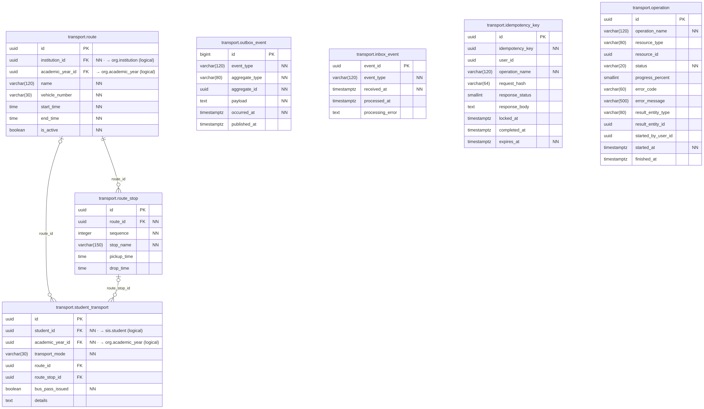

Mermaid source

```mermaid
erDiagram
    transport__route["transport.route"] {
        uuid id PK
        uuid institution_id FK "NN · → org.institution (logical)"
        uuid academic_year_id FK "→ org.academic_year (logical)"
        varchar(120) name "NN"
        varchar(30) vehicle_number "NN"
        time start_time "NN"
        time end_time "NN"
        boolean is_active "NN"
    }
    transport__route_stop["transport.route_stop"] {
        uuid id PK
        uuid route_id FK "NN"
        integer sequence "NN"
        varchar(150) stop_name "NN"
        time pickup_time
        time drop_time
    }
    transport__student_transport["transport.student_transport"] {
        uuid id PK
        uuid student_id FK "NN · → sis.student (logical)"
        uuid academic_year_id FK "NN · → org.academic_year (logical)"
        varchar(30) transport_mode "NN"
        uuid route_id FK
        uuid route_stop_id FK
        boolean bus_pass_issued "NN"
        text details
    }
    transport__outbox_event["transport.outbox_event"] {
        bigint id PK
        varchar(120) event_type "NN"
        varchar(80) aggregate_type "NN"
        uuid aggregate_id "NN"
        text payload "NN"
        timestamptz occurred_at "NN"
        timestamptz published_at
    }
    transport__inbox_event["transport.inbox_event"] {
        uuid event_id PK
        varchar(120) event_type "NN"
        timestamptz received_at "NN"
        timestamptz processed_at
        text processing_error
    }
    transport__idempotency_key["transport.idempotency_key"] {
        uuid id PK
        uuid idempotency_key "NN"
        uuid user_id
        varchar(120) operation_name "NN"
        varchar(64) request_hash
        smallint response_status
        text response_body
        timestamptz locked_at
        timestamptz completed_at
        timestamptz expires_at "NN"
    }
    transport__operation["transport.operation"] {
        uuid id PK
        varchar(120) operation_name "NN"
        varchar(80) resource_type
        uuid resource_id
        varchar(20) status "NN"
        smallint progress_percent
        varchar(60) error_code
        varchar(500) error_message
        varchar(80) result_entity_type
        uuid result_entity_id
        uuid started_by_user_id
        timestamptz started_at "NN"
        timestamptz finished_at
    }
    transport__route ||--o{ transport__route_stop : "route_id"
    transport__route |o--o{ transport__student_transport : "route_id"
    transport__route_stop |o--o{ transport__student_transport : "route_stop_id"
```

### Communication & Community — Messaging & notifications

Mermaid source

```mermaid
erDiagram
    comms__message_template["comms.message_template"] {
        uuid id PK
        uuid institution_id FK "→ org.institution (logical)"
        varchar(30) channel "NN"
        varchar(80) code
        varchar(150) name "NN"
        text subject
        text body
        varchar(80) external_template_id
        boolean is_active "NN"
    }
    comms__outbound_message["comms.outbound_message"] {
        uuid id PK
        uuid institution_id FK "NN · → org.institution (logical)"
        uuid academic_year_id FK "→ org.academic_year (logical)"
        varchar(30) message_kind "NN"
        varchar(30) channel "NN"
        varchar(320) sender "NN"
        varchar(320) recipient "NN"
        uuid recipient_user_id FK "→ iam.user_account (logical)"
        text subject
        text body "NN"
        uuid template_id FK
        varchar(80) related_entity_type
        uuid related_entity_id
        varchar(30) status "NN"
        text provider_response
        timestamptz scheduled_at
        timestamptz sent_at
        varchar(500) template_params
        varchar(1000) action_url
    }
    comms__mailbox_message["comms.mailbox_message"] {
        uuid id PK
        uuid institution_id FK "NN · → org.institution (logical)"
        uuid academic_year_id FK "→ org.academic_year (logical)"
        uuid owner_user_id FK "→ iam.user_account (logical)"
        uuid about_student_id FK "→ sis.student (logical)"
        varchar(30) folder "NN"
        varchar(320) from_address
        varchar(200) from_display
        text to_addresses
        text subject
        text body
        varchar(30) delivery_status
        varchar(200) provider_message_id
        boolean is_processed "NN"
        timestamptz processed_at
        timestamptz dispatched_at
        timestamptz read_at
    }
    comms__in_app_notification["comms.in_app_notification"] {
        uuid id PK
        uuid recipient_user_id FK "NN · → iam.user_account (logical)"
        timestamptz read_at
        uuid notification_type_id FK "NN"
        varchar(255) title
        text body
        varchar(480) sms_text
        varchar(1000) action_url
        uuid cohort_id FK "→ lms.cohort (logical)"
        varchar(30) email_status "NN"
        varchar(30) sms_status "NN"
        varchar(30) popup_status "NN"
        varchar(30) digest_status "NN"
        timestamptz archived_at
        varchar(60) entity_type
        uuid entity_id
    }
    comms__conversation["comms.conversation"] {
        uuid id PK
        uuid institution_id FK "→ org.institution (logical)"
        varchar(30) conversation_type "NN"
        varchar(150) title
        timestamptz last_message_at
        boolean is_active "NN"
    }
    comms__conversation_participant["comms.conversation_participant"] {
        uuid id PK
        uuid conversation_id FK "NN"
        uuid user_id FK "NN · → iam.user_account (logical)"
        timestamptz last_read_at
    }
    comms__conversation_message["comms.conversation_message"] {
        uuid id PK
        uuid conversation_id FK "NN"
        uuid sender_user_id FK "NN · → iam.user_account (logical)"
        text body "NN"
        boolean deleted_by_sender "NN"
    }
    comms__message_receipt["comms.message_receipt"] {
        uuid id PK
        uuid message_id FK "NN"
        uuid user_id FK "NN · → iam.user_account (logical)"
        timestamptz seen_at
        timestamptz deleted_at_by_recipient
    }
    comms__feedback_thread["comms.feedback_thread"] {
        uuid id PK
        uuid institution_id FK "NN · → org.institution (logical)"
        uuid guardian_id FK "NN · → sis.guardian (logical)"
        uuid student_id FK "NN · → sis.student (logical)"
        uuid assigned_to_user_id FK "NN · → iam.user_account (logical)"
        varchar(30) status "NN"
    }
    comms__feedback_message["comms.feedback_message"] {
        uuid id PK
        uuid thread_id FK "NN"
        uuid sender_user_id FK "NN · → iam.user_account (logical)"
        varchar(30) category "NN"
        text message "NN"
        uuid attachment_file_id FK "→ platform.file_object (logical)"
        varchar(30) review_status "NN"
        boolean deleted_by_sender "NN"
        boolean deleted_by_receiver "NN"
    }
    comms__notification_type["comms.notification_type"] {
        uuid id PK
        varchar(80) code UK "NN"
        text description "NN"
        varchar(60) module_code "NN"
        varchar(80) role_code
        boolean is_enabled "NN"
        boolean popup_enabled "NN"
        boolean teacher_popup_enabled "NN"
        varchar(500) valid_parameters
    }
    comms__notification_type_property["comms.notification_type_property"] {
        uuid id PK
        uuid notification_type_id FK "NN"
        varchar(60) module_code
        varchar(500) property_value "NN"
    }
    comms__notification_rule["comms.notification_rule"] {
        uuid id PK
        uuid role_id FK "NN · → iam.role (logical)"
        uuid notification_type_id FK "NN"
        uuid permission_id FK "→ iam.permission (logical)"
        boolean is_enabled "NN"
        text email_subject_template
        text email_body_template
        text sms_template
    }
    comms__notification_cohort_setting["comms.notification_cohort_setting"] {
        uuid id PK
        uuid cohort_id FK "NN · → lms.cohort (logical)"
        uuid notification_type_id FK "NN"
        boolean popup_enabled "NN"
    }
    comms__notification_channel["comms.notification_channel"] {
        uuid id PK
        varchar(60) code "NN"
        varchar(200) description
        boolean is_enabled "NN"
        integer sort_order "NN"
    }
    comms__notification_channel_property["comms.notification_channel_property"] {
        uuid id PK
        uuid notification_channel_id FK "NN"
        varchar(100) property_key "NN"
        text property_value
        text secret_value_enc
        integer sort_order "NN"
        boolean is_mandatory "NN"
    }
    comms__notification_preference_set["comms.notification_preference_set"] {
        uuid id PK
        uuid user_id FK "NN · → iam.user_account (logical)"
        uuid role_id FK "→ iam.role (logical)"
    }
    comms__notification_preference["comms.notification_preference"] {
        uuid id PK
        uuid preference_set_id FK "NN"
        uuid notification_type_id FK
        varchar(100) property_name "NN"
        varchar(200) property_value
    }
    comms__message_template |o--o{ comms__outbound_message : "template_id"
    comms__notification_type ||--o{ comms__in_app_notification : "notification_type_id"
    comms__conversation ||--o{ comms__conversation_participant : "conversation_id"
    comms__conversation ||--o{ comms__conversation_message : "conversation_id"
    comms__conversation_message ||--o{ comms__message_receipt : "message_id"
    comms__feedback_thread ||--o{ comms__feedback_message : "thread_id"
    comms__notification_type ||--o{ comms__notification_type_property : "notification_type_id"
    comms__notification_type ||--o{ comms__notification_rule : "notification_type_id"
    comms__notification_type ||--o{ comms__notification_cohort_setting : "notification_type_id"
    comms__notification_channel ||--o{ comms__notification_channel_property : "notification_channel_id"
    comms__notification_preference_set ||--o{ comms__notification_preference : "preference_set_id"
    comms__notification_type |o--o{ comms__notification_preference : "notification_type_id"
```

### Communication & Community — Notices, events & calendar

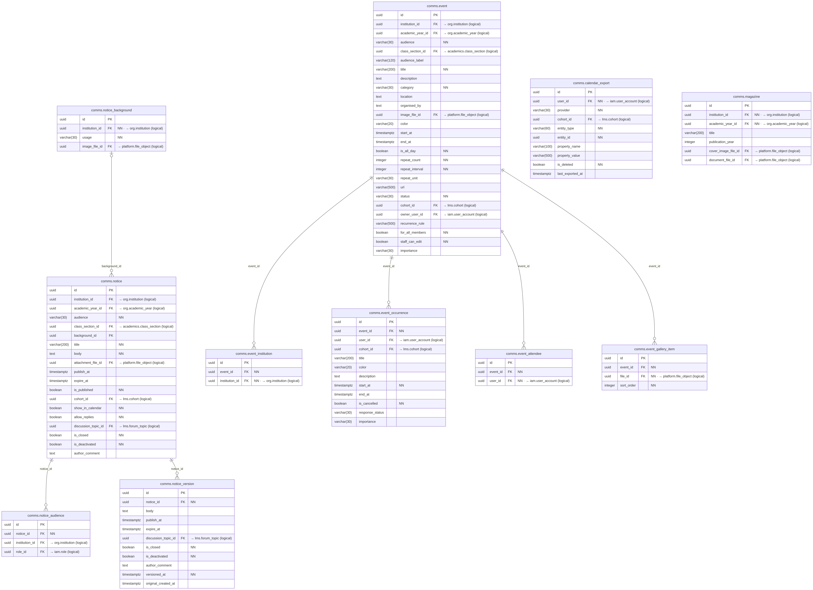

Mermaid source

```mermaid
erDiagram
    comms__notice_background["comms.notice_background"] {
        uuid id PK
        uuid institution_id FK "NN · → org.institution (logical)"
        varchar(30) usage "NN"
        uuid image_file_id FK "→ platform.file_object (logical)"
    }
    comms__notice["comms.notice"] {
        uuid id PK
        uuid institution_id FK "→ org.institution (logical)"
        uuid academic_year_id FK "→ org.academic_year (logical)"
        varchar(30) audience "NN"
        uuid class_section_id FK "→ academics.class_section (logical)"
        uuid background_id FK
        varchar(200) title "NN"
        text body "NN"
        uuid attachment_file_id FK "→ platform.file_object (logical)"
        timestamptz publish_at
        timestamptz expire_at
        boolean is_published "NN"
        uuid cohort_id FK "→ lms.cohort (logical)"
        boolean show_in_calendar "NN"
        boolean allow_replies "NN"
        uuid discussion_topic_id FK "→ lms.forum_topic (logical)"
        boolean is_closed "NN"
        boolean is_deactivated "NN"
        text author_comment
    }
    comms__notice_audience["comms.notice_audience"] {
        uuid id PK
        uuid notice_id FK "NN"
        uuid institution_id FK "→ org.institution (logical)"
        uuid role_id FK "→ iam.role (logical)"
    }
    comms__notice_version["comms.notice_version"] {
        uuid id PK
        uuid notice_id FK "NN"
        text body
        timestamptz publish_at
        timestamptz expire_at
        uuid discussion_topic_id FK "→ lms.forum_topic (logical)"
        boolean is_closed "NN"
        boolean is_deactivated "NN"
        text author_comment
        timestamptz versioned_at "NN"
        timestamptz original_created_at
    }
    comms__event["comms.event"] {
        uuid id PK
        uuid institution_id FK "→ org.institution (logical)"
        uuid academic_year_id FK "→ org.academic_year (logical)"
        varchar(30) audience "NN"
        uuid class_section_id FK "→ academics.class_section (logical)"
        varchar(120) audience_label
        varchar(200) title "NN"
        text description
        varchar(30) category "NN"
        text location
        text organised_by
        uuid image_file_id FK "→ platform.file_object (logical)"
        varchar(20) color
        timestamptz start_at
        timestamptz end_at
        boolean is_all_day "NN"
        integer repeat_count "NN"
        integer repeat_interval "NN"
        varchar(30) repeat_unit
        varchar(500) url
        varchar(30) status "NN"
        uuid cohort_id FK "→ lms.cohort (logical)"
        uuid owner_user_id FK "→ iam.user_account (logical)"
        varchar(500) recurrence_rule
        boolean for_all_members "NN"
        boolean staff_can_edit "NN"
        varchar(30) importance
    }
    comms__event_institution["comms.event_institution"] {
        uuid id PK
        uuid event_id FK "NN"
        uuid institution_id FK "NN · → org.institution (logical)"
    }
    comms__event_occurrence["comms.event_occurrence"] {
        uuid id PK
        uuid event_id FK "NN"
        uuid user_id FK "→ iam.user_account (logical)"
        uuid cohort_id FK "→ lms.cohort (logical)"
        varchar(200) title
        varchar(20) color
        text description
        timestamptz start_at "NN"
        timestamptz end_at
        boolean is_cancelled "NN"
        varchar(30) response_status
        varchar(30) importance
    }
    comms__event_attendee["comms.event_attendee"] {
        uuid id PK
        uuid event_id FK "NN"
        uuid user_id FK "NN · → iam.user_account (logical)"
    }
    comms__calendar_export["comms.calendar_export"] {
        uuid id PK
        uuid user_id FK "NN · → iam.user_account (logical)"
        varchar(30) provider "NN"
        uuid cohort_id FK "→ lms.cohort (logical)"
        varchar(60) entity_type "NN"
        uuid entity_id "NN"
        varchar(100) property_name
        varchar(500) property_value
        boolean is_deleted "NN"
        timestamptz last_exported_at
    }
    comms__event_gallery_item["comms.event_gallery_item"] {
        uuid id PK
        uuid event_id FK "NN"
        uuid file_id FK "NN · → platform.file_object (logical)"
        integer sort_order "NN"
    }
    comms__magazine["comms.magazine"] {
        uuid id PK
        uuid institution_id FK "NN · → org.institution (logical)"
        uuid academic_year_id FK "NN · → org.academic_year (logical)"
        varchar(200) title
        integer publication_year
        uuid cover_image_file_id FK "→ platform.file_object (logical)"
        uuid document_file_id FK "→ platform.file_object (logical)"
    }
    comms__notice_background |o--o{ comms__notice : "background_id"
    comms__event ||--o{ comms__event_gallery_item : "event_id"
    comms__notice ||--o{ comms__notice_audience : "notice_id"
    comms__notice ||--o{ comms__notice_version : "notice_id"
    comms__event ||--o{ comms__event_institution : "event_id"
    comms__event ||--o{ comms__event_occurrence : "event_id"
    comms__event ||--o{ comms__event_attendee : "event_id"
```

### Communication & Community — Community pages & posts

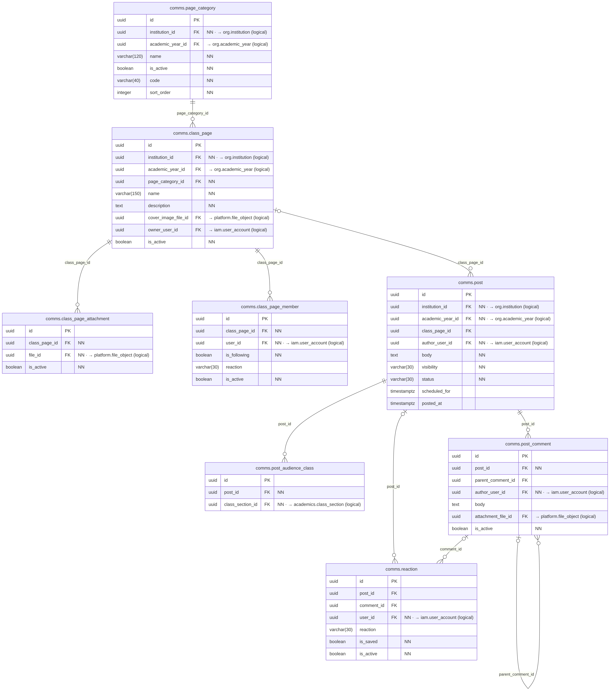

Mermaid source

```mermaid
erDiagram
    comms__page_category["comms.page_category"] {
        uuid id PK
        uuid institution_id FK "NN · → org.institution (logical)"
        uuid academic_year_id FK "→ org.academic_year (logical)"
        varchar(120) name "NN"
        boolean is_active "NN"
        varchar(40) code "NN"
        integer sort_order "NN"
    }
    comms__class_page["comms.class_page"] {
        uuid id PK
        uuid institution_id FK "NN · → org.institution (logical)"
        uuid academic_year_id FK "→ org.academic_year (logical)"
        uuid page_category_id FK "NN"
        varchar(150) name "NN"
        text description "NN"
        uuid cover_image_file_id FK "→ platform.file_object (logical)"
        uuid owner_user_id FK "→ iam.user_account (logical)"
        boolean is_active "NN"
    }
    comms__class_page_attachment["comms.class_page_attachment"] {
        uuid id PK
        uuid class_page_id FK "NN"
        uuid file_id FK "NN · → platform.file_object (logical)"
        boolean is_active "NN"
    }
    comms__class_page_member["comms.class_page_member"] {
        uuid id PK
        uuid class_page_id FK "NN"
        uuid user_id FK "NN · → iam.user_account (logical)"
        boolean is_following "NN"
        varchar(30) reaction
        boolean is_active "NN"
    }
    comms__post["comms.post"] {
        uuid id PK
        uuid institution_id FK "NN · → org.institution (logical)"
        uuid academic_year_id FK "NN · → org.academic_year (logical)"
        uuid class_page_id FK
        uuid author_user_id FK "NN · → iam.user_account (logical)"
        text body "NN"
        varchar(30) visibility "NN"
        varchar(30) status "NN"
        timestamptz scheduled_for
        timestamptz posted_at
    }
    comms__post_audience_class["comms.post_audience_class"] {
        uuid id PK
        uuid post_id FK "NN"
        uuid class_section_id FK "NN · → academics.class_section (logical)"
    }
    comms__reaction["comms.reaction"] {
        uuid id PK
        uuid post_id FK
        uuid comment_id FK
        uuid user_id FK "NN · → iam.user_account (logical)"
        varchar(30) reaction
        boolean is_saved "NN"
        boolean is_active "NN"
    }
    comms__post_comment["comms.post_comment"] {
        uuid id PK
        uuid post_id FK "NN"
        uuid parent_comment_id FK
        uuid author_user_id FK "NN · → iam.user_account (logical)"
        text body
        uuid attachment_file_id FK "→ platform.file_object (logical)"
        boolean is_active "NN"
    }
    comms__page_category ||--o{ comms__class_page : "page_category_id"
    comms__class_page ||--o{ comms__class_page_attachment : "class_page_id"
    comms__class_page ||--o{ comms__class_page_member : "class_page_id"
    comms__class_page |o--o{ comms__post : "class_page_id"
    comms__post ||--o{ comms__post_audience_class : "post_id"
    comms__post ||--o{ comms__post_comment : "post_id"
    comms__post_comment |o--o{ comms__post_comment : "parent_comment_id"
    comms__post |o--o{ comms__reaction : "post_id"
    comms__post_comment |o--o{ comms__reaction : "comment_id"
```

### Communication & Community — Groups, tasks & module events

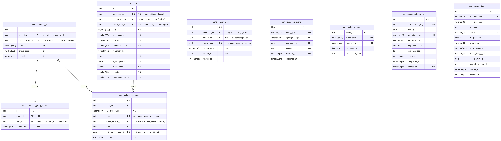

Mermaid source

```mermaid
erDiagram
    comms__audience_group["comms.audience_group"] {
        uuid id PK
        uuid institution_id FK "→ org.institution (logical)"
        uuid class_section_id FK "→ academics.class_section (logical)"
        varchar(150) name "NN"
        varchar(30) group_scope "NN"
        boolean is_active "NN"
    }
    comms__audience_group_member["comms.audience_group_member"] {
        uuid id PK
        uuid group_id FK "NN"
        uuid user_id FK "NN · → iam.user_account (logical)"
        varchar(30) member_type "NN"
    }
    comms__task["comms.task"] {
        uuid id PK
        uuid institution_id FK "NN · → org.institution (logical)"
        uuid academic_year_id FK "→ org.academic_year (logical)"
        uuid owner_user_id FK "NN · → iam.user_account (logical)"
        varchar(255) title "NN"
        varchar(30) task_category "NN"
        timestamptz due_at "NN"
        varchar(30) reminder_option "NN"
        timestamptz reminder_at
        text checklist "NN"
        boolean is_completed "NN"
        boolean is_snoozed "NN"
        varchar(30) priority "NN"
        varchar(30) assignment_mode "NN"
    }
    comms__task_assignee["comms.task_assignee"] {
        uuid id PK
        uuid task_id FK "NN"
        varchar(30) assignee_type "NN"
        uuid user_id FK "→ iam.user_account (logical)"
        uuid class_section_id FK "→ academics.class_section (logical)"
        uuid group_id FK
        uuid claimed_by_user_id FK "→ iam.user_account (logical)"
        varchar(30) status "NN"
    }
    comms__content_view["comms.content_view"] {
        uuid id PK
        uuid institution_id FK "→ org.institution (logical)"
        uuid student_id FK "NN · → sis.student (logical)"
        uuid viewer_user_id FK "→ iam.user_account (logical)"
        varchar(30) content_type "NN"
        uuid content_id "NN"
        timestamptz viewed_at
    }
    comms__outbox_event["comms.outbox_event"] {
        bigint id PK
        varchar(120) event_type "NN"
        varchar(80) aggregate_type "NN"
        uuid aggregate_id "NN"
        text payload "NN"
        timestamptz occurred_at "NN"
        timestamptz published_at
    }
    comms__inbox_event["comms.inbox_event"] {
        uuid event_id PK
        varchar(120) event_type "NN"
        timestamptz received_at "NN"
        timestamptz processed_at
        text processing_error
    }
    comms__idempotency_key["comms.idempotency_key"] {
        uuid id PK
        uuid idempotency_key "NN"
        uuid user_id
        varchar(120) operation_name "NN"
        varchar(64) request_hash
        smallint response_status
        text response_body
        timestamptz locked_at
        timestamptz completed_at
        timestamptz expires_at "NN"
    }
    comms__operation["comms.operation"] {
        uuid id PK
        varchar(120) operation_name "NN"
        varchar(80) resource_type
        uuid resource_id
        varchar(20) status "NN"
        smallint progress_percent
        varchar(60) error_code
        varchar(500) error_message
        varchar(80) result_entity_type
        uuid result_entity_id
        uuid started_by_user_id
        timestamptz started_at "NN"
        timestamptz finished_at
    }
    comms__audience_group ||--o{ comms__audience_group_member : "group_id"
    comms__task ||--o{ comms__task_assignee : "task_id"
    comms__audience_group |o--o{ comms__task_assignee : "group_id"
```

### Front Office

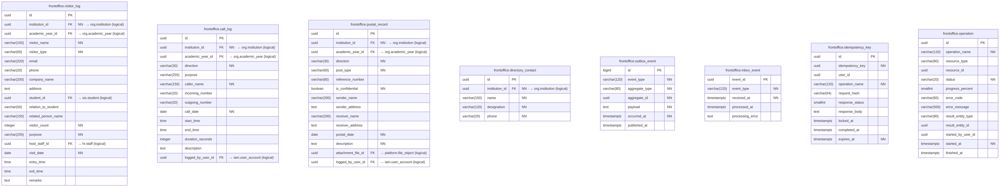

Mermaid source

```mermaid
erDiagram
    frontoffice__visitor_log["frontoffice.visitor_log"] {
        uuid id PK
        uuid institution_id FK "NN · → org.institution (logical)"
        uuid academic_year_id FK "→ org.academic_year (logical)"
        varchar(150) visitor_name "NN"
        varchar(60) visitor_type "NN"
        varchar(320) email
        varchar(20) phone
        varchar(200) company_name
        text address
        uuid student_id FK "→ sis.student (logical)"
        varchar(60) relation_to_student
        varchar(150) related_person_name
        integer visitor_count "NN"
        varchar(255) purpose "NN"
        uuid host_staff_id FK "→ hr.staff (logical)"
        date visit_date "NN"
        time entry_time
        time exit_time
        text remarks
    }
    frontoffice__call_log["frontoffice.call_log"] {
        uuid id PK
        uuid institution_id FK "NN · → org.institution (logical)"
        uuid academic_year_id FK "→ org.academic_year (logical)"
        varchar(30) direction "NN"
        varchar(255) purpose
        varchar(150) caller_name "NN"
        varchar(20) incoming_number
        varchar(20) outgoing_number
        date call_date "NN"
        time start_time
        time end_time
        integer duration_seconds
        text description
        uuid logged_by_user_id FK "→ iam.user_account (logical)"
    }
    frontoffice__postal_record["frontoffice.postal_record"] {
        uuid id PK
        uuid institution_id FK "NN · → org.institution (logical)"
        uuid academic_year_id FK "→ org.academic_year (logical)"
        varchar(30) direction "NN"
        varchar(60) post_type "NN"
        varchar(80) reference_number
        boolean is_confidential "NN"
        varchar(200) sender_name
        text sender_address
        varchar(200) receiver_name
        text receiver_address
        date postal_date "NN"
        text description "NN"
        uuid attachment_file_id FK "→ platform.file_object (logical)"
        uuid logged_by_user_id FK "→ iam.user_account (logical)"
    }
    frontoffice__directory_contact["frontoffice.directory_contact"] {
        uuid id PK
        uuid institution_id FK "NN · → org.institution (logical)"
        varchar(150) name "NN"
        varchar(120) designation "NN"
        varchar(20) phone "NN"
    }
    frontoffice__outbox_event["frontoffice.outbox_event"] {
        bigint id PK
        varchar(120) event_type "NN"
        varchar(80) aggregate_type "NN"
        uuid aggregate_id "NN"
        text payload "NN"
        timestamptz occurred_at "NN"
        timestamptz published_at
    }
    frontoffice__inbox_event["frontoffice.inbox_event"] {
        uuid event_id PK
        varchar(120) event_type "NN"
        timestamptz received_at "NN"
        timestamptz processed_at
        text processing_error
    }
    frontoffice__idempotency_key["frontoffice.idempotency_key"] {
        uuid id PK
        uuid idempotency_key "NN"
        uuid user_id
        varchar(120) operation_name "NN"
        varchar(64) request_hash
        smallint response_status
        text response_body
        timestamptz locked_at
        timestamptz completed_at
        timestamptz expires_at "NN"
    }
    frontoffice__operation["frontoffice.operation"] {
        uuid id PK
        varchar(120) operation_name "NN"
        varchar(80) resource_type
        uuid resource_id
        varchar(20) status "NN"
        smallint progress_percent
        varchar(60) error_code
        varchar(500) error_message
        varchar(80) result_entity_type
        uuid result_entity_id
        uuid started_by_user_id
        timestamptz started_at "NN"
        timestamptz finished_at
    }
```

### Careers

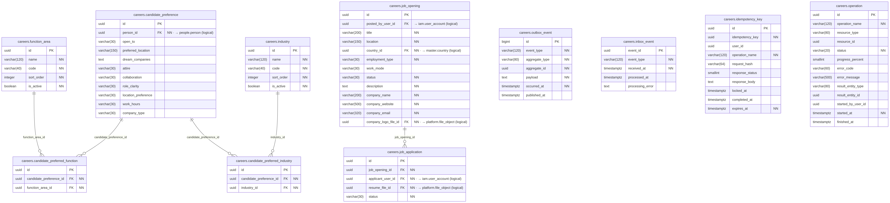

Mermaid source

```mermaid
erDiagram
    careers__function_area["careers.function_area"] {
        uuid id PK
        varchar(120) name "NN"
        varchar(40) code "NN"
        integer sort_order "NN"
        boolean is_active "NN"
    }
    careers__industry["careers.industry"] {
        uuid id PK
        varchar(120) name "NN"
        varchar(40) code "NN"
        integer sort_order "NN"
        boolean is_active "NN"
    }
    careers__job_opening["careers.job_opening"] {
        uuid id PK
        uuid posted_by_user_id FK "→ iam.user_account (logical)"
        varchar(200) title "NN"
        varchar(150) location "NN"
        uuid country_id FK "NN · → master.country (logical)"
        varchar(30) employment_type "NN"
        varchar(30) work_mode
        varchar(30) status "NN"
        text description "NN"
        varchar(200) company_name "NN"
        varchar(500) company_website "NN"
        varchar(320) company_email "NN"
        uuid company_logo_file_id FK "NN · → platform.file_object (logical)"
    }
    careers__job_application["careers.job_application"] {
        uuid id PK
        uuid job_opening_id FK "NN"
        uuid applicant_user_id FK "NN · → iam.user_account (logical)"
        uuid resume_file_id FK "NN · → platform.file_object (logical)"
        varchar(30) status "NN"
    }
    careers__candidate_preference["careers.candidate_preference"] {
        uuid id PK
        uuid person_id FK "NN · → people.person (logical)"
        varchar(30) open_to
        varchar(150) preferred_location
        text dream_companies
        varchar(30) attire
        varchar(30) collaboration
        varchar(30) role_clarity
        varchar(30) location_preference
        varchar(30) work_hours
        varchar(30) company_type
    }
    careers__candidate_preferred_function["careers.candidate_preferred_function"] {
        uuid id PK
        uuid candidate_preference_id FK "NN"
        uuid function_area_id FK "NN"
    }
    careers__candidate_preferred_industry["careers.candidate_preferred_industry"] {
        uuid id PK
        uuid candidate_preference_id FK "NN"
        uuid industry_id FK "NN"
    }
    careers__outbox_event["careers.outbox_event"] {
        bigint id PK
        varchar(120) event_type "NN"
        varchar(80) aggregate_type "NN"
        uuid aggregate_id "NN"
        text payload "NN"
        timestamptz occurred_at "NN"
        timestamptz published_at
    }
    careers__inbox_event["careers.inbox_event"] {
        uuid event_id PK
        varchar(120) event_type "NN"
        timestamptz received_at "NN"
        timestamptz processed_at
        text processing_error
    }
    careers__idempotency_key["careers.idempotency_key"] {
        uuid id PK
        uuid idempotency_key "NN"
        uuid user_id
        varchar(120) operation_name "NN"
        varchar(64) request_hash
        smallint response_status
        text response_body
        timestamptz locked_at
        timestamptz completed_at
        timestamptz expires_at "NN"
    }
    careers__operation["careers.operation"] {
        uuid id PK
        varchar(120) operation_name "NN"
        varchar(80) resource_type
        uuid resource_id
        varchar(20) status "NN"
        smallint progress_percent
        varchar(60) error_code
        varchar(500) error_message
        varchar(80) result_entity_type
        uuid result_entity_id
        uuid started_by_user_id
        timestamptz started_at "NN"
        timestamptz finished_at
    }
    careers__job_opening ||--o{ careers__job_application : "job_opening_id"
    careers__candidate_preference ||--o{ careers__candidate_preferred_function : "candidate_preference_id"
    careers__function_area ||--o{ careers__candidate_preferred_function : "function_area_id"
    careers__candidate_preference ||--o{ careers__candidate_preferred_industry : "candidate_preference_id"
    careers__industry ||--o{ careers__candidate_preferred_industry : "industry_id"
```

## Regenerating

Any tool that reads PostgreSQL DDL can rebuild these. To render a single file locally: `npx @mermaid-js/mermaid-cli -i 150_lms_1.mmd -o 150_lms_1.png -s 2`. Database IDEs (DBeaver, DataGrip, pgAdmin ERD tool) can also reverse-engineer a live database created from the migrations.
